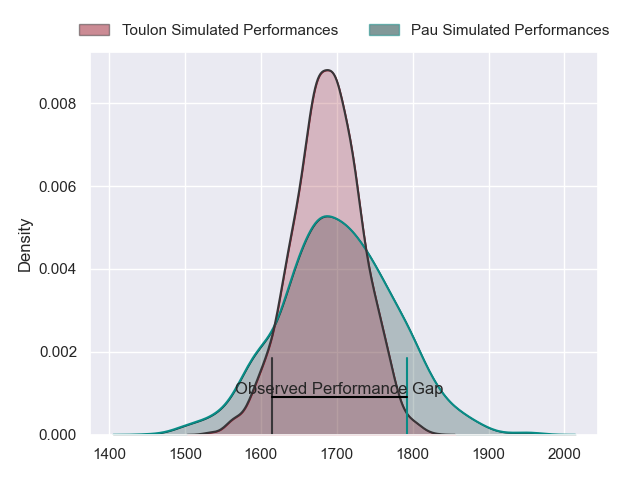
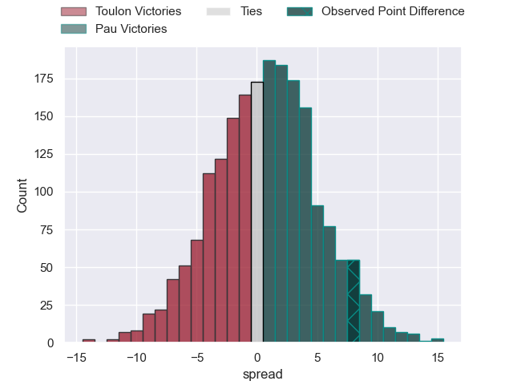
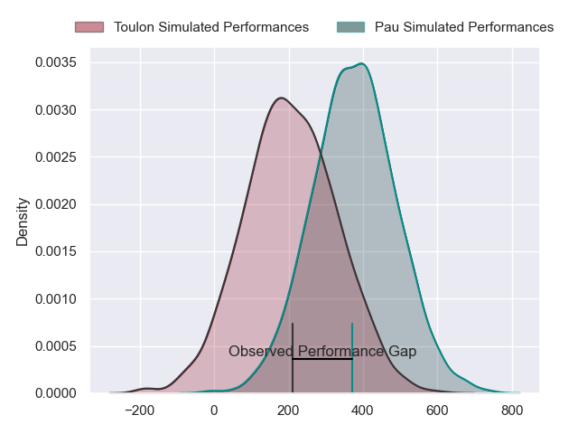
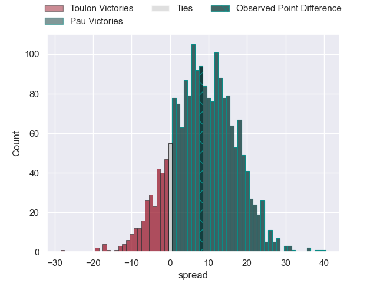
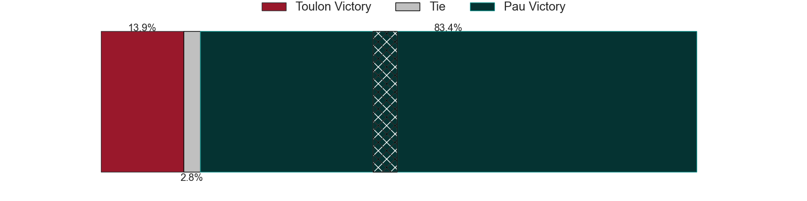

---  
layout: page  
title: Toulon at Pau; 9-17  
date: 2024-02-24 18:00:00 -0500  
categories: "Top 14 Orange 2023" match review  
---
# Toulon at Pau; 9-17

# Club Level Predictions

The first set of predictions treats a club as the smallest object, as the club develops its members, organizes a gameplan, and deploys its players as needed for each match. This club model has a prediction of 0.522, which translates to predicting Pau to win by 0.8.

Our Over/Under is 44.5 - and combined with the spread above, we have a predicted scoreline of 22 to 22

Each club has a rating and a rating deviation (similar to a Glicko rating), and expected performances can be generated. This allows for simulated matches and spreads like the ones below.
## Projected Performances - Club Model

## Projected Spreads - Club Model

## Projected Results - Club Model

# Player Level Predictions - Version 2

Treating teams instead as an entity made up of the currently active players, I have ratings for each player in an altogether different system. These can be combined to form team ratings once teamsheets are announced, weighting starters a bit higher than the reserves. After the match is played, players can be weighted by their minutes on the field, allowing for an accurate measure of the team's composition. With these compiled team ratings, we can make predictions, measure inaccuracy, and update the individual player ratings.
## Prediction without Player Minutes: Pau by 10.3

Pau by 2.3 on a neutral pitch

## Projected Performances - Player Model

## Projected Spreads - Player Model

## Projected Results - Player Model

|   Away Minutes | Away Player            |   Away Percentile |   Number |   Home Percentile | Home Player          |   Home Minutes |
|---------------:|:-----------------------|------------------:|---------:|------------------:|:---------------------|---------------:|
|             65 | Bruce Devaux           |             11.92 |        1 |             12.37 | Guram Papidze        |             36 |
|             65 | Teddy Baubigny         |             32.1  |        2 |             18.45 | Lucas Rey            |             50 |
|             65 | Beka Gigashvili        |             47.85 |        3 |             84.95 | Siate Tokolahi       |             50 |
|             50 | Matthias Halagahu      |             33.41 |        4 |             62.56 | Hugo Auradou         |             50 |
|             80 | David Ribbans          |             76.61 |        5 |             81.91 | Fabrice Metz         |             50 |
|             54 | Mattéo Le Corvec       |             43.7  |        6 |             16.08 | Sacha Zegueur        |             80 |
|             80 | Jules Coulon           |             44.02 |        7 |             98.62 | Luke Whitelock       |             80 |
|             80 | Selevasio Tolofua      |             79.02 |        8 |             55.01 | Beka Gorgadze        |             80 |
|             54 | Vasil Lobzhanidze      |             10.61 |        9 |             89    | Thibault Daubagna    |             55 |
|             80 | Enzo Herve             |             75.77 |       10 |             57.72 | Axel Desperes        |             80 |
|             80 | Seta Tuicuvu           |             56.3  |       11 |              6.14 | Samuel Ezeala        |             80 |
|             65 | Duncan Paia'aua        |             49.59 |       12 |             94.88 | Tumua Manu           |             80 |
|             80 | Leicester Fainga'anuku |             84.87 |       13 |             50.17 | Emilien Gailleton    |             80 |
|             80 | Gael Drean             |             31.64 |       14 |             81.59 | Aminiasi Tuimaba     |             80 |
|             80 | Melvyn Jaminet         |             68.97 |       15 |             40.46 | Theo Attissogbe      |             80 |
|             30 | Brian Alainu'uese      |             73.16 |       16 |            nan    | Simon-Pierre Chauvac |             44 |
|             26 | Jules Danglot          |             72.3  |       17 |              8.24 | Nicolas Corato       |             30 |
|             26 | Facundo Isa            |             85.31 |       18 |             34.32 | Romain Ruffenach     |             30 |
|             15 | Fabio Gonzalez         |             53.67 |       19 |             70.26 | Lekima Tagitagivalu  |             30 |
|             15 | Kieran Brookes         |             12.54 |       20 |             25.12 | Guillaume Ducat      |             30 |
|             15 | Mathieu Smaili         |             17.58 |       21 |             98.04 | Dan Robson           |             25 |
|             15 | Jack Singleton         |             91.14 |       22 |            nan    | nan                  |            nan |

