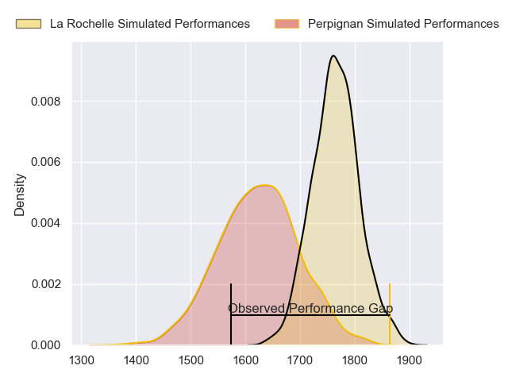
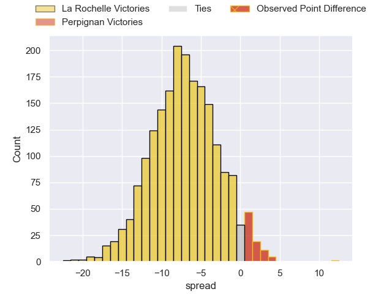
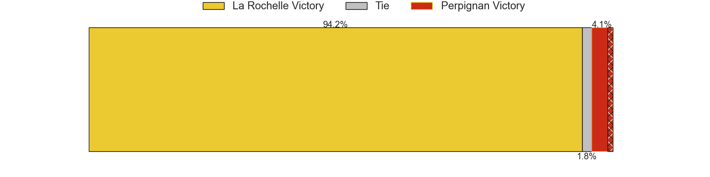
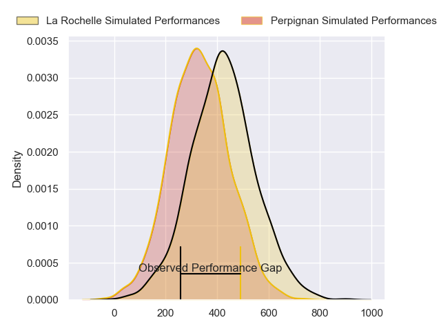
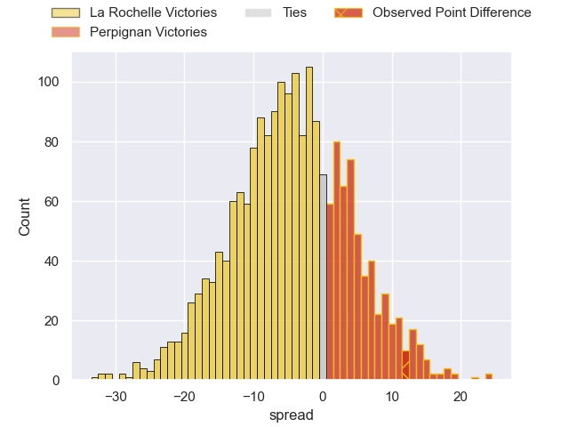
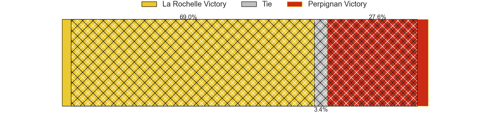

---  
layout: page  
title: La Rochelle at Perpignan; 15-27  
date: 2024-02-24 18:00:00 -0500  
categories: "Top 14 Orange 2023" match review  
---
# La Rochelle at Perpignan; 15-27

# Club Level Predictions

The first set of predictions treats a club as the smallest object, as the club develops its members, organizes a gameplan, and deploys its players as needed for each match. This club model has a prediction of 0.306, which translates to predicting La Rochelle to win by 7.2.

Our Over/Under is 56.5 - and combined with the spread above, we have a predicted scoreline of 32 to 25

Each club has a rating and a rating deviation (similar to a Glicko rating), and expected performances can be generated. This allows for simulated matches and spreads like the ones below.
## Projected Performances - Club Model

## Projected Spreads - Club Model

## Projected Results - Club Model

# Player Level Predictions - Version 2

Treating teams instead as an entity made up of the currently active players, I have ratings for each player in an altogether different system. These can be combined to form team ratings once teamsheets are announced, weighting starters a bit higher than the reserves. After the match is played, players can be weighted by their minutes on the field, allowing for an accurate measure of the team's composition. With these compiled team ratings, we can make predictions, measure inaccuracy, and update the individual player ratings.
## Prediction without Player Minutes: La Rochelle by 4.3

La Rochelle by 13.0 on a neutral pitch

## Projected Performances - Player Model

## Projected Spreads - Player Model

## Projected Results - Player Model

|   Away Minutes | Away Player           |   Away Percentile |   Number |   Home Percentile | Home Player           |   Home Minutes |
|---------------:|:----------------------|------------------:|---------:|------------------:|:----------------------|---------------:|
|             57 | Louis Penverne        |             28.32 |        1 |              2.87 | Giorgi Tetrashvili    |             57 |
|             45 | Sacha Idoumi          |             50.37 |        2 |             88.93 | Seilala Lam           |             60 |
|             49 | Georges-Henri Colombe |              2.96 |        3 |             57.44 | Nemo Roelofse         |             74 |
|             59 | Thomas Ployet         |             38.71 |        4 |             70.05 | Jacobus van Tonder    |             68 |
|             80 | Remi Picquette        |             50.69 |        5 |             57.6  | Mathieu Tanguy        |             80 |
|             80 | Judicael Cancoriet    |             22.96 |        6 |             93.23 | Patrick Sobela        |             80 |
|             73 | Levani Botia          |             97.04 |        7 |             73.97 | Alan Brazo            |             70 |
|             80 | Yoan Tanga            |             59.44 |        8 |             81.59 | Joaquin Oviedo        |             60 |
|             73 | Tawera Kerr-Barlow    |             97.64 |        9 |             80.55 | Tom Ecochard          |             57 |
|             80 | Antoine Hastoy        |             49.17 |       10 |             83.61 | Jake McIntyre         |             49 |
|             59 | Raymond Rhule         |             97.99 |       11 |             64.66 | Lucas Dubois          |             80 |
|             80 | Jules Favre           |             79.16 |       12 |             99.77 | Jeronimo de la Fuente |             80 |
|             80 | Ulupano Seuteni       |             61.93 |       13 |             13.04 | Alivereti Duguivalu   |             80 |
|             80 | Teddy Thomas          |             87.51 |       14 |             68.78 | Tavite Veredamu       |             80 |
|             73 | Brice Dulin           |             99.08 |       15 |             81.38 | Tommaso Allan         |             80 |
|             35 | Quentin Lespiaucq     |             71.22 |       16 |             28.06 | Apisai Naqalevu       |             31 |
|             31 | Alexandre Kuntelia    |             54.12 |       17 |             42.92 | Xavier Chiocci        |             23 |
|             23 | Joel Sclavi           |             85.57 |       18 |              8.06 | Sadek Deghmache       |             23 |
|             21 | Oscar Jegou           |             30.9  |       19 |             69    | Ignacio Ruiz          |             20 |
|             21 | Ihaia West            |             53.2  |       20 |             13.75 | Lucas Velarte         |             20 |
|              7 | Thomas Berjon         |             80.53 |       21 |              2.19 | Shahn Eru             |             12 |
|              7 | Matthias Haddad       |             45.82 |       22 |             19.01 | Tristan Labouteley    |             10 |
|              7 | Simeli Daunivucu      |             59.14 |       23 |              8.51 | Akato Fakatika        |              6 |

