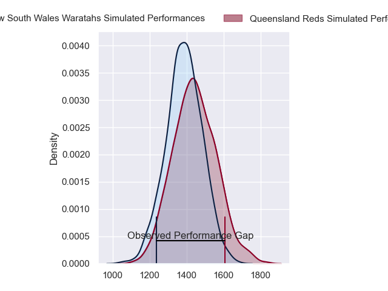
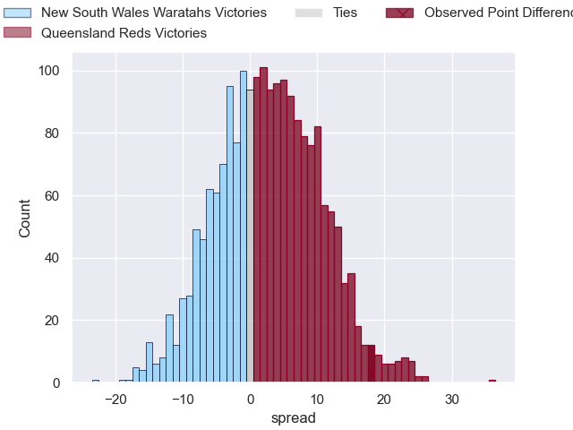
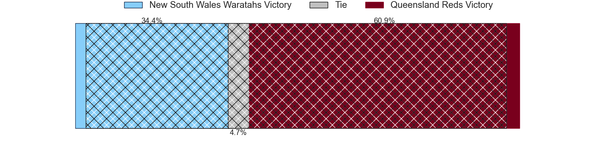
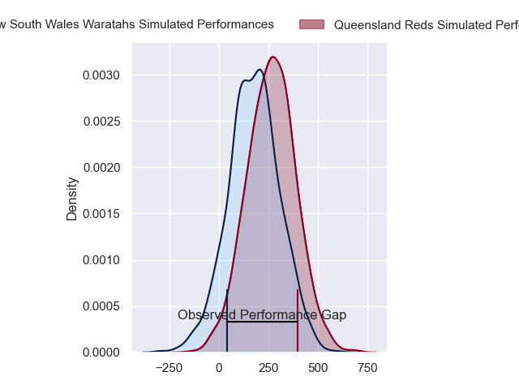
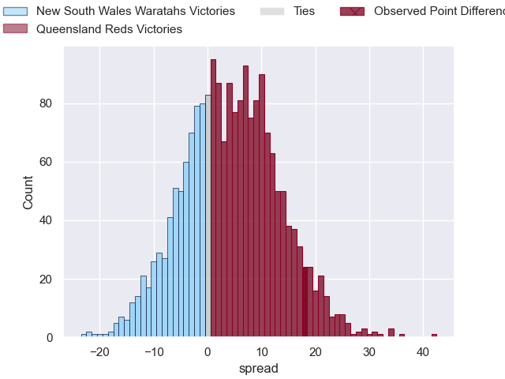

---  
layout: page  
title: New South Wales Waratahs at Queensland Reds; 22-40  
date: 2024-02-24 18:00:00 -0500  
categories: "Super Rugby Pacific 2024" match review  
---
# New South Wales Waratahs at Queensland Reds; 22-40

# Club Level Predictions

The first set of predictions treats a club as the smallest object, as the club develops its members, organizes a gameplan, and deploys its players as needed for each match. This club model has a prediction of 0.584, which translates to predicting Queensland Reds to win by 3.1.

Our Over/Under is 47.5 - and combined with the spread above, we have a predicted scoreline of 22 to 25

Each club has a rating and a rating deviation (similar to a Glicko rating), and expected performances can be generated. This allows for simulated matches and spreads like the ones below.
## Projected Performances - Club Model

## Projected Spreads - Club Model

## Projected Results - Club Model

# Player Level Predictions - Version 2

Treating teams instead as an entity made up of the currently active players, I have ratings for each player in an altogether different system. These can be combined to form team ratings once teamsheets are announced, weighting starters a bit higher than the reserves. After the match is played, players can be weighted by their minutes on the field, allowing for an accurate measure of the team's composition. With these compiled team ratings, we can make predictions, measure inaccuracy, and update the individual player ratings.
## Prediction without Player Minutes: Queensland Reds by 4.5

New South Wales Waratahs by 0.2 on a neutral pitch

## Projected Performances - Player Model

## Projected Spreads - Player Model

## Projected Results - Player Model

|   Away Minutes | Away Player              |   Away Percentile |   Number |   Home Percentile | Home Player               |   Home Minutes |
|---------------:|:-------------------------|------------------:|---------:|------------------:|:--------------------------|---------------:|
|             66 | Angus Bell               |             85.15 |        1 |             58.94 | Alex Hodgman              |             66 |
|             61 | Mahe Vailanu             |              9.19 |        2 |             56.62 | Matt Faessler             |             76 |
|             61 | Harry Johnson-Holmes     |             49.37 |        3 |             56.44 | Zane Nonggorr             |             48 |
|             80 | Jed Holloway             |             17.8  |        4 |             18.03 | Ryan Smith                |             71 |
|             61 | Miles Amatosero          |             38.35 |        5 |             37.66 | Seru Uru                  |             80 |
|             66 | Fergus Lee-Warner        |             15.38 |        6 |             93.43 | Liam Wright               |             80 |
|             80 | Charlie Gamble           |             54.61 |        7 |             89.4  | Fraser McReight           |             80 |
|             80 | Langi Gleeson            |             50.12 |        8 |             43.36 | Harry Wilson              |             35 |
|             66 | Jake Gordon              |             81.69 |        9 |             73.03 | Tate McDermott            |             80 |
|             71 | Tane Edmed               |             17.14 |       10 |             67.38 | Tom Lynagh                |             54 |
|             80 | Dylan Pietsch            |             69.39 |       11 |             64.3  | Mac Grealy                |             80 |
|             80 | Joey Walton              |             77.09 |       12 |             76.05 | Hunter Paisami            |             80 |
|             41 | Izaia Perese             |             57.67 |       13 |             17.91 | Josh Flook                |             70 |
|             80 | Mark Nawaqanitawase      |             24.05 |       14 |             20.23 | Suliasi Vunivalu          |             67 |
|             80 | Max Jorgensen            |             57.04 |       15 |             86.37 | Jordan Petaia             |             80 |
|             19 | Theo Fourie              |            nan    |       16 |            nan    | Josh Nasser               |              4 |
|             14 | Hayden Thompson-Stringer |            nan    |       17 |             40.52 | Peni Ravai Kovekalou      |             14 |
|             19 | Daniel Botha             |            nan    |       18 |             65.12 | Sef Fa'agase              |             32 |
|             14 | Sam Thomson              |             35.82 |       19 |            nan    | Cormac Daly               |              9 |
|             19 | Hugh Sinclair            |             19.86 |       20 |            nan    | John Bryant               |              4 |
|             14 | Teddy Wilson             |            nan    |       21 |             65.75 | Kalani Thomas             |             10 |
|              9 | Jack Bowen               |            nan    |       22 |            nan    | Harry McLaughlin-Phillips |             26 |
|             35 | Harry Wilson             |             35.33 |       23 |             48.5  | Jock Campbell             |             13 |

