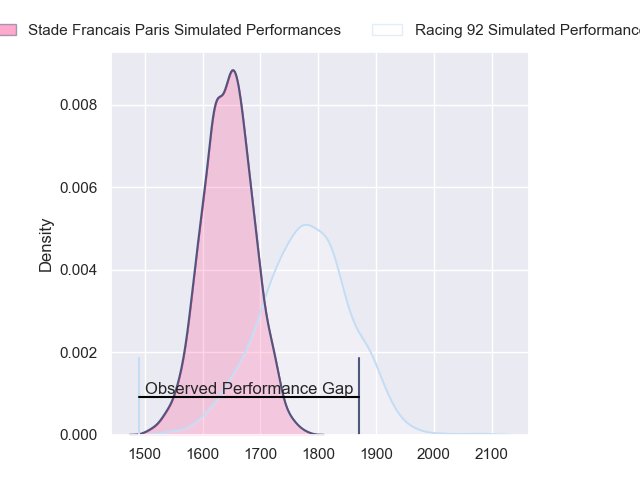
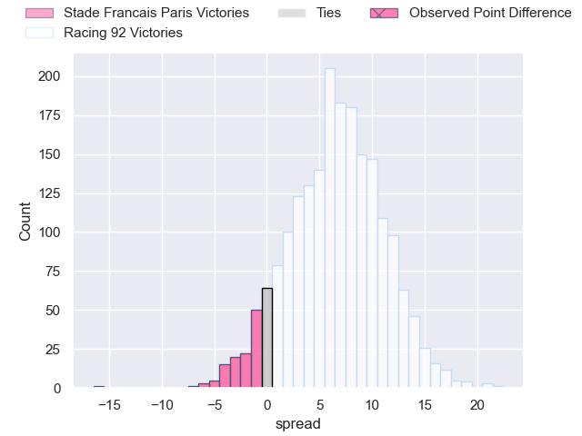
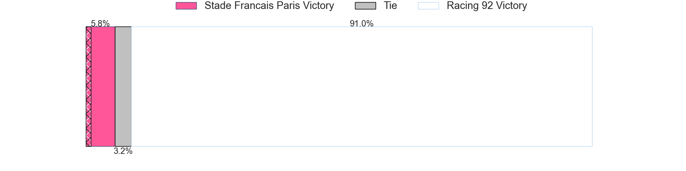
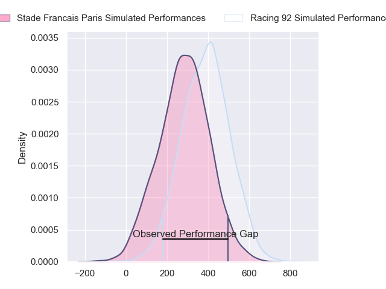
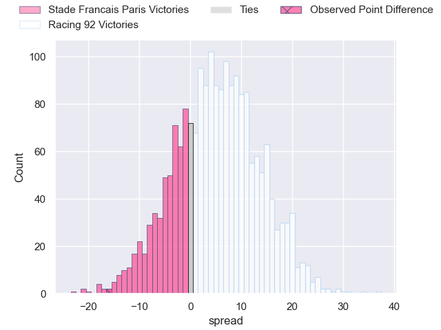
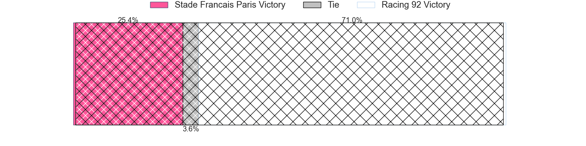

---  
layout: page  
title: Stade Francais Paris at Racing 92; 27-11  
date: 2024-02-24 18:00:00 -0500  
categories: "Top 14 Orange 2023" match review  
---
# Stade Francais Paris at Racing 92; 27-11

# Club Level Predictions

The first set of predictions treats a club as the smallest object, as the club develops its members, organizes a gameplan, and deploys its players as needed for each match. This club model has a prediction of 0.682, which translates to predicting Racing 92 to win by 6.7.

Our Over/Under is 53.5 - and combined with the spread above, we have a predicted scoreline of 23 to 30

Each club has a rating and a rating deviation (similar to a Glicko rating), and expected performances can be generated. This allows for simulated matches and spreads like the ones below.
## Projected Performances - Club Model

## Projected Spreads - Club Model

## Projected Results - Club Model

# Player Level Predictions - Version 2

Treating teams instead as an entity made up of the currently active players, I have ratings for each player in an altogether different system. These can be combined to form team ratings once teamsheets are announced, weighting starters a bit higher than the reserves. After the match is played, players can be weighted by their minutes on the field, allowing for an accurate measure of the team's composition. With these compiled team ratings, we can make predictions, measure inaccuracy, and update the individual player ratings.
## Prediction without Player Minutes: Racing 92 by 7.5

Racing 92 by 0.7 on a neutral pitch

## Projected Performances - Player Model

## Projected Spreads - Player Model

## Projected Results - Player Model

|   Away Minutes | Away Player          |   Away Percentile |   Number |   Home Percentile | Home Player        |   Home Minutes |
|---------------:|:---------------------|------------------:|---------:|------------------:|:-------------------|---------------:|
|             72 | Clement Castets      |             51.16 |        1 |              6.18 | Hassane Kolingar   |             68 |
|             60 | Mickael Ivaldi       |             96.86 |        2 |             90.04 | Camille Chat       |             66 |
|             66 | Paul Alo-Emile       |             89.52 |        3 |             46.06 | Trevor Nyakane     |             67 |
|             47 | Pierre-Henri Azagoh  |             73.39 |        4 |             71.54 | Boris Palu         |             67 |
|             72 | Tanginoa Halaifonua  |             42.28 |        5 |              4.84 | Veikoso Poloniati  |             80 |
|             60 | Ryan Chapuis         |              6.24 |        6 |              6.14 | Ibrahim Diallo     |             54 |
|             80 | Romain Briatte       |             78.94 |        7 |             90.69 | Siya Kolisi        |             80 |
|             80 | Sekou Macalou        |             93.94 |        8 |             86.71 | Wenceslas Lauret   |             41 |
|             63 | Rory Kockott         |             99.02 |        9 |             22.2  | Max Spring         |             72 |
|             80 | Zack Henry           |             85.75 |       10 |             11.16 | Martin Meliande    |             80 |
|             80 | Lester Etien         |             90.26 |       11 |             10.16 | Wame Naituvi       |             80 |
|             80 | Julien Delbouis      |             90.34 |       12 |             97.67 | Henry Chavancy     |             80 |
|             80 | Joe Marchant         |             91.85 |       13 |              6.52 | Olivier Klemenczak |             68 |
|             80 | Peniasi Dakuwaqa     |             50.48 |       14 |              7.94 | Henry Arundell     |             80 |
|             40 | Kylan Hamdaoui       |             57.7  |       15 |             26.9  | Tristan Tedder     |             80 |
|             40 | Joris Segonds        |             71.02 |       16 |             65.97 | Jordan Joseph      |             39 |
|             33 | Baptiste Pesenti     |             83.18 |       17 |             40.85 | Maxime Baudonne    |             26 |
|             20 | Mathieu Hirigoyen    |              5.4  |       18 |             15.68 | Janick Tarrit      |             14 |
|             20 | Lucas Peyresblanques |             21.96 |       19 |             66.58 | Cedate Gomes Sa    |             13 |
|             17 | Brad Weber           |             96.86 |       20 |            nan    | Junior Kpoku       |             13 |
|             14 | Hugo Ndiaye          |             46.24 |       21 |             94.92 | Christian Wade     |              8 |
|              8 | JJ van der Mescht    |             86.87 |       22 |             97.85 | Eddy Ben Arous     |             12 |
|              8 | Vasil Kakovin        |             36.38 |       23 |             23.86 | Francis Saili      |             12 |

