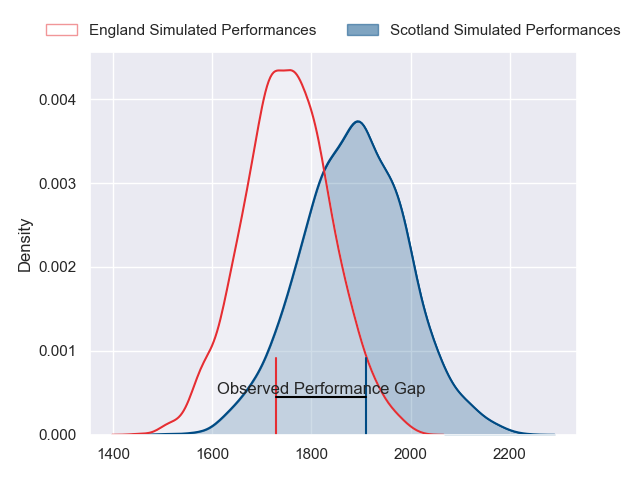
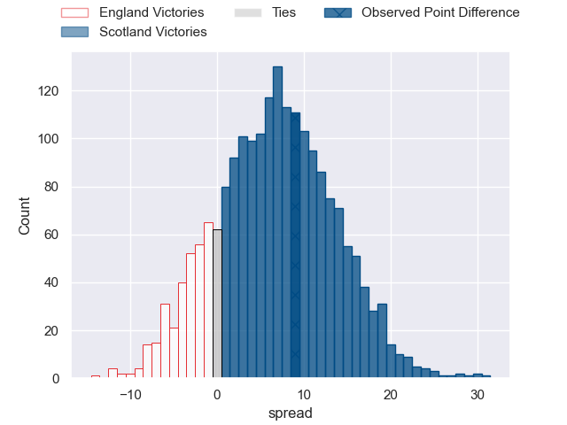
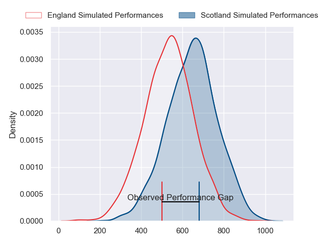
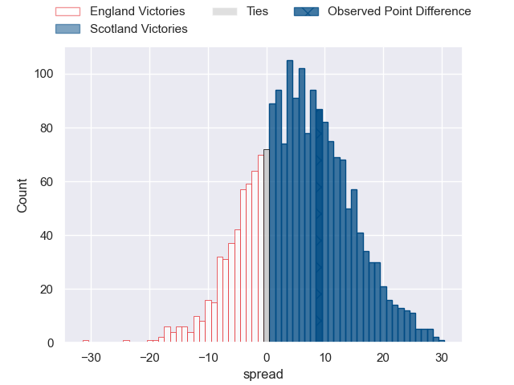

---  
layout: page  
title: England at Scotland; 21-30  
date: 2024-02-24 18:00:00 -0500  
categories: "Six Nations Championship 2024" match review  
---
# England at Scotland; 21-30

# Club Level Predictions

The first set of predictions treats a club as the smallest object, as the club develops its members, organizes a gameplan, and deploys its players as needed for each match. This club model has a prediction of 0.68, which translates to predicting Scotland to win by 6.8.

Our Over/Under is 42.5 - and combined with the spread above, we have a predicted scoreline of 18 to 25

Each club has a rating and a rating deviation (similar to a Glicko rating), and expected performances can be generated. This allows for simulated matches and spreads like the ones below.
## Projected Performances - Club Model

## Projected Spreads - Club Model

## Projected Results - Club Model

# Player Level Predictions - Version 2

Treating teams instead as an entity made up of the currently active players, I have ratings for each player in an altogether different system. These can be combined to form team ratings once teamsheets are announced, weighting starters a bit higher than the reserves. After the match is played, players can be weighted by their minutes on the field, allowing for an accurate measure of the team's composition. With these compiled team ratings, we can make predictions, measure inaccuracy, and update the individual player ratings.
## Prediction without Player Minutes: Scotland by 8.4

Scotland by 4.6 on a neutral pitch

## Projected Performances - Player Model

## Projected Spreads - Player Model

## Projected Results - Player Model

|   Away Minutes | Away Player               |   Away Percentile |   Number |   Home Percentile | Home Player         |   Home Minutes |
|---------------:|:--------------------------|------------------:|---------:|------------------:|:--------------------|---------------:|
|             62 | Ellis Genge               |             32.17 |        1 |             92.83 | Pierre Schoeman     |             80 |
|             68 | Jamie George              |             97.23 |        2 |             99.63 | George Turner       |             53 |
|             56 | Dan Cole                  |             32.62 |        3 |             99.19 | Zander Fagerson     |             62 |
|             80 | Maro Itoje                |             94.24 |        4 |             94.7  | Grant Gilchrist     |             68 |
|             80 | Ollie Chessum             |             77.65 |        5 |             96.66 | Scott Cummings      |             80 |
|             48 | Ethan Roots               |             74.81 |        6 |            100    | Jamie Ritchie       |             53 |
|             56 | Sam Underhill             |             85.71 |        7 |             74.92 | Rory Darge          |             80 |
|             80 | Ben Earl                  |             92.77 |        8 |             40.09 | Jack Dempsey        |             80 |
|             48 | Danny Care                |            100    |        9 |             70.53 | Ben White           |             63 |
|             62 | George Ford               |             93.35 |       10 |             99.52 | Finn Russell        |             80 |
|             80 | Elliot Daly               |             80.42 |       11 |             82.12 | Duhan van der Merwe |             80 |
|             80 | Ollie Lawrence            |             72.88 |       12 |             69.85 | Sione Tuipulotu     |             41 |
|             62 | Henry Slade               |             96.97 |       13 |             33.29 | Huw Jones           |             80 |
|             80 | Tommy Freeman             |             96.08 |       14 |             96.83 | Kyle Steyn          |             80 |
|             80 | George Furbank            |             94.94 |       15 |             99.54 | Blair Kinghorn      |             80 |
|             32 | George Martin             |             87.9  |       16 |             56.46 | Cameron Redpath     |             32 |
|             32 | Ben Spencer               |             76.62 |       17 |             88.38 | Ewan Ashman         |             27 |
|             24 | Chandler Cunningham-South |             72.8  |       18 |             17.88 | Andy Christie       |             27 |
|             24 | Will Stuart               |             21.77 |       19 |             76.43 | Elliot Millar-Mills |             18 |
|             18 | Joe Marler                |             98.3  |       20 |             99.61 | George Horne        |             17 |
|             18 | Fin Smith                 |             85.99 |       21 |             88.13 | Sam Skinner         |             12 |
|             18 | Immanuel Feyi-Waboso      |             74.18 |       22 |             88.6  | Ben Healy           |              7 |
|             12 | Theo Dan                  |             37.45 |       23 |            nan    | nan                 |            nan |

