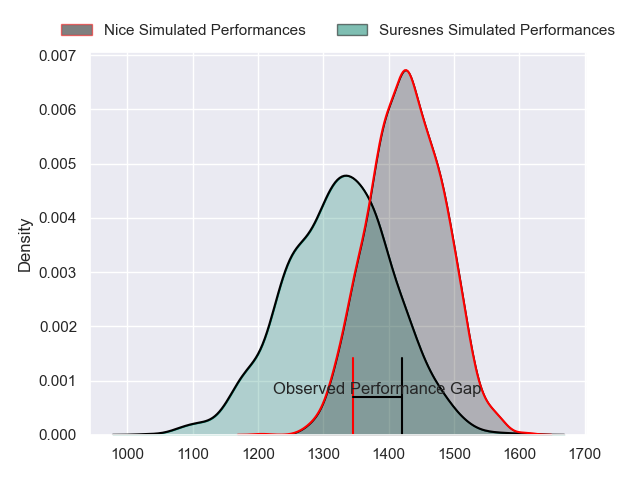
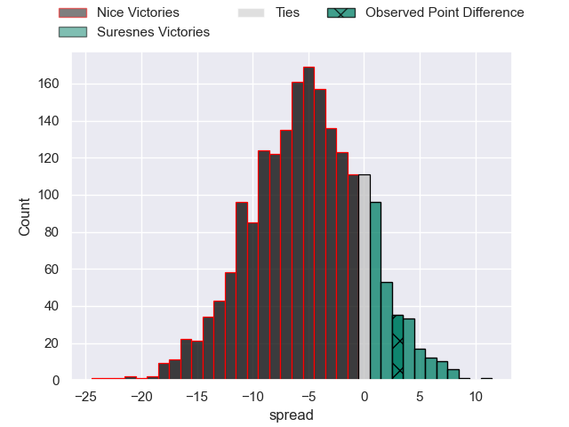
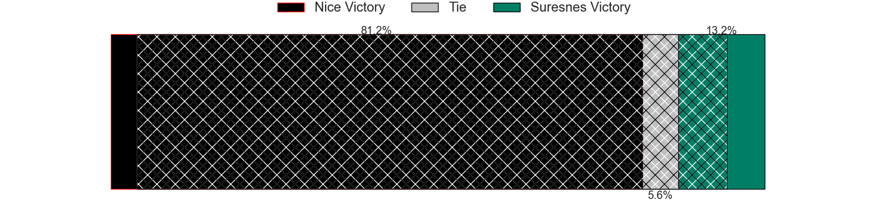
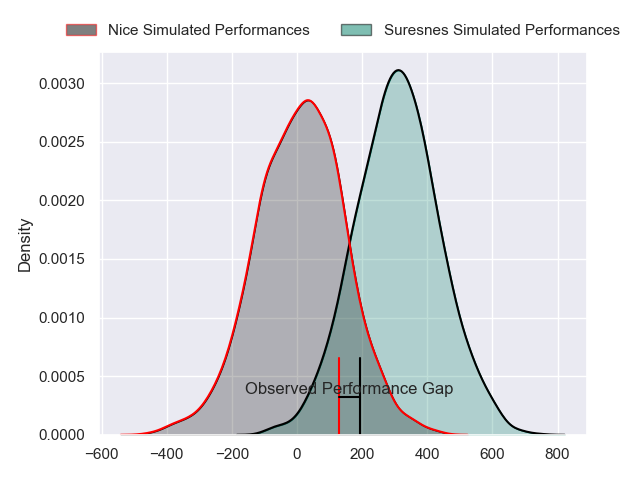
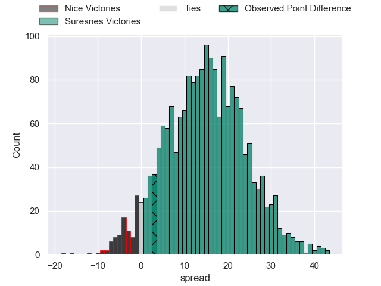
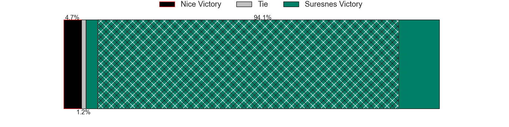

---  
layout: page  
title: Nice at Suresnes; 16-19  
date: 2024-02-24 18:00:00 -0500  
categories: "Nationale 2023" match review  
---
# Nice at Suresnes; 16-19

# Club Level Predictions

The first set of predictions treats a club as the smallest object, as the club develops its members, organizes a gameplan, and deploys its players as needed for each match. This club model has a prediction of 0.357, which translates to predicting Nice to win by 5.2.

Our Over/Under is 43.5 - and combined with the spread above, we have a predicted scoreline of 24 to 19

Each club has a rating and a rating deviation (similar to a Glicko rating), and expected performances can be generated. This allows for simulated matches and spreads like the ones below.
## Projected Performances - Club Model

## Projected Spreads - Club Model

## Projected Results - Club Model

# Player Level Predictions - Version 2

Treating teams instead as an entity made up of the currently active players, I have ratings for each player in an altogether different system. These can be combined to form team ratings once teamsheets are announced, weighting starters a bit higher than the reserves. After the match is played, players can be weighted by their minutes on the field, allowing for an accurate measure of the team's composition. With these compiled team ratings, we can make predictions, measure inaccuracy, and update the individual player ratings.
## Prediction without Player Minutes: Suresnes by 16.5

Suresnes by 13.7 on a neutral pitch

## Projected Performances - Player Model

## Projected Spreads - Player Model

## Projected Results - Player Model

|   Away Minutes | Away Player          |   Away Percentile |   Number |   Home Percentile | Home Player            |   Home Minutes |
|---------------:|:---------------------|------------------:|---------:|------------------:|:-----------------------|---------------:|
|             80 | Jules Martinez       |              3.22 |        1 |             22.9  | Elias Coulibaly        |             80 |
|             80 | Pierre Strippoli     |             11.21 |        2 |             77.39 | Hayam El Bibouji       |             80 |
|             80 | Luvuyo Pupuma        |             70.3  |        3 |             88.64 | Leandro Mario Assi     |             80 |
|             80 | Thibault Rey         |              4.94 |        4 |             22.5  | Damien Bozic           |             80 |
|             80 | Martin Freytes       |             54.65 |        5 |             89.32 | Marvin Woki            |             80 |
|             80 | Bastien Berenguel    |             51.22 |        6 |             53.02 | Jean-Baptiste Lachaise |             80 |
|             80 | Arthur Vignolles     |             72.22 |        7 |             61.72 | Florian Desbordes      |             80 |
|             80 | Laijiasa Bolenaivalu |             93.01 |        8 |             23.78 | Lakisipone Lee         |             80 |
|             80 | Jules Solinas        |             90.16 |        9 |             54.33 | Théo Bachiri           |             80 |
|             80 | Romain Riguet        |             84.29 |       10 |             14.29 | Tanguy Lacoste         |             80 |
|             80 | Simon Delas          |             94.39 |       11 |             40.25 | Alexis Clement         |             80 |
|             80 | Baptiste Lafond      |              1.4  |       12 |             87.56 | Petero Tuwai           |             80 |
|             80 | Luca Cutayar         |             12.21 |       13 |             93.84 | Victor Barnier         |             80 |
|             80 | Hugo Martin          |              4.24 |       14 |             97.99 | Faraj Fartass          |             80 |
|             80 | David Odiete         |             91.22 |       15 |             31.18 | Thomas Baudy           |             80 |

