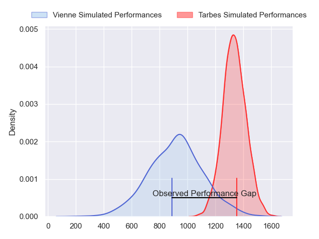
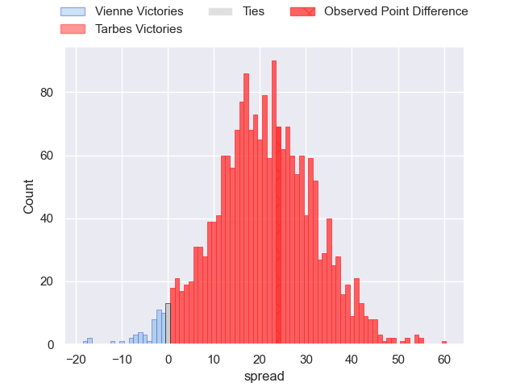
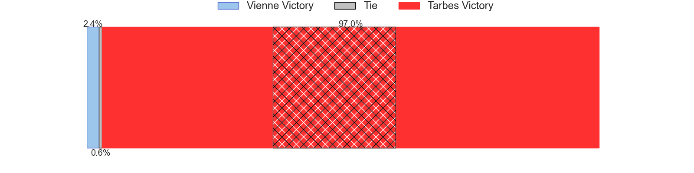
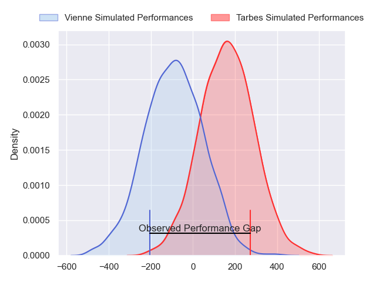
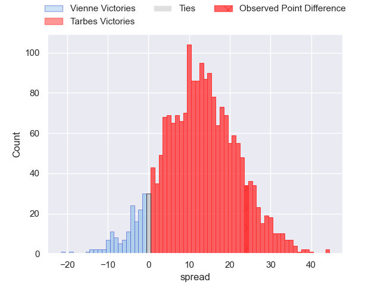
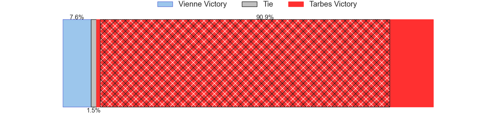

---  
layout: page  
title: Vienne at Tarbes; 7-31  
date: 2024-02-24 18:00:00 -0500  
categories: "Nationale 2023" match review  
---
# Vienne at Tarbes; 7-31

# Club Level Predictions

The first set of predictions treats a club as the smallest object, as the club develops its members, organizes a gameplan, and deploys its players as needed for each match. This club model has a prediction of 0.886, which translates to predicting Tarbes to win by 20.9.

Our Over/Under is 40.5 - and combined with the spread above, we have a predicted scoreline of 10 to 31

Each club has a rating and a rating deviation (similar to a Glicko rating), and expected performances can be generated. This allows for simulated matches and spreads like the ones below.
## Projected Performances - Club Model

## Projected Spreads - Club Model

## Projected Results - Club Model

# Player Level Predictions - Version 2

Treating teams instead as an entity made up of the currently active players, I have ratings for each player in an altogether different system. These can be combined to form team ratings once teamsheets are announced, weighting starters a bit higher than the reserves. After the match is played, players can be weighted by their minutes on the field, allowing for an accurate measure of the team's composition. With these compiled team ratings, we can make predictions, measure inaccuracy, and update the individual player ratings.
## Prediction without Player Minutes: Tarbes by 13.3

Tarbes by 7.0 on a neutral pitch

## Projected Performances - Player Model

## Projected Spreads - Player Model

## Projected Results - Player Model

|   Away Minutes | Away Player      |   Away Percentile |   Number |   Home Percentile | Home Player            |   Home Minutes |
|---------------:|:-----------------|------------------:|---------:|------------------:|:-----------------------|---------------:|
|             80 | Louan Capuano    |             16.64 |        1 |             42.13 | Johan Mees Erasmus     |             80 |
|             80 | Dimitri Gibierge |              3.68 |        2 |             64.15 | Vincent Dolier         |             80 |
|             80 | Corentin Durand  |             42.04 |        3 |             16.91 | Aleksi Tchitchiashvili |             80 |
|             80 | Pierre Chapelle  |             28.13 |        4 |             77.96 | Léo Saint-Guilhem      |             80 |
|             80 | Ciaran O'Flynn   |              9.87 |        5 |             73.59 | Baptiste Peytavi       |             80 |
|             80 | Léon Peyrat      |              2.65 |        6 |             71.05 | Jean Guicherd          |             80 |
|             80 | Charles Massot   |              2.44 |        7 |             53.66 | Jon Abadie             |             80 |
|             80 | Théo Minodier    |             12.82 |        8 |             13.29 | Filipe Manu            |             80 |
|             80 | Malory Piet      |             38.39 |        9 |             50.2  | Thibaut Dulucq         |             80 |
|             80 | Tom Richard      |              7.14 |       10 |             37.62 | Mathieu Berbizier      |             80 |
|             80 | Hippolyte Massa  |             29.98 |       11 |              2.65 | Jone Tuva              |             80 |
|             80 | Matthias Giovale |              7.79 |       12 |             51.28 | Clement Latorre        |             80 |
|             80 | Pierre Mollard   |             20.81 |       13 |             71.98 | Savenaca Rawaca        |             80 |
|             80 | Théo Brunel      |             31.04 |       14 |              3.07 | Johan Paulet           |             80 |
|             80 | Brandon Bellavia |             10.85 |       15 |             71.59 | Yon Camou              |             80 |

