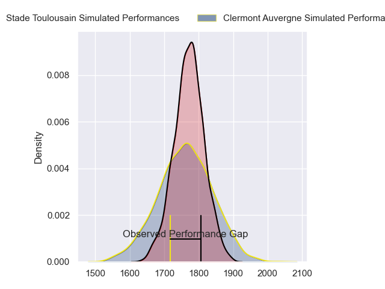
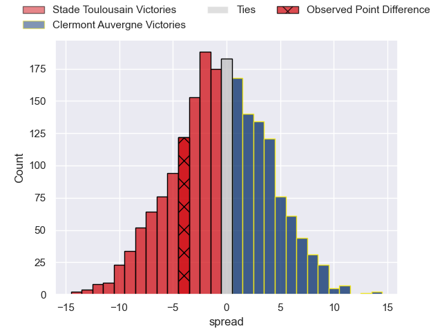
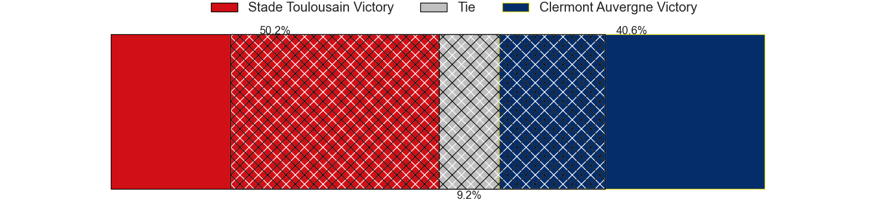
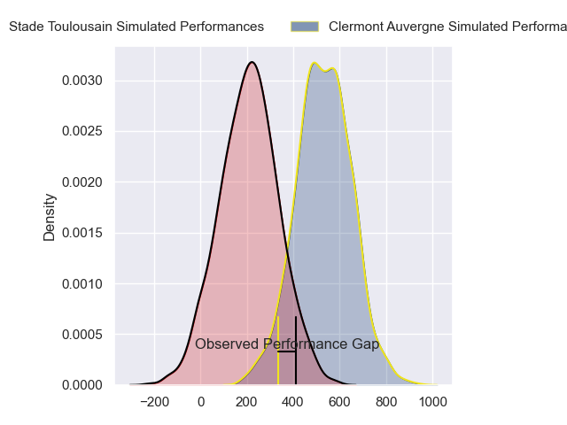
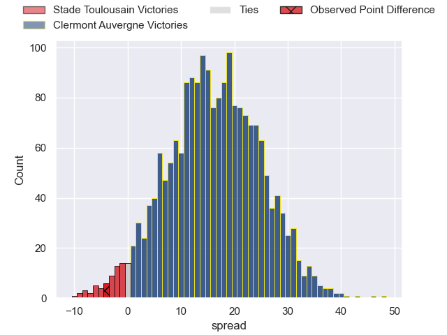
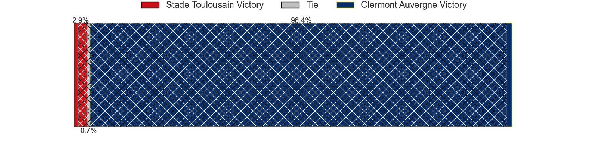

---  
layout: page  
title: Stade Toulousain at Clermont Auvergne; 37-33  
date: 2024-02-25 18:00:00 -0500  
categories: "Top 14 Orange 2023" match review  
---
# Stade Toulousain at Clermont Auvergne; 37-33

# Club Level Predictions

The first set of predictions treats a club as the smallest object, as the club develops its members, organizes a gameplan, and deploys its players as needed for each match. This club model has a prediction of 0.484, which translates to predicting Stade Toulousain to win by 0.6.

Our Over/Under is 48.5 - and combined with the spread above, we have a predicted scoreline of 24 to 24

Each club has a rating and a rating deviation (similar to a Glicko rating), and expected performances can be generated. This allows for simulated matches and spreads like the ones below.
## Projected Performances - Club Model

## Projected Spreads - Club Model

## Projected Results - Club Model

# Player Level Predictions - Version 2

Treating teams instead as an entity made up of the currently active players, I have ratings for each player in an altogether different system. These can be combined to form team ratings once teamsheets are announced, weighting starters a bit higher than the reserves. After the match is played, players can be weighted by their minutes on the field, allowing for an accurate measure of the team's composition. With these compiled team ratings, we can make predictions, measure inaccuracy, and update the individual player ratings.
## Prediction without Player Minutes: Clermont Auvergne by 18.2

Clermont Auvergne by 10.8 on a neutral pitch

## Projected Performances - Player Model

## Projected Spreads - Player Model

## Projected Results - Player Model

|   Away Minutes | Away Player          |   Away Percentile |   Number |   Home Percentile | Home Player          |   Home Minutes |
|---------------:|:---------------------|------------------:|---------:|------------------:|:---------------------|---------------:|
|             52 | David Ainu'u         |             87.03 |        1 |             45.35 | Giorgi Beria         |             52 |
|             63 | Guillaume Cramont    |             78.68 |        2 |             94.67 | Folau Fainga'a       |             80 |
|             52 | Joel Merkler         |             64.67 |        3 |             73.35 | Cristian Ojovan      |             80 |
|             73 | Joshua Brennan       |             73.48 |        4 |             95.18 | Rob Simmons          |             80 |
|             62 | Piula Fa'asalele     |             65.9  |        5 |             93    | Tomas Lavanini       |             52 |
|             11 | Alban Placines       |             72    |        6 |             28.31 | Peceli Yato          |             55 |
|             80 | Leo Banos            |             70.84 |        7 |             80.81 | Marcos Kremer        |             77 |
|             63 | Mathis Castro        |             60.14 |        8 |             91.14 | Fritz Lee            |             15 |
|             63 | Baptiste Germain     |              6.1  |        9 |             93.11 | Sebastien Bezy       |             46 |
|             80 | Juan Cruz Mallia     |             97.38 |       10 |             87.38 | Benjamin Urdapilleta |             61 |
|             80 | Arthur Retiere       |             95.13 |       11 |             21.19 | Alivereti Raka       |             80 |
|             80 | Pierre-Louis Barassi |             88.14 |       12 |             95.58 | George Moala         |             80 |
|             80 | Paul Costes          |             58.95 |       13 |             20.35 | Pierre Fouyssac      |             61 |
|             79 | Lucas Tauzin         |             62.29 |       14 |             85.7  | Bautista Delguy      |             80 |
|             80 | Kalvin Gourgues      |             58.2  |       15 |             76.44 | Alex Newsome         |             80 |
|             17 | Malachi Hawkes       |            nan    |       16 |            nan    | Henzo Kiteau         |              0 |
|             28 | Rodrigue Neti        |             45.8  |       17 |             23.43 | Daniel Bibi Biziwu   |             28 |
|             25 | Richie Arnold        |             70.72 |       18 |             83.47 | Thibaud Lanen        |             28 |
|             69 | Clement Verge        |            nan    |       19 |             75.93 | Killian Tixeront     |             28 |
|             17 | Leo Labarthe         |            nan    |       20 |             52.56 | Baptiste Jauneau     |             34 |
|              1 | Celian Pouzelgues    |            nan    |       21 |            nan    | Jules Plisson        |             19 |
|             17 | Sofiane Guitoune     |             95.81 |       22 |             25.87 | Thomas Roziere       |             19 |
|             28 | Paul Mallez          |            nan    |       23 |             91.14 | Rabah Slimani        |             65 |

