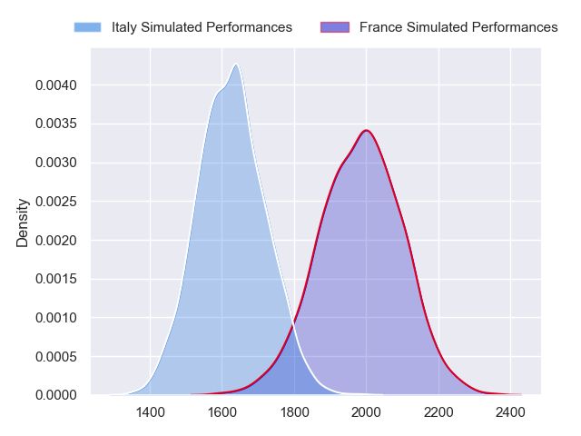
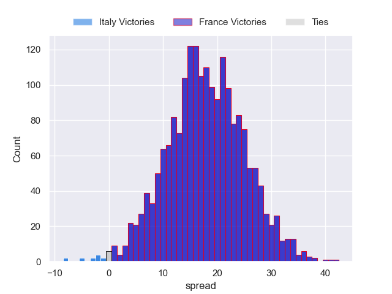
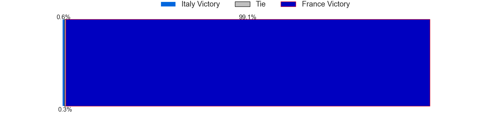
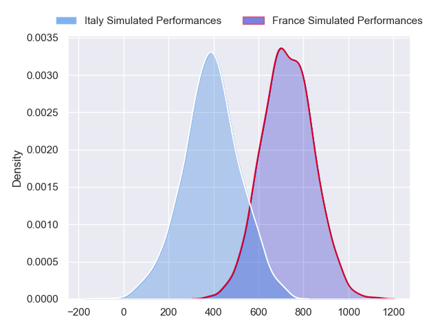
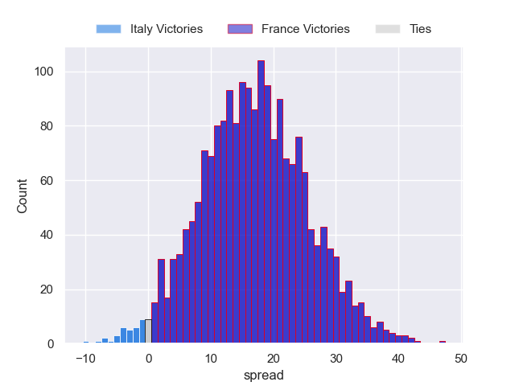
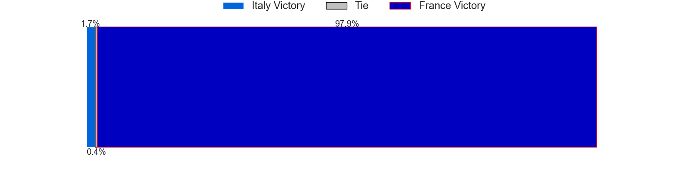

---  
layout: page  
title: Italy at France; 13-13  
date: 2024-02-25 18:00:00 -0500  
categories: "Six Nations Championship 2024" match review  
---
# Italy at France; 13-13

# Club Level Predictions

The first set of predictions treats a club as the smallest object, as the club develops its members, organizes a gameplan, and deploys its players as needed for each match. This club model has a prediction of 0.879, which translates to predicting France to win by 18.0.

Our Over/Under is 60.5 - and combined with the spread above, we have a predicted scoreline of 21 to 39

Each club has a rating and a rating deviation (similar to a Glicko rating), and expected performances can be generated. This allows for simulated matches and spreads like the ones below.
## Projected Performances - Club Model

## Projected Spreads - Club Model

## Projected Results - Club Model

# Player Level Predictions - Version 2

Treating teams instead as an entity made up of the currently active players, I have ratings for each player in an altogether different system. These can be combined to form team ratings once teamsheets are announced, weighting starters a bit higher than the reserves. After the match is played, players can be weighted by their minutes on the field, allowing for an accurate measure of the team's composition. With these compiled team ratings, we can make predictions, measure inaccuracy, and update the individual player ratings.
## Prediction without Player Minutes: France by 22.7

France by 18.9 on a neutral pitch

## Projected Performances - Player Model

## Projected Spreads - Player Model

## Projected Results - Player Model

|   Away Minutes | Away Player        |   Away Percentile |   Number |   Home Percentile | Home Player          |   Home Minutes |
|---------------:|:-------------------|------------------:|---------:|------------------:|:---------------------|---------------:|
|             57 | Danilo Fischetti   |             67.62 |        1 |             94.54 | Cyril Baille         |             48 |
|             57 | Giacomo Nicotera   |             98.16 |        2 |             92.83 | Peato Mauvaka        |             49 |
|             64 | Giosue Zilocchi    |             62.52 |        3 |             99.46 | Uini Atonio          |             49 |
|             80 | Niccolo Cannone    |             57.75 |        4 |             79.56 | Cameron Woki         |             49 |
|             66 | Federico Ruzza     |             96.21 |        5 |             26.75 | Posolo Tuilagi       |             48 |
|             49 | Riccardo Favretto  |             27.68 |        6 |             13.04 | Paul Boudehent       |             80 |
|             80 | Michele Lamaro     |             95.65 |        7 |             96.82 | Charles Ollivon      |             66 |
|             80 | Ross Vintcent      |             66.2  |        8 |             96.74 | Francois Cros        |             80 |
|             54 | Martin Page-Relo   |             79.53 |        9 |             99.41 | Maxime Lucu          |             49 |
|             80 | Paolo Garbisi      |             79.05 |       10 |             96.43 | Matthieu Jalibert    |             37 |
|             80 | Monty Ioane        |             98.94 |       11 |             98.2  | Matthis Lebel        |             80 |
|             66 | Federico Mori      |             61.63 |       12 |             95    | Jonathan Danty       |             80 |
|             80 | Juan Ignacio Brex  |             93.49 |       13 |             94.77 | Gael Fickou          |             80 |
|             80 | Tommaso Menoncello |             86.97 |       14 |             93.33 | Damian Penaud        |             80 |
|             80 | Ange Capuozzo      |             94    |       15 |             94.46 | Thomas Ramos         |             80 |
|             23 | Gianmarco Lucchesi |             79.96 |       16 |             98.71 | Julien Marchand      |             31 |
|             23 | Mirco Spagnolo     |            nan    |       17 |             15.92 | Sebastien Taofifenua |             32 |
|             16 | Simone Ferrari     |             97.05 |       18 |             97.41 | Dorian Aldegheri     |             31 |
|              0 | Matteo Canali      |             87.94 |       19 |             48.79 | Romain Taofifenua    |             32 |
|             14 | Andrea Zambonin    |             45.24 |       20 |             96.04 | Alexandre Roumat     |             31 |
|             31 | Manuel Zuliani     |             68.61 |       21 |             37.01 | Esteban Abadie       |             14 |
|             26 | Stephen Varney     |             18.9  |       22 |            nan    | Nolann le Garrec     |             31 |
|             14 | Leonardo Marin     |             64.05 |       23 |             83.05 | Yoram Moefana        |             43 |

