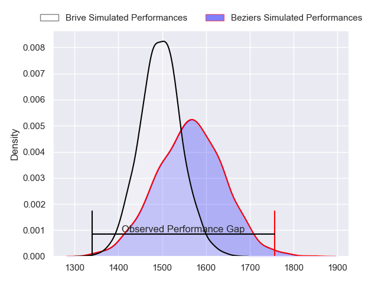
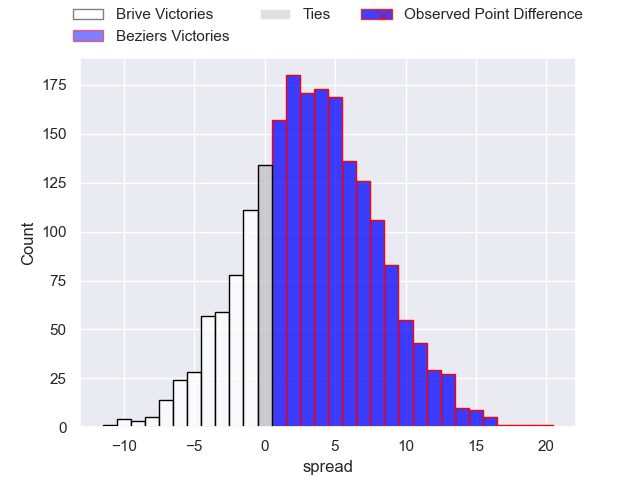
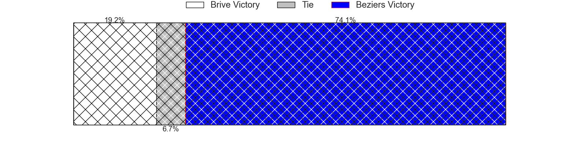
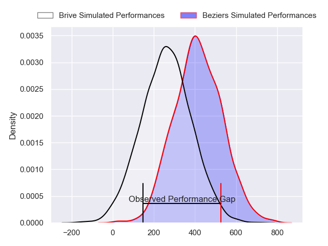
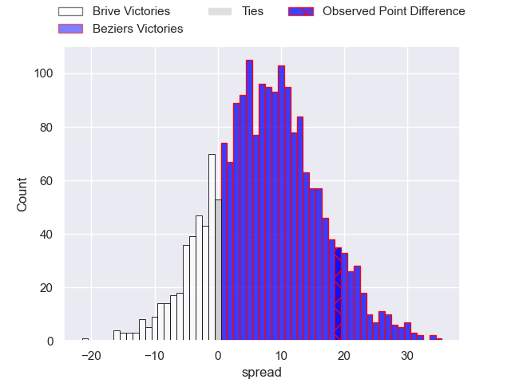
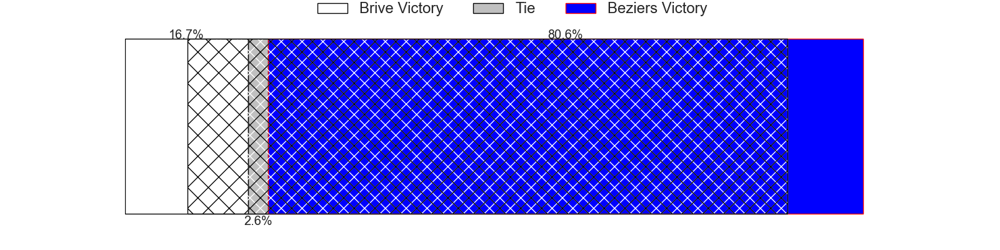

---  
layout: page  
title: Brive at Beziers; 15-34  
date: 2024-02-29 18:00:00 -0500  
categories: "Pro D2 2023" match review  
---
# Brive at Beziers; 15-34

# Club Level Predictions

The first set of predictions treats a club as the smallest object, as the club develops its members, organizes a gameplan, and deploys its players as needed for each match. This club model has a prediction of 0.596, which translates to predicting Beziers to win by 3.4.

Our Over/Under is 51.5 - and combined with the spread above, we have a predicted scoreline of 24 to 27

Each club has a rating and a rating deviation (similar to a Glicko rating), and expected performances can be generated. This allows for simulated matches and spreads like the ones below.
## Projected Performances - Club Model

## Projected Spreads - Club Model

## Projected Results - Club Model

# Player Level Predictions - Version 2

Treating teams instead as an entity made up of the currently active players, I have ratings for each player in an altogether different system. These can be combined to form team ratings once teamsheets are announced, weighting starters a bit higher than the reserves. After the match is played, players can be weighted by their minutes on the field, allowing for an accurate measure of the team's composition. With these compiled team ratings, we can make predictions, measure inaccuracy, and update the individual player ratings.
## Prediction without Player Minutes: Beziers by 9.5

Beziers by 1.3 on a neutral pitch

## Projected Performances - Player Model

## Projected Spreads - Player Model

## Projected Results - Player Model

|   Away Minutes | Away Player               |   Away Percentile |   Number |   Home Percentile | Home Player         |   Home Minutes |
|---------------:|:--------------------------|------------------:|---------:|------------------:|:--------------------|---------------:|
|             56 | Hugo Reilhes              |             68.97 |        1 |             33.58 | Francisco Fernandes |             76 |
|             62 | Issam Hamel               |             76.98 |        2 |             84.91 | Jose Luis Gonzalez  |             55 |
|             51 | Marcel van der Merwe      |             11.62 |        3 |             82.4  | Jon Zabala Arrieta  |             68 |
|             51 | Tevita Ratuva             |             70.12 |        4 |             70.94 | Clément Bitz        |             55 |
|             51 | Julien Delannoy           |             30.24 |        5 |             41.65 | John Madigan        |             55 |
|             80 | Retief Marais             |             68.25 |        6 |             62.96 | William van Bost    |             80 |
|             62 | Sasha Gue                 |             52.7  |        7 |             80.13 | Sias Koen           |             80 |
|             80 | Ross Moriarty             |             84.74 |        8 |             14.32 | Hans N'kinsi        |             80 |
|             80 | Leo Carbonneau            |             27.54 |        9 |             94.61 | Samuel Marques      |             73 |
|             68 | Stuart Olding             |             88.16 |       10 |             73.19 | Charly Malie        |             58 |
|             30 | Rahboni Warren-Vosayaco   |             67.1  |       11 |             81.99 | Nicolas Plazy       |             80 |
|             80 | Guillaume Galletier       |             56.3  |       12 |             78.8  | Taleta Tupuola      |             80 |
|             80 | Paula Walisolio           |             31.21 |       13 |             64.78 | Paul Recor          |             80 |
|             80 | Arthur Bonneval           |             75.67 |       14 |             94.21 | Raffaele Storti     |             58 |
|             80 | Mathis Ferté              |             53.59 |       15 |             92.82 | Gabin Lorre         |             80 |
|             50 | Thomas Laranjeira         |             76.79 |       16 |             14.35 | Pierre Gayraud      |             25 |
|             29 | Asier Usarraga            |             67.29 |       17 |             77.36 | Wilmar Arnoldi      |             25 |
|             29 | Renger Van Eerten         |             53.76 |       18 |              9.29 | Gillian Benoy       |             25 |
|             29 | Francisco Coria Marchetti |             16.79 |       19 |             92.51 | Tim Nanai-Williams  |             22 |
|             24 | Nathan Fraissenon         |            nan    |       20 |             34.41 | Pierre Courtaud     |             22 |
|             18 | Lucas da Silva            |             34.72 |       21 |             61.89 | Luka Tchelidze      |             12 |
|             18 | Taniela Sadrugu           |             51.64 |       22 |             21.16 | Jean Victor Goillot |              7 |
|             12 | Julien Blanc              |             66.47 |       23 |            nan    | Clément Samper      |              4 |

