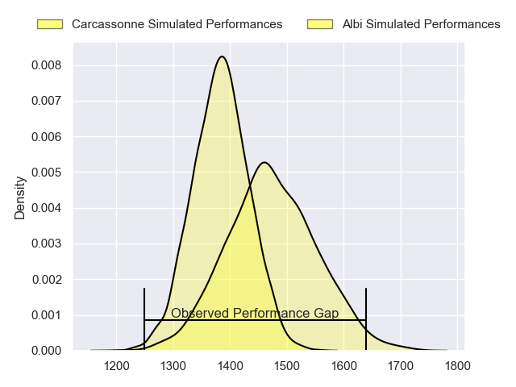
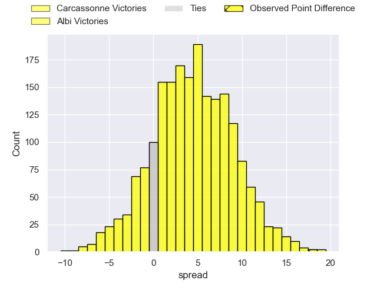
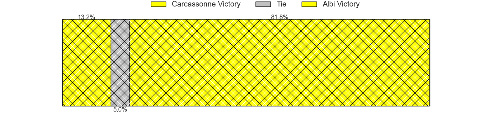
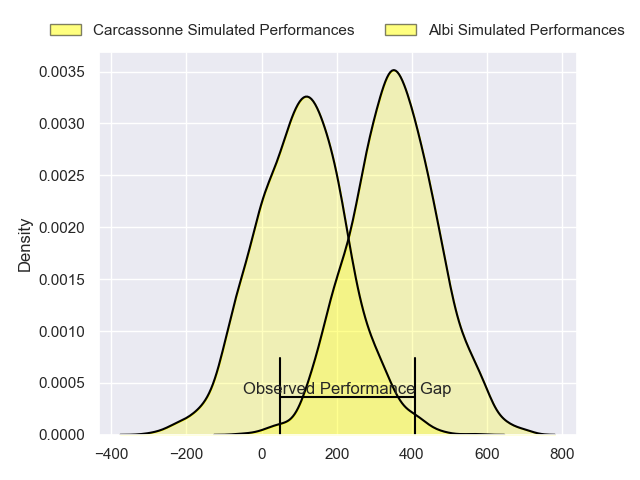
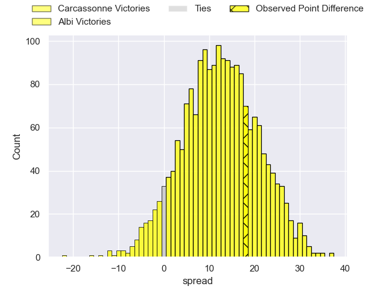
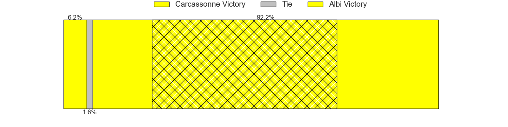

---  
layout: page  
title: Carcassonne at Albi; 5-23  
date: 2024-03-01 18:00:00 -0500  
categories: "Nationale 2023" match review  
---
# Carcassonne at Albi; 5-23

# Club Level Predictions

The first set of predictions treats a club as the smallest object, as the club develops its members, organizes a gameplan, and deploys its players as needed for each match. This club model has a prediction of 0.627, which translates to predicting Albi to win by 4.6.

Our Over/Under is 34.5 - and combined with the spread above, we have a predicted scoreline of 15 to 20

Each club has a rating and a rating deviation (similar to a Glicko rating), and expected performances can be generated. This allows for simulated matches and spreads like the ones below.
## Projected Performances - Club Model

## Projected Spreads - Club Model

## Projected Results - Club Model

# Player Level Predictions - Version 2

Treating teams instead as an entity made up of the currently active players, I have ratings for each player in an altogether different system. These can be combined to form team ratings once teamsheets are announced, weighting starters a bit higher than the reserves. After the match is played, players can be weighted by their minutes on the field, allowing for an accurate measure of the team's composition. With these compiled team ratings, we can make predictions, measure inaccuracy, and update the individual player ratings.
## Prediction without Player Minutes: Albi by 14.0

Albi by 7.2 on a neutral pitch

## Projected Performances - Player Model

## Projected Spreads - Player Model

## Projected Results - Player Model

|   Away Minutes | Away Player           |   Away Percentile |   Number |   Home Percentile | Home Player             |   Home Minutes |
|---------------:|:----------------------|------------------:|---------:|------------------:|:------------------------|---------------:|
|             54 | Florent Lorenzon      |             45.32 |        1 |             90.55 | Antoine Soave           |             51 |
|             54 | Luka Petriashvili     |             66.42 |        2 |             88.49 | Romain Maurice          |             62 |
|             54 | Fabien Lorenzon       |             76.75 |        3 |             78.66 | Jean Baptiste De Clercq |             51 |
|             80 | Romain Manchia        |             18.47 |        4 |             41.41 | Guillem Calmon          |             80 |
|             54 | Marius Iftimiciuc     |             11.53 |        5 |             12.35 | Jacques Engelbrecht     |             53 |
|             58 | Gary Graham           |             81.84 |        6 |             47.89 | Pierre Roussel          |             80 |
|             80 | Etienne Herjean       |             66.16 |        7 |             59.68 | Vincent Calas           |             80 |
|             54 | Romain Guyot          |             60.33 |        8 |             82.39 | Sandrick Maciotta       |             60 |
|             80 | Gaetan Pichon         |             18.16 |        9 |             83.03 | Gilen Queheille         |             60 |
|             80 | Damien Añon           |             30.02 |       10 |             83.78 | Benjamin Pehau          |             80 |
|             80 | Clement Egiziano      |             75.88 |       11 |             64.09 | Sean Robinson           |             80 |
|             54 | Tutuila Vaea          |             44.76 |       12 |             66.43 | Gabriel Aviragnet       |             51 |
|             80 | Mathys Barka          |             55.59 |       13 |             93.64 | Baptiste Couchinave     |             53 |
|             80 | Sakiusa Bureitakiyaca |             23.79 |       14 |             78.46 | Simon Hartmann          |             80 |
|             54 | Enahemo Artaud        |             27.27 |       15 |             33.01 | Téo Dospital            |             80 |
|             26 | Jordan Puletua        |             14.37 |       16 |             88.83 | Dimitri Tchapnga        |             29 |
|             26 | Nikoloz Narmania      |             70.48 |       17 |             37.22 | Jarrod Poi              |             29 |
|             26 | Valentin Sese         |             36.76 |       18 |            nan    | Lucas Pindor            |             29 |
|             26 | Yan Arnold            |            nan    |       19 |              3.39 | James Haydn Tedder      |             27 |
|             26 | Clément Fontaine      |             27.29 |       20 |             25.76 | Dion Evrard Oulai       |             27 |
|             26 | Maxime Gianet         |             66.75 |       21 |             72.77 | Camille Jarreau         |             20 |
|             26 | Raphael Carbou        |             49.25 |       22 |             95.21 | Théo Vidal              |             20 |
|             22 | Corentin Bousquet     |             32.86 |       23 |             17.92 | Reinach Venter          |             18 |

