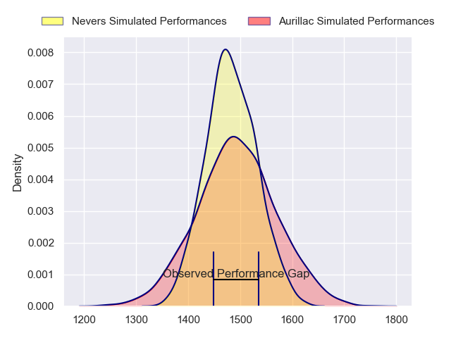
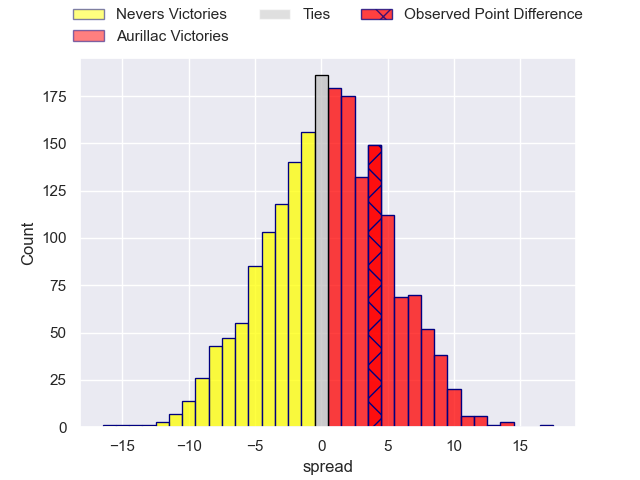
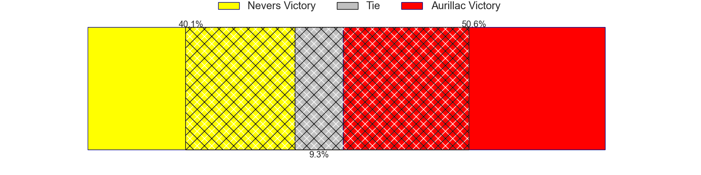
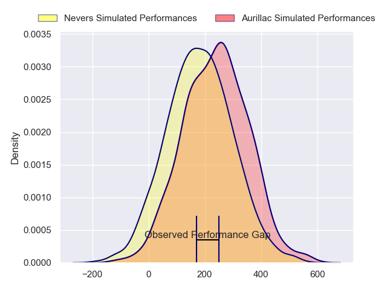
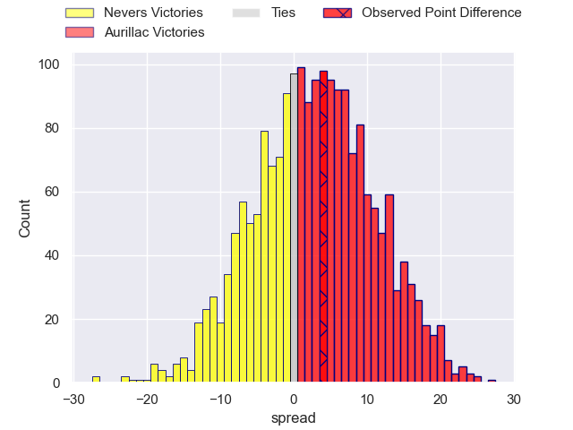
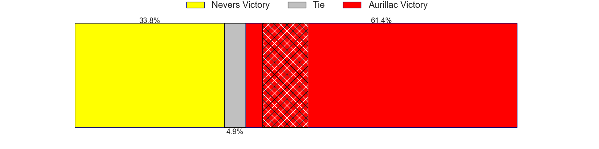

---  
layout: page  
title: Nevers at Aurillac; 12-16  
date: 2024-03-01 18:00:00 -0500  
categories: "Pro D2 2023" match review  
---
# Nevers at Aurillac; 12-16

# Club Level Predictions

The first set of predictions treats a club as the smallest object, as the club develops its members, organizes a gameplan, and deploys its players as needed for each match. This club model has a prediction of 0.513, which translates to predicting Aurillac to win by 0.4.

Our Over/Under is 36.5 - and combined with the spread above, we have a predicted scoreline of 18 to 18

Each club has a rating and a rating deviation (similar to a Glicko rating), and expected performances can be generated. This allows for simulated matches and spreads like the ones below.
## Projected Performances - Club Model

## Projected Spreads - Club Model

## Projected Results - Club Model

# Player Level Predictions - Version 2

Treating teams instead as an entity made up of the currently active players, I have ratings for each player in an altogether different system. These can be combined to form team ratings once teamsheets are announced, weighting starters a bit higher than the reserves. After the match is played, players can be weighted by their minutes on the field, allowing for an accurate measure of the team's composition. With these compiled team ratings, we can make predictions, measure inaccuracy, and update the individual player ratings.
## Prediction without Player Minutes: Aurillac by 2.4

Nevers by 5.4 on a neutral pitch

## Projected Performances - Player Model

## Projected Spreads - Player Model

## Projected Results - Player Model

|   Away Minutes | Away Player              |   Away Percentile |   Number |   Home Percentile | Home Player         |   Home Minutes |
|---------------:|:-------------------------|------------------:|---------:|------------------:|:--------------------|---------------:|
|             53 | Tornike Mataradze        |             57.17 |        1 |             13.79 | Robert Rodgers      |             63 |
|             61 | Jonathan Maiau           |             15.47 |        2 |             42.83 | Ronan Loughnane     |             51 |
|             53 | Ilia Kaikatsishvili      |             63.52 |        3 |             30.58 | Tim Daniel-Meissen  |             61 |
|             50 | Lado Chachanidze         |             48.35 |        4 |             57.76 | Martial Rolland     |             68 |
|             41 | Chris Gabriel            |             56.35 |        5 |             80.35 | Cam Dodson          |             80 |
|             53 | Luka Plataret            |             79.81 |        6 |             82.51 | Heath Backhouse     |             46 |
|             80 | Julien Kazubek           |             84.88 |        7 |             74.3  | Hugo Huurman        |             80 |
|             80 | Steven David             |             62.21 |        8 |             10.8  | Latuka Maituku      |             46 |
|             63 | Hugo Bouyssou            |             12.18 |        9 |             28.54 | David Delarue       |             76 |
|             80 | Shaun Reynolds           |             39.37 |       10 |             42.03 | Antoine Aucagne     |             80 |
|             80 | Arthur Mathiron          |             52.73 |       11 |             75.24 | AJ Coertzen         |             80 |
|             80 | Rudy Derrieux            |             87.51 |       12 |             13.43 | Christa Powell      |             80 |
|             80 | Alifereti Loaloa         |             76.68 |       13 |             73.14 | Ofa Manuofetoa      |             80 |
|             80 | Christian Ambadiang      |             62.59 |       14 |             11.9  | Simeli Yabaki       |             61 |
|             56 | Dylan Jaminet            |             67.94 |       15 |             21.05 | Marc Palmier        |             80 |
|             39 | Christiaan van der Merwe |              8.35 |       16 |             92.83 | Lasha Mchelidze     |             19 |
|             30 | Kevin Noah               |             35.06 |       17 |             82    | Eoghan Masterson    |             34 |
|             27 | Kamaliele Tufele         |             73.41 |       18 |             47.52 | Didier Tison        |             34 |
|             27 | Hugues Bastide           |             89.85 |       19 |             52.9  | Irakli Mtchedlidze  |             29 |
|             27 | Aselo Ikahehegi          |            nan    |       20 |             67.52 | Juun Pieters        |             19 |
|             19 | Quentin Beaudaux         |             42.45 |       21 |             12.89 | Jean-Jacques Gymael |             17 |
|             24 | Yohan Le Bourhis         |             72.95 |       22 |             13.39 | Théo Cambon         |             12 |
|             17 | Arthurs Barbier          |             74.65 |       23 |            nan    | Leo Salvan          |              4 |

