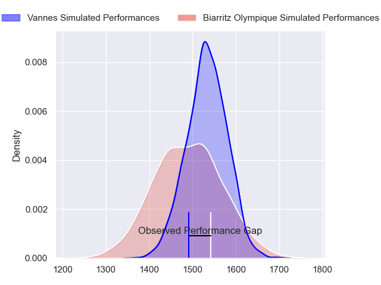
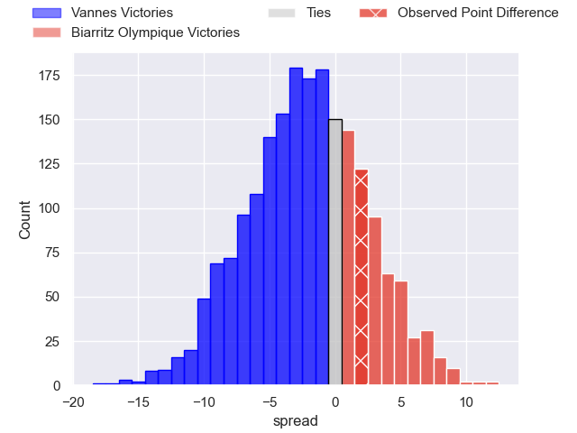
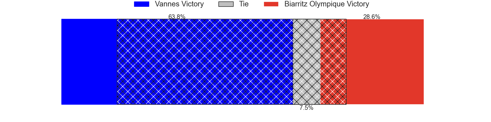
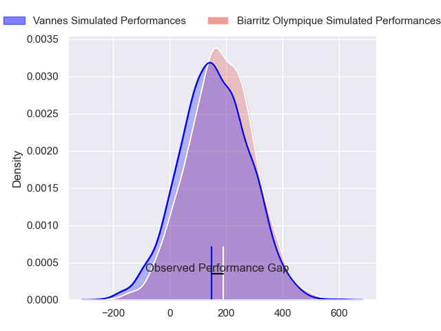
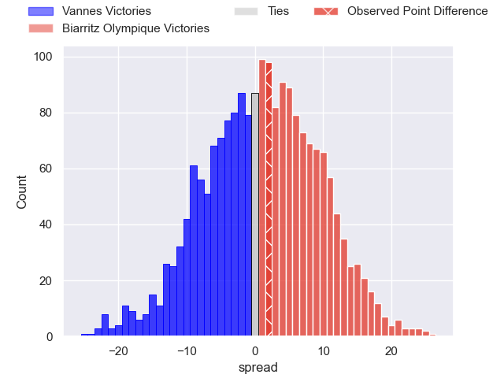

---  
layout: page  
title: Vannes at Biarritz Olympique; 10-12  
date: 2024-03-01 18:00:00 -0500  
categories: "Pro D2 2023" match review  
---
# Vannes at Biarritz Olympique; 10-12

# Club Level Predictions

The first set of predictions treats a club as the smallest object, as the club develops its members, organizes a gameplan, and deploys its players as needed for each match. This club model has a prediction of 0.441, which translates to predicting Vannes to win by 2.1.

Our Over/Under is 49.5 - and combined with the spread above, we have a predicted scoreline of 26 to 24

Each club has a rating and a rating deviation (similar to a Glicko rating), and expected performances can be generated. This allows for simulated matches and spreads like the ones below.
## Projected Performances - Club Model

## Projected Spreads - Club Model

## Projected Results - Club Model

# Player Level Predictions - Version 2

Treating teams instead as an entity made up of the currently active players, I have ratings for each player in an altogether different system. These can be combined to form team ratings once teamsheets are announced, weighting starters a bit higher than the reserves. After the match is played, players can be weighted by their minutes on the field, allowing for an accurate measure of the team's composition. With these compiled team ratings, we can make predictions, measure inaccuracy, and update the individual player ratings.
## Prediction without Player Minutes: Biarritz Olympique by 1.6

Vannes by 7.2 on a neutral pitch

## Projected Performances - Player Model

## Projected Spreads - Player Model

## Projected Results - Player Model

|   Away Minutes | Away Player           |   Away Percentile |   Number |   Home Percentile | Home Player              |   Home Minutes |
|---------------:|:----------------------|------------------:|---------:|------------------:|:-------------------------|---------------:|
|             55 | Charles-Henri Berguet |             31.99 |        1 |             20.35 | Kevin Tougne             |             54 |
|             49 | Pat Leafa             |             86.45 |        2 |             76.34 | Thomas Sauveterre        |             40 |
|             55 | Paga Tafili           |             91.84 |        3 |             82.31 | Mohamed Haouas           |             66 |
|             55 | Eric Marks            |             11.32 |        4 |             49.46 | Tiaan Jacobs             |             40 |
|             66 | Mattéo Desjeux        |             15.61 |        5 |             65.91 | Nafi Ma'afu              |             64 |
|             49 | Karl Chateau          |             14.32 |        6 |             36.12 | Dave O'Callaghan         |             54 |
|             80 | Gregoire Bazin        |             22.69 |        7 |             53.74 | Simon Augry              |             80 |
|             80 | Sione Kalamafoni      |             52.67 |        8 |             41.02 | Temo Matiu               |             80 |
|             60 | Erwan Nicolas         |             64.42 |        9 |             31.29 | Pierre Pages             |             80 |
|             52 | Jean Cotarmanac'h     |             20.9  |       10 |              9.45 | Billy Searle             |             80 |
|             80 | Théo Bastardie        |             67.67 |       11 |             53.06 | Gervais Cordin           |             80 |
|             80 | Alex Arrate           |             12.14 |       12 |              7.02 | Francois Vergnaud        |             80 |
|             80 | Arthur Proult         |              6.07 |       13 |             19.52 | Vincent Martin           |             80 |
|             80 | Paul Surano           |             53.72 |       14 |             19.76 | Zach Kibirige            |             64 |
|             80 | Gwenaël Duplenne      |             98.56 |       15 |             70.5  | Joe Jonas                |             80 |
|             31 | Théo Beziat           |             54.2  |       16 |              3.34 | Adrian Motoc             |             40 |
|             31 | Joe Edwards           |             92.97 |       17 |             43.13 | Luteru Tolai             |             40 |
|             28 | Massimo Ortolan       |              6.72 |       18 |             28.3  | Thomas Hebert            |             26 |
|             25 | Thomas Moukoro        |             29.51 |       19 |             39.69 | Killian Taofifenua       |             26 |
|             25 | Matthieu Uhila        |            nan    |       20 |             39.81 | Pieter Jansen van Vuuren |             16 |
|             25 | Jérémy Boyadjis       |             74.89 |       21 |             57.57 | Baptiste Fariscot        |             16 |
|             20 | Alexandre Gouaux      |            nan    |       22 |              5.22 | Alfie Petch              |             14 |
|             14 | Timothé Mezou         |            nan    |       23 |            nan    | nan                      |            nan |

