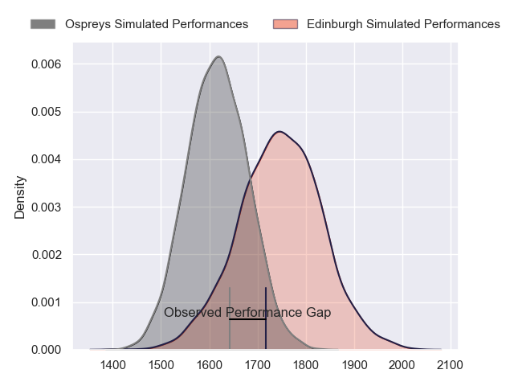
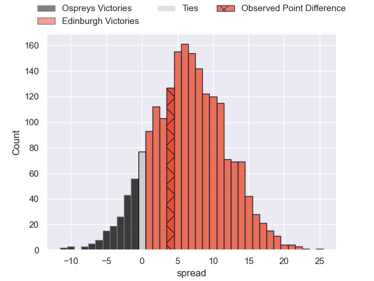
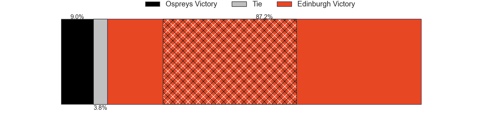
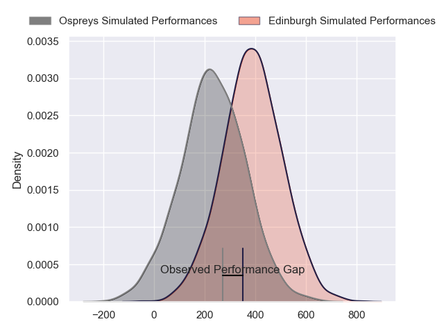
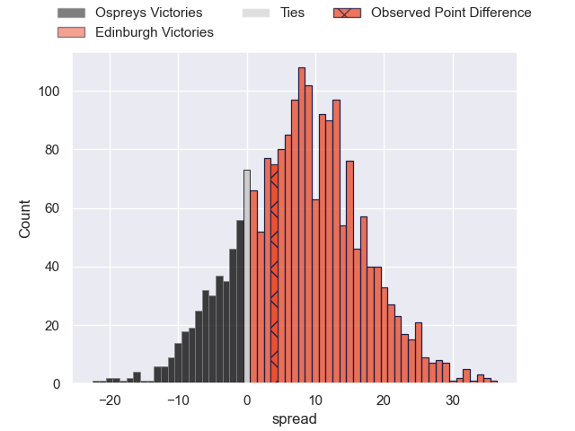
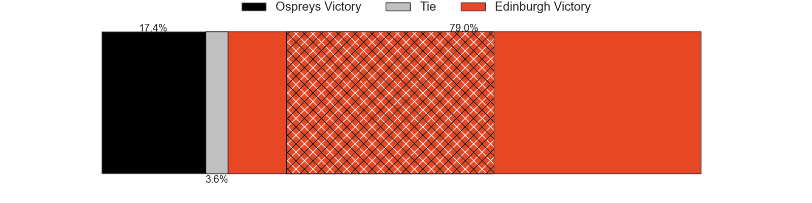

---  
layout: page  
title: Ospreys at Edinburgh; 15-19  
date: 2024-03-01 18:00:00 -0500  
categories: "United Rugby Championship 2023" match review  
---
# Ospreys at Edinburgh; 15-19

# Club Level Predictions

The first set of predictions treats a club as the smallest object, as the club develops its members, organizes a gameplan, and deploys its players as needed for each match. This club model has a prediction of 0.674, which translates to predicting Edinburgh to win by 6.4.

Our Over/Under is 38.5 - and combined with the spread above, we have a predicted scoreline of 16 to 22

Each club has a rating and a rating deviation (similar to a Glicko rating), and expected performances can be generated. This allows for simulated matches and spreads like the ones below.
## Projected Performances - Club Model

## Projected Spreads - Club Model

## Projected Results - Club Model

# Player Level Predictions - Version 2

Treating teams instead as an entity made up of the currently active players, I have ratings for each player in an altogether different system. These can be combined to form team ratings once teamsheets are announced, weighting starters a bit higher than the reserves. After the match is played, players can be weighted by their minutes on the field, allowing for an accurate measure of the team's composition. With these compiled team ratings, we can make predictions, measure inaccuracy, and update the individual player ratings.
## Prediction without Player Minutes: Edinburgh by 9.7

Edinburgh by 3.2 on a neutral pitch

## Projected Performances - Player Model

## Projected Spreads - Player Model

## Projected Results - Player Model

|   Away Minutes | Away Player     |   Away Percentile |   Number |   Home Percentile | Home Player       |   Home Minutes |
|---------------:|:----------------|------------------:|---------:|------------------:|:------------------|---------------:|
|             69 | Nicky Smith     |             54.59 |        1 |             24.34 | Boan Venter       |             70 |
|             56 | Sam Parry       |             62.26 |        2 |             64.34 | Dave Cherry       |             64 |
|             59 | Tom Botha       |             73.66 |        3 |             99.64 | WP Nel            |             52 |
|             80 | James Ratti     |             58.59 |        4 |             84.24 | Sam Skinner       |             64 |
|             54 | Victor Sekekete |             18.24 |        5 |              9.06 | Glen Young        |             80 |
|             80 | Harri Deaves    |             82.81 |        6 |             37.3  | Tom Dodd          |             64 |
|             80 | Justin Tipuric  |             98.27 |        7 |             73.08 | Hamish Watson     |             80 |
|             54 | Jeandre Rudolph |             46.95 |        8 |             84.04 | Viliame Mata      |             80 |
|             80 | Luke Davies     |             49.7  |        9 |             88.22 | Ben Vellacott     |             57 |
|             62 | Dan Edwards     |             36.08 |       10 |             87.65 | Ben Healy         |             80 |
|             80 | Keelan Giles    |              6.97 |       11 |             13.72 | Chris Dean        |             57 |
|             80 | Keiran Williams |             82.21 |       12 |             89.75 | Matt Currie       |             80 |
|             80 | Evardi Boshoff  |             39.1  |       13 |             69.38 | Mark Bennett      |             80 |
|             67 | Alex Cuthbert   |             98.71 |       14 |             47.91 | Harry Paterson    |             80 |
|             80 | Jack Walsh      |             17.94 |       15 |             61.24 | Emiliano Boffelli |             80 |
|             24 | Lewis Lloyd     |            nan    |       16 |            nan    | Patrick Harrison  |             16 |
|             11 | Rhys Henry      |             83.38 |       17 |             27.88 | Luan de Bruin     |             10 |
|             21 | Ben Warren      |            nan    |       18 |             71.12 | Javan Sebastian   |             28 |
|             26 | Rhys Davies     |             89.95 |       19 |             89.88 | Marshall Sykes    |             16 |
|             26 | Morgan Morris   |            nan    |       20 |            nan    | Ben Muncaster     |             16 |
|              0 | Cam Jones       |            nan    |       21 |             87.82 | Ali Price         |             23 |
|             18 | Owen Williams   |             93.7  |       22 |            nan    | Cameron Scott     |              0 |
|             13 | Matt Protheroe  |             92.07 |       23 |            nan    | Wes Goosen        |             23 |

