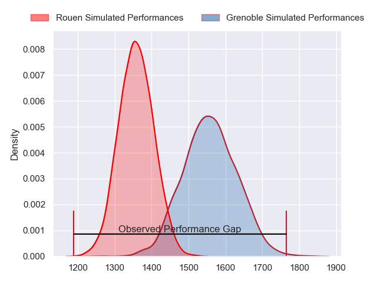
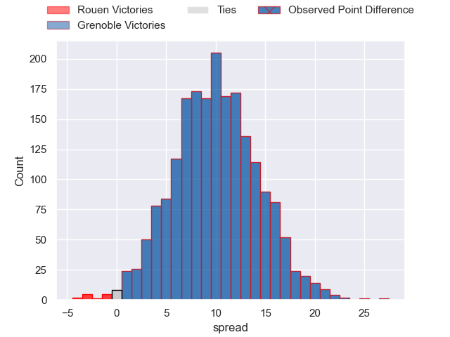
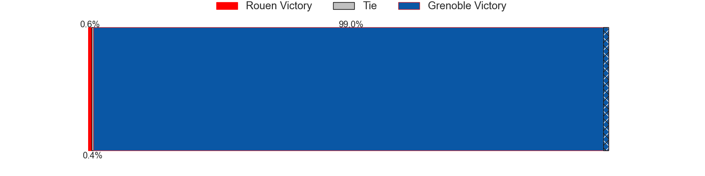
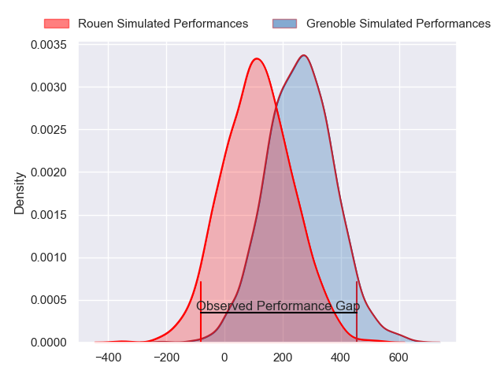
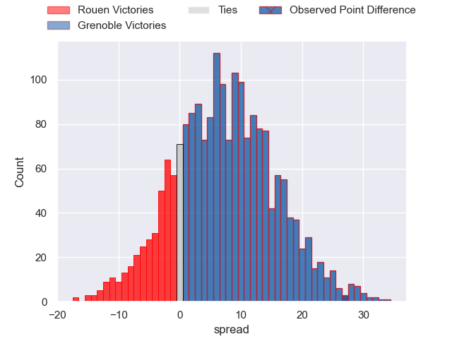
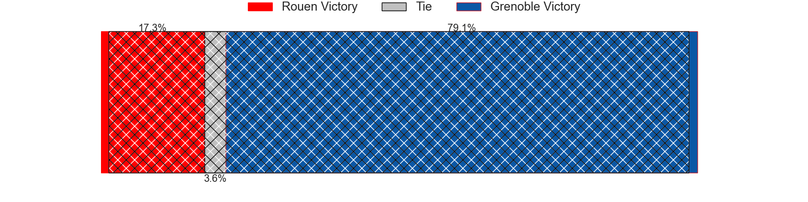

---  
layout: page  
title: Rouen at Grenoble; 16-43  
date: 2024-03-01 18:00:00 -0500  
categories: "Pro D2 2023" match review  
---
# Rouen at Grenoble; 16-43

# Club Level Predictions

The first set of predictions treats a club as the smallest object, as the club develops its members, organizes a gameplan, and deploys its players as needed for each match. This club model has a prediction of 0.757, which translates to predicting Grenoble to win by 10.0.

Our Over/Under is 53.5 - and combined with the spread above, we have a predicted scoreline of 22 to 32

Each club has a rating and a rating deviation (similar to a Glicko rating), and expected performances can be generated. This allows for simulated matches and spreads like the ones below.
## Projected Performances - Club Model

## Projected Spreads - Club Model

## Projected Results - Club Model

# Player Level Predictions - Version 2

Treating teams instead as an entity made up of the currently active players, I have ratings for each player in an altogether different system. These can be combined to form team ratings once teamsheets are announced, weighting starters a bit higher than the reserves. After the match is played, players can be weighted by their minutes on the field, allowing for an accurate measure of the team's composition. With these compiled team ratings, we can make predictions, measure inaccuracy, and update the individual player ratings.
## Prediction without Player Minutes: Grenoble by 7.8

Rouen by 0.1 on a neutral pitch

## Projected Performances - Player Model

## Projected Spreads - Player Model

## Projected Results - Player Model

|   Away Minutes | Away Player          |   Away Percentile |   Number |   Home Percentile | Home Player         |   Home Minutes |
|---------------:|:---------------------|------------------:|---------:|------------------:|:--------------------|---------------:|
|             51 | Enzo Baggiani        |             32.63 |        1 |             51.33 | Luka Goginava       |             59 |
|             51 | Lucas Malbert        |             17.18 |        2 |             24.62 | Mathis Sarragallet  |             49 |
|             51 | Luka Azariashvili    |              2.84 |        3 |             74.61 | Regis Montagne      |             42 |
|             41 | Jean Leleu           |             23.6  |        4 |             48.15 | Thomas Lainault     |             80 |
|             56 | Toby Salmon          |             62.1  |        5 |             62.34 | Pierce Phillips     |             63 |
|             80 | Lucas Costa          |             35.35 |        6 |             56.07 | Antonin Berruyer    |             56 |
|             80 | Julien Ruaud         |             83.7  |        7 |             70.48 | Steeve Blanc-Mappaz |             80 |
|             80 | Tino Mapapalangi     |             24.51 |        8 |             36.65 | Thibaut Martel      |             80 |
|             59 | Florent Campeggia    |             47.85 |        9 |             91.41 | Eric Escande        |             65 |
|             56 | Edgar Retiere        |             48.51 |       10 |             53.98 | Max Clement         |             59 |
|             80 | Paul Vallee          |             66.81 |       11 |             78.63 | Erwan Dridi         |             80 |
|             80 | JT Jackson           |             23.21 |       12 |             32.38 | Romain Fusier       |             80 |
|             80 | Alex Luatua          |              7.5  |       13 |             60.6  | Romain Trouilloud   |             80 |
|             59 | Benjamin Descamps    |             53.81 |       14 |             84.75 | Wilfried Hulleu     |             80 |
|             80 | Pete Lydon           |             84.65 |       15 |             44.36 | Geoffrey Cros       |             65 |
|             39 | Raphaël Vieilledent  |             61.5  |       16 |             70.8  | Barnabé Massa       |             31 |
|             29 | Cody Thomas          |             18.61 |       17 |             36.94 | Vincent Vial        |             38 |
|             29 | Efi Ma'afu           |             38.74 |       18 |             45.39 | Pio Muarua          |             24 |
|             29 | Sidi-Mohammed Diallo |            nan    |       19 |             17.42 | Eli Eglaine         |             21 |
|             24 | Baptiste Mouchous    |             72.9  |       20 |             96.31 | Bautista Ezcurra    |             21 |
|             24 | Jimi Maximin         |             26.22 |       21 |             42.55 | Brandon Nansen      |             17 |
|             21 | Maxime Sidobre       |             73.42 |       22 |             15.59 | Hugo Trouilloud     |             15 |
|             21 | Kevin Bly            |             90.23 |       23 |             96.11 | Felipe Ezcurra      |             15 |

