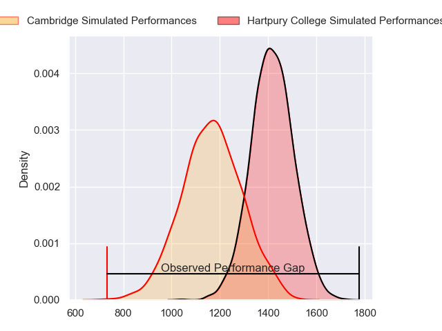
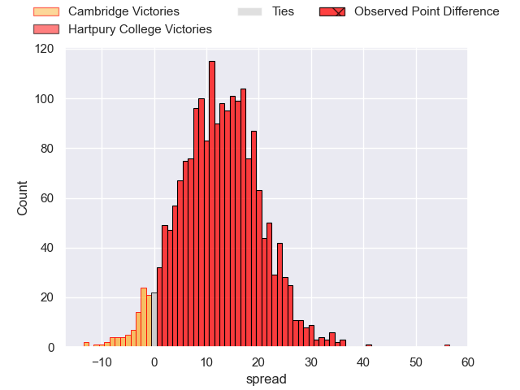
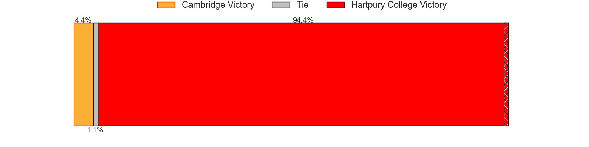
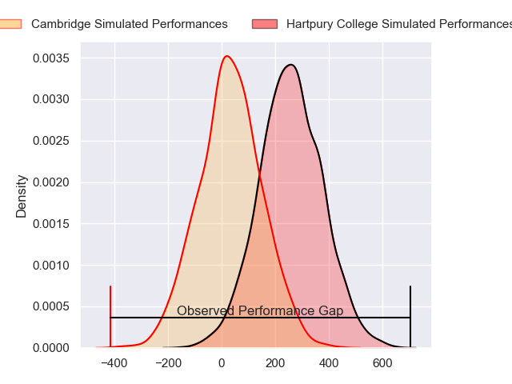
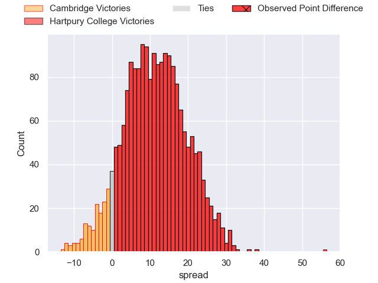
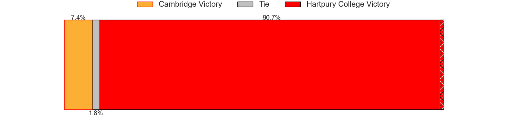

---  
layout: page  
title: Cambridge at Hartpury College; 5-61  
date: 2024-03-01 18:00:00 -0500  
categories: "RFU Championship 2023" match review  
---
# Cambridge at Hartpury College; 5-61

# Club Level Predictions

The first set of predictions treats a club as the smallest object, as the club develops its members, organizes a gameplan, and deploys its players as needed for each match. This club model has a prediction of 0.788, which translates to predicting Hartpury College to win by 12.3.

Our Over/Under is 46.5 - and combined with the spread above, we have a predicted scoreline of 17 to 29

Each club has a rating and a rating deviation (similar to a Glicko rating), and expected performances can be generated. This allows for simulated matches and spreads like the ones below.
## Projected Performances - Club Model

## Projected Spreads - Club Model

## Projected Results - Club Model

# Player Level Predictions - Version 2

Treating teams instead as an entity made up of the currently active players, I have ratings for each player in an altogether different system. These can be combined to form team ratings once teamsheets are announced, weighting starters a bit higher than the reserves. After the match is played, players can be weighted by their minutes on the field, allowing for an accurate measure of the team's composition. With these compiled team ratings, we can make predictions, measure inaccuracy, and update the individual player ratings.
## Prediction without Player Minutes: Hartpury College by 12.3

Hartpury College by 9.2 on a neutral pitch

## Projected Performances - Player Model

## Projected Spreads - Player Model

## Projected Results - Player Model

|   Away Minutes | Away Player          |   Away Percentile |   Number |   Home Percentile | Home Player           |   Home Minutes |
|---------------:|:---------------------|------------------:|---------:|------------------:|:----------------------|---------------:|
|             54 | Jake Elwood          |             28.96 |        1 |             83.59 | Aristot Benz-Salomon  |             45 |
|             54 | Benjamin Brownlie    |             45.04 |        2 |             73.66 | Ethan Hunt            |             55 |
|             49 | Billy Walker         |             17.05 |        3 |             78.92 | Jonathan Benz-Salomon |             59 |
|             80 | Kieran Frost         |             31.35 |        4 |             55.18 | Freddie Thomas        |             80 |
|             80 | Gareth Baxter        |             49.34 |        5 |             88.08 | Jack Davies           |             80 |
|             43 | George Bretag-Norris |             41.52 |        6 |             37    | Samuel Lewis          |             65 |
|             43 | Ben Adams            |             10.35 |        7 |             85.46 | Harry Short           |             80 |
|             80 | Nahum Merigan        |             37.14 |        8 |             88.88 | Josh Gray             |             72 |
|             53 | Kieran Duffin        |             33.33 |        9 |             77.51 | Michael Austin        |             72 |
|             53 | Steffan James        |             33.58 |       10 |             85.57 | Harry Bazalgette      |             30 |
|             80 | Josef Green          |             38.13 |       11 |             51.02 | Alex Morgan           |             55 |
|             80 | Matt Williams        |             13.21 |       12 |             68.66 | Morgan Adderly-Jones  |             80 |
|             66 | Sam Hanks            |             10.6  |       13 |             16.67 | Robbie Smith          |             80 |
|             80 | Kwaku Asiedu         |             26.75 |       14 |             61.76 | Louis Hillman-Cooper  |             80 |
|             80 | Elias Caven          |             16.55 |       15 |             19.42 | Jake Morris           |             80 |
|             37 | Matthew Dawson       |             27.09 |       16 |             88.4  | Charlie Powell        |             50 |
|             37 | Benjamin Hoppe       |             46.92 |       17 |             67.28 | Mikey Summerfield     |             35 |
|             27 | Toby Dabell          |             32.31 |       18 |             75.19 | Bradley Denty         |             25 |
|             27 | Lawrence Rayner      |            nan    |       19 |             79.01 | William Crane         |             25 |
|             31 | Matt Collins         |             48.21 |       20 |             73.78 | Dale Lemon            |             15 |
|             26 | Morgan Veness        |             12.02 |       21 |             62.62 | Jarrad Hayler         |              8 |
|             26 | Huw Owen             |             59.4  |       22 |            nan    | Joseph Williams       |              8 |
|             14 | Tom Hoppe            |             45.83 |       23 |              1.65 | Joe Rees              |             21 |

