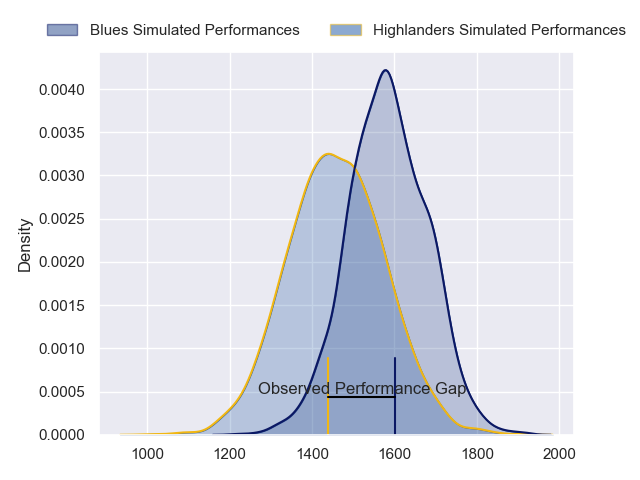
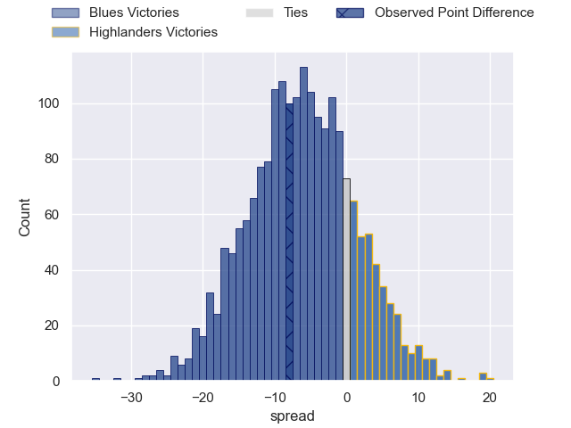
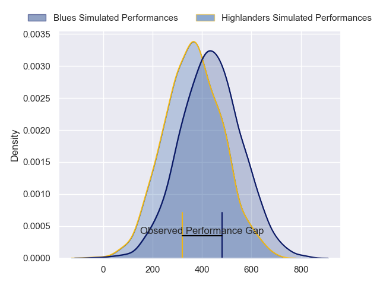
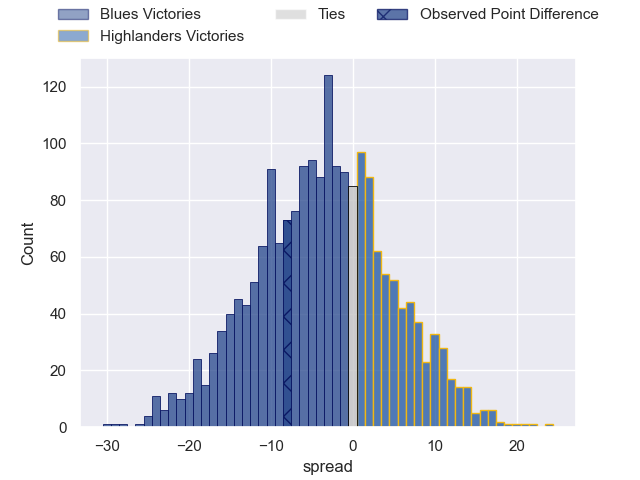

---  
layout: page  
title: Blues at Highlanders; 37-29  
date: 2024-03-01 18:00:00 -0500  
categories: "Super Rugby Pacific 2024" match review  
---
# Blues at Highlanders; 37-29

# Club Level Predictions

The first set of predictions treats a club as the smallest object, as the club develops its members, organizes a gameplan, and deploys its players as needed for each match. This club model has a prediction of 0.333, which translates to predicting Blues to win by 6.3.

Our Over/Under is 50.5 - and combined with the spread above, we have a predicted scoreline of 28 to 22

Each club has a rating and a rating deviation (similar to a Glicko rating), and expected performances can be generated. This allows for simulated matches and spreads like the ones below.
## Projected Performances - Club Model

## Projected Spreads - Club Model

## Projected Results - Club Model

# Player Level Predictions - Version 2

Treating teams instead as an entity made up of the currently active players, I have ratings for each player in an altogether different system. These can be combined to form team ratings once teamsheets are announced, weighting starters a bit higher than the reserves. After the match is played, players can be weighted by their minutes on the field, allowing for an accurate measure of the team's composition. With these compiled team ratings, we can make predictions, measure inaccuracy, and update the individual player ratings.
## Prediction without Player Minutes: Blues by 2.0

Blues by 6.6 on a neutral pitch

## Projected Performances - Player Model

## Projected Spreads - Player Model

## Projected Results - Player Model

|   Away Minutes | Away Player        |   Away Percentile |   Number |   Home Percentile | Home Player                   |   Home Minutes |
|---------------:|:-------------------|------------------:|---------:|------------------:|:------------------------------|---------------:|
|             40 | Ofa Tu'ungafasi    |             98.19 |        1 |             69.87 | Ethan de Groot                |             44 |
|             75 | Ricky Riccitelli   |             70.19 |        2 |             34.34 | Henry Bell                    |             44 |
|             53 | Marcel Renata      |             62.89 |        3 |             36.57 | Jermaine Ainsley              |             44 |
|             64 | Laghlan McWhannell |             94.59 |        4 |             97.65 | Pari Pari Parkinson           |             35 |
|              8 | Sam Darry          |             34.24 |        5 |             52.94 | Max Hicks                     |             83 |
|             83 | Akira Ioane        |             95.25 |        6 |             19.44 | Sean Withy                    |             83 |
|             83 | Dalton Papalii     |             98.6  |        7 |             73.43 | Billy Harmon                  |             83 |
|             83 | Hoskins Sotutu     |             89.44 |        8 |              8.22 | Hugh Renton                   |             41 |
|             48 | Taufa Funaki       |             14.97 |        9 |             65.07 | Folau Fakatava                |             53 |
|             83 | Stephen Perofeta   |             95.89 |       10 |             97.58 | Rhys Patchell                 |             83 |
|             83 | Caleb Clarke       |             24.54 |       11 |             81.46 | Jona Nareki                   |             60 |
|             45 | Bryce Heem         |             98.12 |       12 |             38.4  | Sam Gilbert                   |             83 |
|             83 | AJ Lam             |             58.54 |       13 |             45.7  | Tanielu Tele'a                |             70 |
|             83 | Mark Tele'a        |             56.38 |       14 |             33.87 | Timoci Tavatavanawai          |             83 |
|             77 | Zarn Sullivan      |             80.86 |       15 |             96.41 | Jacob Ratumaitavuki-Kneepkens |             83 |
|              8 | Soane Vikena       |             74.72 |       16 |            nan    | Ricky Jackson                 |             39 |
|             43 | Josh Fusitu'a      |             49.82 |       17 |             21.14 | Dan Lienert-Brown             |             39 |
|             30 | Angus Ta'avao      |             95.92 |       18 |             53.54 | Saula Ma'u                    |             39 |
|             75 | Josh Beehre        |             73.18 |       19 |             72    | Fabian Holland                |             48 |
|             19 | Adrian Choat       |             48.81 |       20 |             46.71 | Nikora Broughton              |             42 |
|             35 | Sam Nock           |             76.05 |       21 |            nan    | Nathan Hastie                 |             30 |
|             38 | Harry Plummer      |             90.58 |       22 |            nan    | Ajay Faleafaga                |             13 |
|              6 | Cole Forbes        |             48.56 |       23 |             86.92 | Jonah Lowe                    |             23 |

