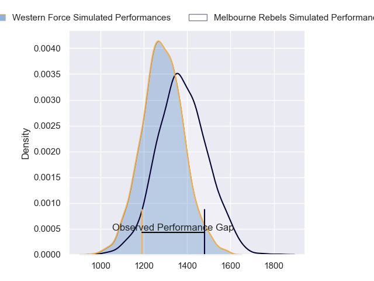
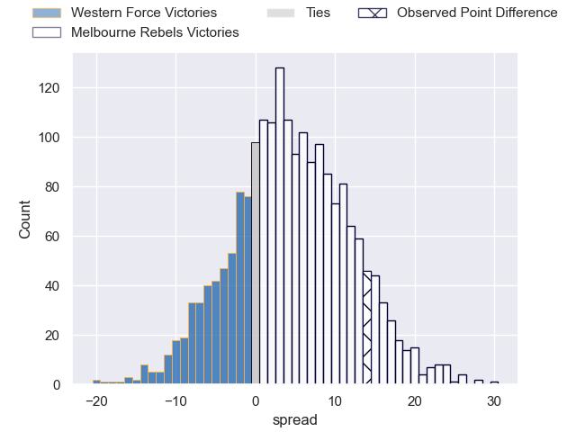
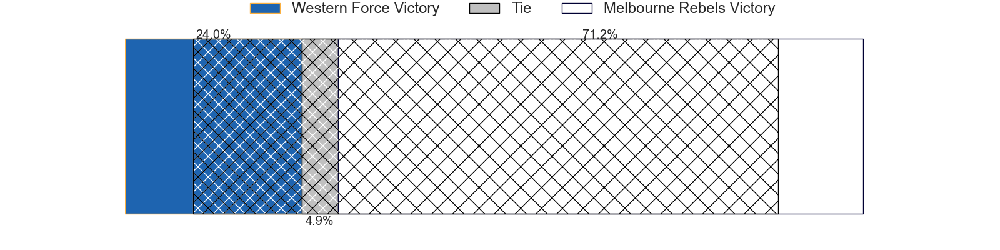
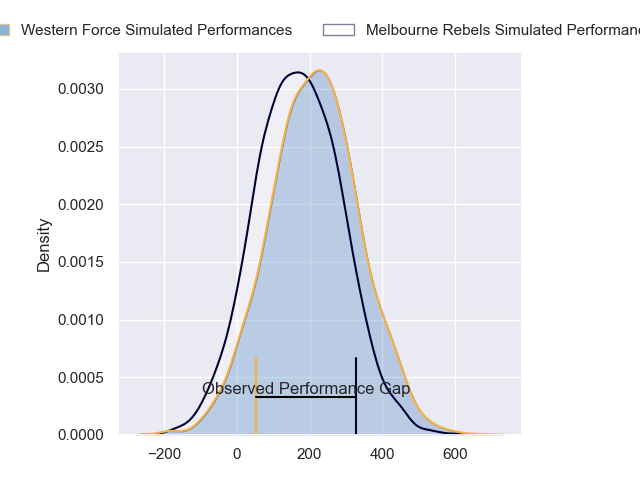
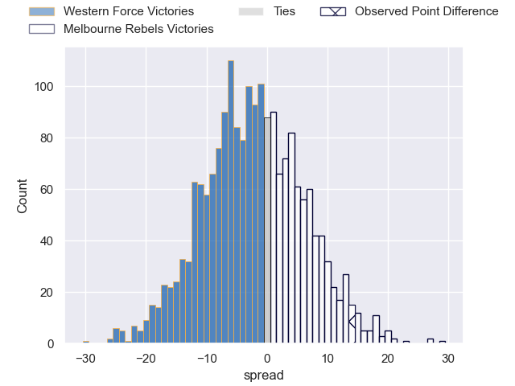

---  
layout: page  
title: Western Force at Melbourne Rebels; 34-48  
date: 2024-03-01 18:00:00 -0500  
categories: "Super Rugby Pacific 2024" match review  
---
# Western Force at Melbourne Rebels; 34-48

# Club Level Predictions

The first set of predictions treats a club as the smallest object, as the club develops its members, organizes a gameplan, and deploys its players as needed for each match. This club model has a prediction of 0.628, which translates to predicting Melbourne Rebels to win by 4.8.

Our Over/Under is 46.5 - and combined with the spread above, we have a predicted scoreline of 21 to 26

Each club has a rating and a rating deviation (similar to a Glicko rating), and expected performances can be generated. This allows for simulated matches and spreads like the ones below.
## Projected Performances - Club Model

## Projected Spreads - Club Model

## Projected Results - Club Model

# Player Level Predictions - Version 2

Treating teams instead as an entity made up of the currently active players, I have ratings for each player in an altogether different system. These can be combined to form team ratings once teamsheets are announced, weighting starters a bit higher than the reserves. After the match is played, players can be weighted by their minutes on the field, allowing for an accurate measure of the team's composition. With these compiled team ratings, we can make predictions, measure inaccuracy, and update the individual player ratings.
## Prediction without Player Minutes: Western Force by 0.6

Western Force by 4.2 on a neutral pitch

## Projected Performances - Player Model

## Projected Spreads - Player Model

## Projected Results - Player Model

|   Away Minutes | Away Player           |   Away Percentile |   Number |   Home Percentile | Home Player          |   Home Minutes |
|---------------:|:----------------------|------------------:|---------:|------------------:|:---------------------|---------------:|
|             57 | Ryan Coxon            |             24.7  |        1 |             74.93 | Matt Gibbon          |             50 |
|             55 | Tom Horton            |             51.89 |        2 |             51.32 | Alex Mafi            |             75 |
|             65 | Santiago Medrano      |              6.9  |        3 |             97.82 | Taniela Tupou        |             50 |
|             65 | Jeremy Williams       |             17.76 |        4 |             47.18 | Josh Canham          |             80 |
|             76 | Tom Franklin          |             92.82 |        5 |              7.41 | Lukhan Salakaia-Loto |             80 |
|             57 | Michael Wells         |              1.73 |        6 |             17.51 | Josh Kemeny          |             80 |
|             80 | Carlo Tizzano         |             13.73 |        7 |             46.16 | Brad Wilkin          |             57 |
|             80 | Will Harris           |             58.45 |        8 |             19.25 | Rob Leota            |             52 |
|             57 | Nic White             |             99.2  |        9 |             65.87 | James Tuttle         |             50 |
|             80 | Ben Donaldson         |             54.96 |       10 |             51.82 | Carter Gordon        |             80 |
|             80 | Chase Tiatia          |             77.49 |       11 |             86.92 | Filipo Daugunu       |             80 |
|             80 | Hamish Stewart        |             82.33 |       12 |             46.53 | David Feliuai        |             80 |
|             71 | Sam Spink             |             33.22 |       13 |             73.03 | Matt Proctor         |             28 |
|             70 | Harry Potter          |             49.95 |       14 |             37.19 | Lachie Anderson      |             80 |
|             80 | Max Burey             |              8.85 |       15 |             78.23 | Andrew Kellaway      |             80 |
|             25 | Feleti Kaitu'u        |             28.68 |       16 |             26.23 | Jordan Uelese        |              5 |
|             23 | Charlie Hancock       |             41.87 |       17 |            nan    | Isaac Aedo Kailea    |             30 |
|             15 | Tiaan Tauakipulu      |            nan    |       18 |             17.89 | Sam Talakai          |             30 |
|             15 | Lopeti Faifua         |             27.53 |       19 |             62.12 | Tuaina Taii Tualima  |             23 |
|             23 | Tim Anstee            |             14.05 |       20 |             28.64 | Vaiolini Ekuasi      |             28 |
|              4 | Ollie Callan          |              5.95 |       21 |             95.81 | Ryan Louwrens        |             30 |
|             23 | Issak Fines-Leleiwasa |             66.67 |       22 |             16.46 | Jake Strachan        |             52 |
|             19 | George Poolman        |            nan    |       23 |             57.36 | Nick Jooste          |              0 |

