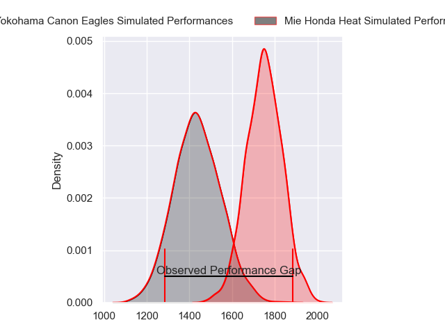
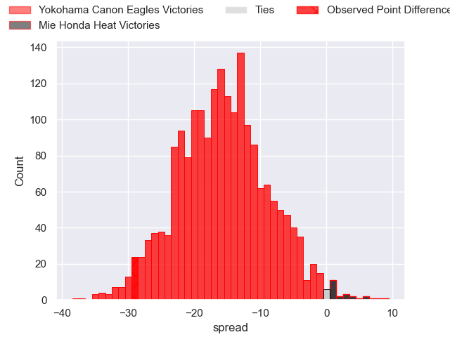
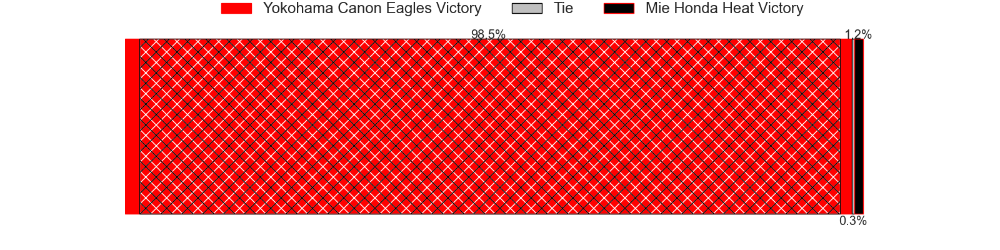
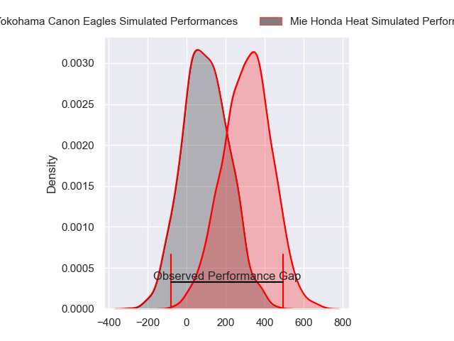
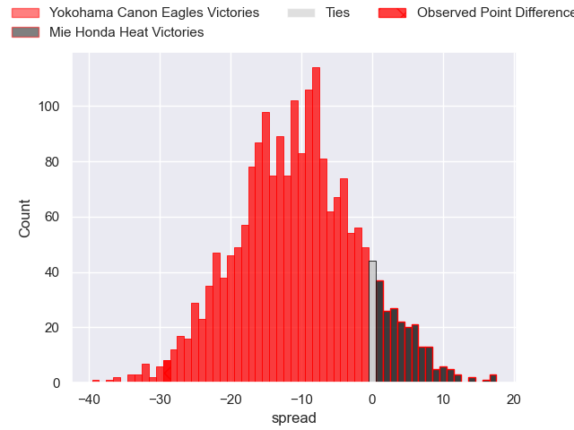
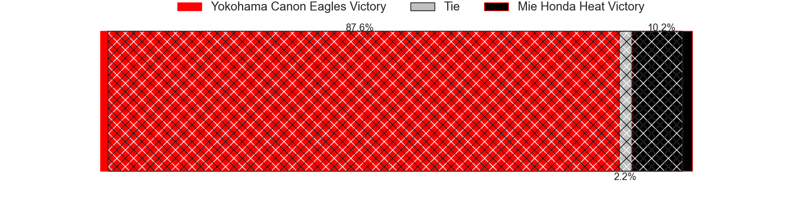

---  
layout: page  
title: Yokohama Canon Eagles at Mie Honda Heat; 50-21  
date: 2024-03-01 18:00:00 -0500  
categories: "Japan Rugby League One 2023" match review  
---
# Yokohama Canon Eagles at Mie Honda Heat; 50-21

# Club Level Predictions

The first set of predictions treats a club as the smallest object, as the club develops its members, organizes a gameplan, and deploys its players as needed for each match. This club model has a prediction of 0.149, which translates to predicting Yokohama Canon Eagles to win by 15.6.

Our Over/Under is 56.5 - and combined with the spread above, we have a predicted scoreline of 36 to 20

Each club has a rating and a rating deviation (similar to a Glicko rating), and expected performances can be generated. This allows for simulated matches and spreads like the ones below.
## Projected Performances - Club Model

## Projected Spreads - Club Model

## Projected Results - Club Model

# Player Level Predictions - Version 2

Treating teams instead as an entity made up of the currently active players, I have ratings for each player in an altogether different system. These can be combined to form team ratings once teamsheets are announced, weighting starters a bit higher than the reserves. After the match is played, players can be weighted by their minutes on the field, allowing for an accurate measure of the team's composition. With these compiled team ratings, we can make predictions, measure inaccuracy, and update the individual player ratings.
## Prediction without Player Minutes: Yokohama Canon Eagles by 11.6

Yokohama Canon Eagles by 14.5 on a neutral pitch

## Projected Performances - Player Model

## Projected Spreads - Player Model

## Projected Results - Player Model

|   Away Minutes | Away Player              |   Away Percentile |   Number |   Home Percentile | Home Player           |   Home Minutes |
|---------------:|:-------------------------|------------------:|---------:|------------------:|:----------------------|---------------:|
|             61 | Takato Okabe             |             96.06 |        1 |              3.12 | Tatsuhiko Tsurukawa   |             40 |
|             51 | Shunta Nakamura          |             83.78 |        2 |              6.11 | Lee Seung Hyok        |             70 |
|             61 | Ryosuke Iwaihara         |             60.13 |        3 |             11.73 | Taiki Yoshioka        |             49 |
|             80 | Max Douglas              |             82.72 |        4 |             15.38 | Tetuhi Roberts        |             80 |
|             51 | Matt Philip              |             58.4  |        5 |             90.23 | Franco Mostert        |             80 |
|             80 | Kobus Van Dyk            |             89.43 |        6 |              3.74 | Ryota Kobayashi       |             80 |
|             80 | Naoto Shimada            |             79.52 |        7 |             50.33 | Kosuke Hattori        |             57 |
|             33 | Amanaki Mafi             |             92.48 |        8 |             16.75 | Heiden Bedwell-Curtis |             51 |
|             52 | Kafazumi Yamasuga        |             62.37 |        9 |             17.18 | Shogo Nezuka          |             49 |
|             61 | Yu Tamura                |             65.17 |       10 |             64.43 | Mitch Hunt            |             49 |
|             61 | Masayoshi Takezawa       |             32.44 |       11 |             25.46 | Kanta Watanabe        |             80 |
|             80 | Yusuke Kajimura          |             93.45 |       12 |              5    | Fraser Quirk          |             49 |
|             80 | Rohan Janse van Rensburg |             79.4  |       13 |              4.4  | Clinton Knox          |             80 |
|             80 | Viliame Takayawa         |             94.09 |       14 |             15.47 | Haruhiko Uemura       |             80 |
|             80 | Jumpei Ogura             |             97.6  |       15 |             80.58 | Tom Banks             |             80 |
|             47 | Sione Halasili           |             64.08 |       16 |            nan    | Takumi Fuji           |             40 |
|             29 | Liaki Moli               |              4.77 |       17 |             16.77 | Katsuyuki Hoshino     |             31 |
|             29 | Yusuke Niwai             |             74.81 |       18 |             19.15 | Gwangtee Oh           |             31 |
|             28 | Toshiki Amano            |             71.37 |       19 |             37.22 | Takuro Hojo           |             31 |
|             19 | Chang Ho Ahn             |             51.79 |       20 |             94.88 | Tevita Li             |             31 |
|             19 | Tatsuro Sugimoto         |              5.59 |       21 |            nan    | Justin Downey         |             29 |
|             19 | Chihito Matsui           |             68.31 |       22 |             24.31 | Yoji Akiyama          |             23 |
|             19 | SP Marais                |             95.12 |       23 |            nan    | Hiroaki Shirahama     |             10 |

