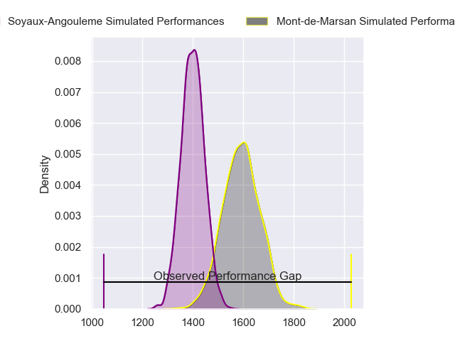
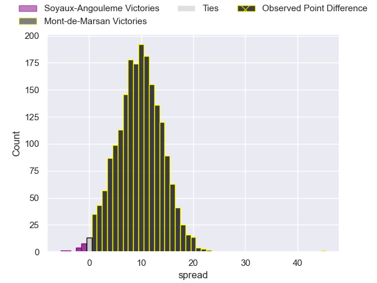
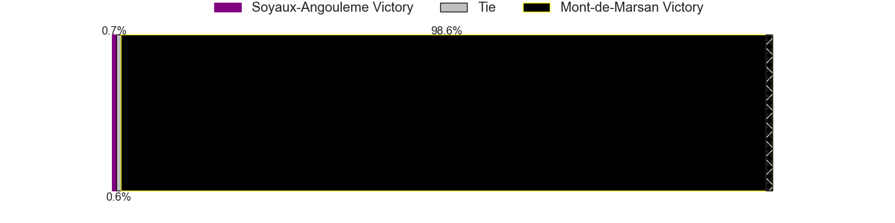
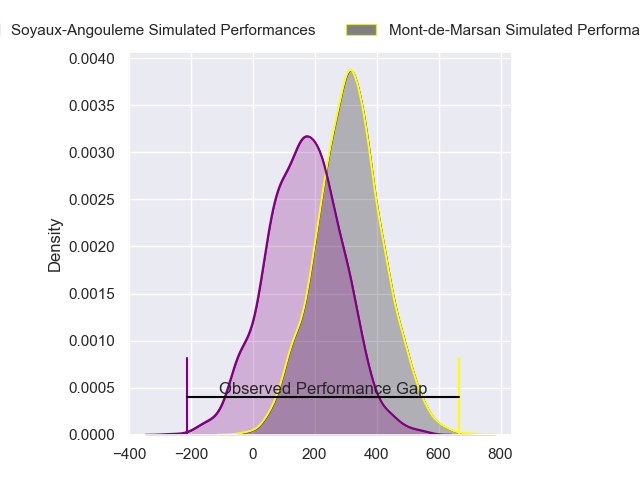
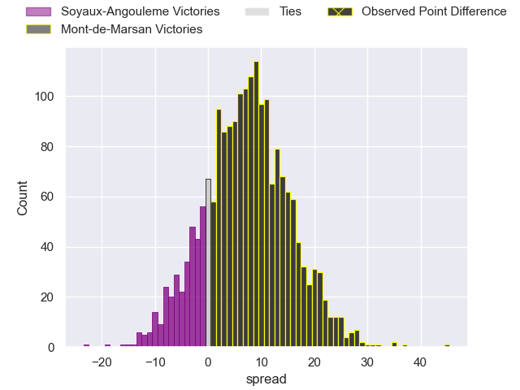
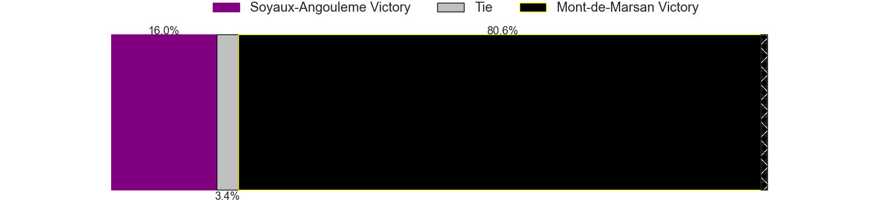

---  
layout: page  
title: Soyaux-Angouleme at Mont-de-Marsan; 7-52  
date: 2024-03-01 18:00:00 -0500  
categories: "Pro D2 2023" match review  
---
# Soyaux-Angouleme at Mont-de-Marsan; 7-52

# Club Level Predictions

The first set of predictions treats a club as the smallest object, as the club develops its members, organizes a gameplan, and deploys its players as needed for each match. This club model has a prediction of 0.752, which translates to predicting Mont-de-Marsan to win by 9.8.

Our Over/Under is 50.5 - and combined with the spread above, we have a predicted scoreline of 21 to 30

Each club has a rating and a rating deviation (similar to a Glicko rating), and expected performances can be generated. This allows for simulated matches and spreads like the ones below.
## Projected Performances - Club Model

## Projected Spreads - Club Model

## Projected Results - Club Model

# Player Level Predictions - Version 2

Treating teams instead as an entity made up of the currently active players, I have ratings for each player in an altogether different system. These can be combined to form team ratings once teamsheets are announced, weighting starters a bit higher than the reserves. After the match is played, players can be weighted by their minutes on the field, allowing for an accurate measure of the team's composition. With these compiled team ratings, we can make predictions, measure inaccuracy, and update the individual player ratings.
## Prediction without Player Minutes: Mont-de-Marsan by 7.2

Soyaux-Angouleme by 0.6 on a neutral pitch

## Projected Performances - Player Model

## Projected Spreads - Player Model

## Projected Results - Player Model

|   Away Minutes | Away Player            |   Away Percentile |   Number |   Home Percentile | Home Player        |   Home Minutes |
|---------------:|:-----------------------|------------------:|---------:|------------------:|:-------------------|---------------:|
|             53 | Omar Odishvili         |             59.85 |        1 |             15.86 | Jean-Luc Innocente |             46 |
|             40 | Rayne Barka            |             68.51 |        2 |             57.06 | Florian Dufour     |             36 |
|             56 | Omar Dahir             |             36.11 |        3 |             64.16 | Mattéo Lalanne     |             54 |
|             80 | William Greatbanks     |             64.96 |        4 |             51.97 | Jules Dussutour    |             49 |
|             30 | Saba Pesvianidze       |             26.1  |        5 |             71.51 | Andrei Ostrikov    |             80 |
|             50 | Germain Burgaud        |             81.28 |        6 |             63.44 | Aurélien Lisena    |             80 |
|             80 | Irakli Tskhadadze      |             75.44 |        7 |             75.66 | Nicolas Garrault   |             40 |
|             80 | Maxence Lemardelet     |             39.32 |        8 |             66.02 | Raphaël Robic      |             80 |
|             80 | Adrien Bau             |              3.68 |        9 |             54.4  | Kevin Viallard     |             60 |
|             80 | Jacob Botica           |             24.63 |       10 |             90.55 | Willie du Plessis  |             51 |
|             80 | Eoghan Barrett         |             52.74 |       11 |             79.59 | Eroni Sau          |             80 |
|             30 | Nasoni Naqiri Kunavore |             86.43 |       12 |             78.93 | Jules Even         |             80 |
|             36 | Akuila Joeli Tabualevu |             77.5  |       13 |             47.74 | Gatien Masse       |             80 |
|             80 | Inaki Ayarza           |             36.84 |       14 |             68.74 | Semi Lagivala      |             40 |
|             80 | Pierre Lafitte         |             46.52 |       15 |             54.68 | Théo Cortes        |             80 |
|             13 | Matthys Gratien        |             76.58 |       16 |             58.4  | Samuel Lagrange    |             44 |
|             50 | Sikeli Nabou           |             86.17 |       17 |             81.72 | William Wavrin     |             40 |
|             44 | Rémi Brosset           |             37.17 |       18 |             18.81 | Simon Desaubies    |             40 |
|             40 | German Kessler         |             41.03 |       19 |             58.2  | Dino Casadei       |             34 |
|             37 | Manu Saubusse          |             50.72 |       20 |             80.93 | Romain Durand      |             31 |
|             30 | Ian Kitwanga           |             50.18 |       21 |             17.16 | Joris Pialot       |             29 |
|             27 | Georgy Balakarev       |            nan    |       22 |             16.96 | Anthony Alves      |             26 |
|             24 | Seydou Diakité         |             19.62 |       23 |             42.94 | Baptiste Canut     |             20 |

