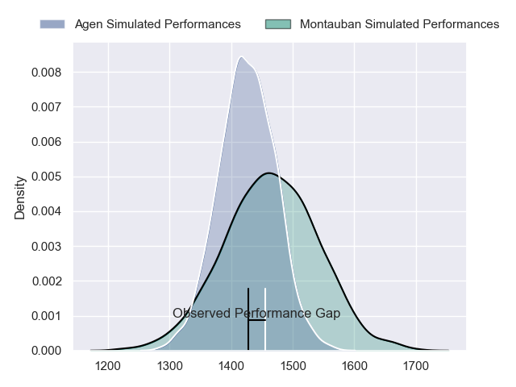
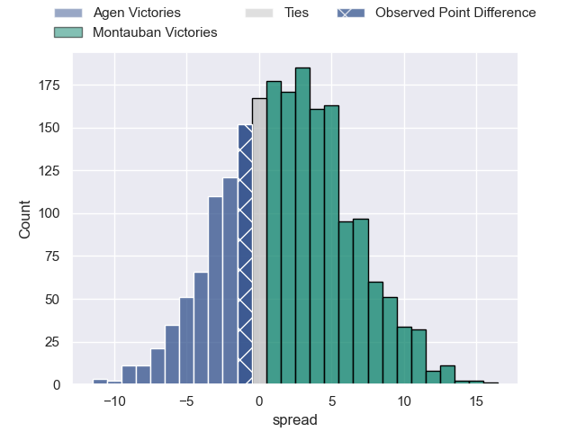
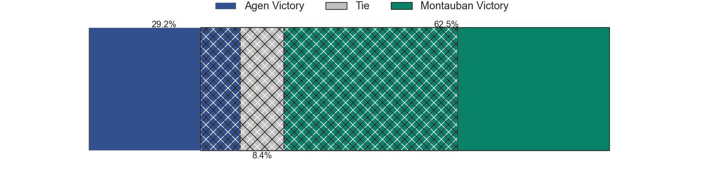
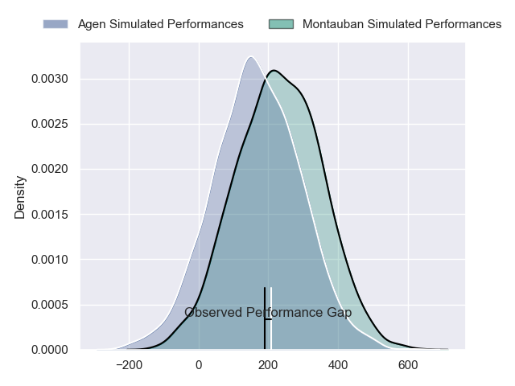
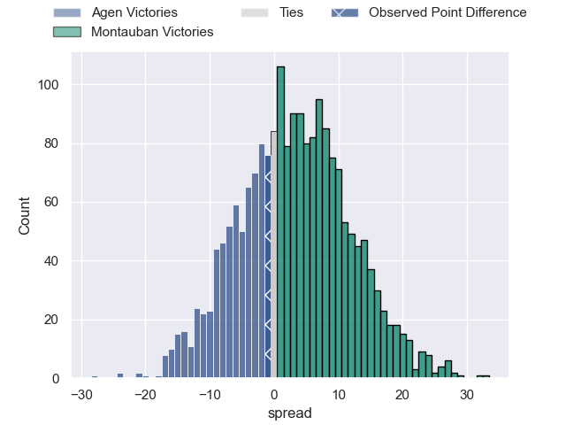
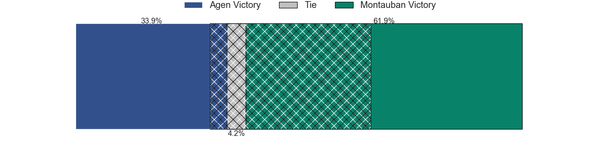

---  
layout: page  
title: Agen at Montauban; 27-26  
date: 2024-03-01 18:00:00 -0500  
categories: "Pro D2 2023" match review  
---
# Agen at Montauban; 27-26

# Club Level Predictions

The first set of predictions treats a club as the smallest object, as the club develops its members, organizes a gameplan, and deploys its players as needed for each match. This club model has a prediction of 0.554, which translates to predicting Montauban to win by 1.9.

Our Over/Under is 40.5 - and combined with the spread above, we have a predicted scoreline of 19 to 21

Each club has a rating and a rating deviation (similar to a Glicko rating), and expected performances can be generated. This allows for simulated matches and spreads like the ones below.
## Projected Performances - Club Model

## Projected Spreads - Club Model

## Projected Results - Club Model

# Player Level Predictions - Version 2

Treating teams instead as an entity made up of the currently active players, I have ratings for each player in an altogether different system. These can be combined to form team ratings once teamsheets are announced, weighting starters a bit higher than the reserves. After the match is played, players can be weighted by their minutes on the field, allowing for an accurate measure of the team's composition. With these compiled team ratings, we can make predictions, measure inaccuracy, and update the individual player ratings.
## Prediction without Player Minutes: Montauban by 2.3

Agen by 4.2 on a neutral pitch

## Projected Performances - Player Model

## Projected Spreads - Player Model

## Projected Results - Player Model

|   Away Minutes | Away Player        |   Away Percentile |   Number |   Home Percentile | Home Player         |   Home Minutes |
|---------------:|:-------------------|------------------:|---------:|------------------:|:--------------------|---------------:|
|             56 | Hans Lombard-Buret |             69.24 |        1 |             28.13 | Thomas Bue          |             56 |
|             56 | Clement Martinez   |             59.06 |        2 |             15.09 | Badri Alkhazashvili |             56 |
|             59 | Alex Burin         |             73.5  |        3 |              4.72 | Mirian Burduli      |             80 |
|             80 | Evan Olmstead      |              8.12 |        4 |             88.47 | Frank Bradshaw      |             80 |
|             56 | William Demotte    |             90.12 |        5 |             30    | Dimitri Vaotoa      |             54 |
|             80 | Julien Lebian      |             28.08 |        6 |             12.85 | Karl Wilkins        |             80 |
|             80 | Arnaud Duputs      |             87.04 |        7 |             40.6  | Stéphane Munoz      |             54 |
|             59 | Fotu Lokotui       |             33.33 |        8 |             24.65 | Corentin Coularis   |             44 |
|             80 | Sonatane Takulua   |             13.57 |        9 |             59.48 | Alexis Bernadet     |             80 |
|             80 | Thomas Vincent     |             76.09 |       10 |             81.16 | Jérôme Bosviel      |             80 |
|             80 | Iban Etcheverry    |             62.49 |       11 |             42.87 | Yvan Reilhac        |             80 |
|              6 | Clement Garrigues  |             76.33 |       12 |             78.33 | Dan Goggin          |             80 |
|             80 | Theo Belan         |             69.38 |       13 |             58.19 | Simon Renda         |             72 |
|             80 | Henry Purdy        |             93.68 |       14 |              7.82 | Raphael Sanchez     |             80 |
|             69 | Mathieu Lamoulie   |             90.67 |       15 |             84.21 | Semesa Rokoduguni   |             80 |
|             26 | Harry Sloan        |             75.97 |       16 |             24.84 | Quentin Witt        |             36 |
|             48 | Ben Volavola       |             37.68 |       17 |             64.69 | Otar Giorgadze      |             26 |
|             24 | Florent Guion      |             27.59 |       18 |              6.24 | Kevin Gimeno        |             26 |
|             24 | Mike Sosene-Feagai |             13.58 |       19 |             12.25 | Lucas Seyrolle      |             24 |
|             24 | Joe Maksymiw       |             10.71 |       20 |             22.83 | Ru-Hann Greyling    |             24 |
|             21 | Beau Farrance      |             56.62 |       21 |             12.84 | Maxime Mathy        |              8 |
|             21 | Valentin Gayraud   |             42.44 |       22 |            nan    | nan                 |            nan |
|             11 | Theo Idjellidaine  |             26.55 |       23 |            nan    | nan                 |            nan |

