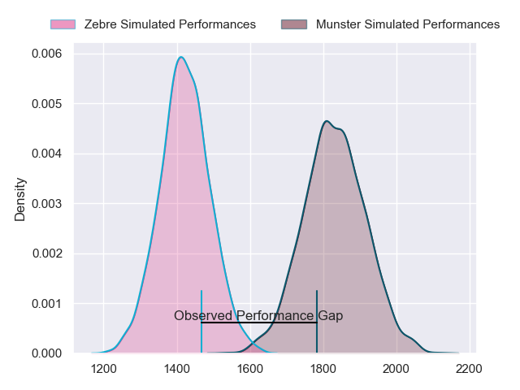
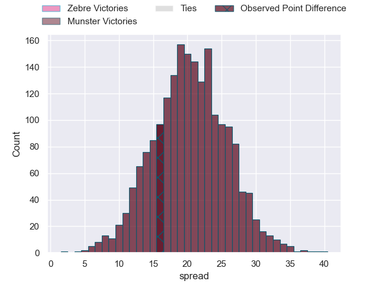
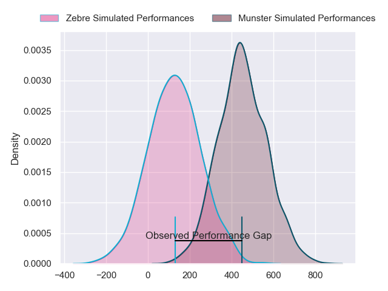
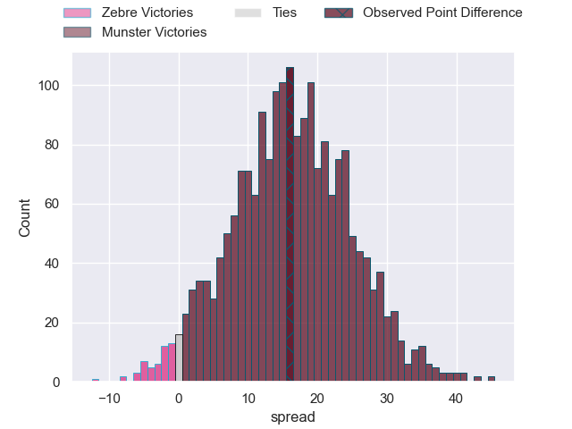

---  
layout: page  
title: Zebre at Munster; 29-45  
date: 2024-03-01 18:00:00 -0500  
categories: "United Rugby Championship 2023" match review  
---
# Zebre at Munster; 29-45

# Club Level Predictions

The first set of predictions treats a club as the smallest object, as the club develops its members, organizes a gameplan, and deploys its players as needed for each match. This club model has a prediction of 0.909, which translates to predicting Munster to win by 20.4.

Our Over/Under is 42.5 - and combined with the spread above, we have a predicted scoreline of 11 to 31

Each club has a rating and a rating deviation (similar to a Glicko rating), and expected performances can be generated. This allows for simulated matches and spreads like the ones below.
## Projected Performances - Club Model

## Projected Spreads - Club Model

## Projected Results - Club Model

# Player Level Predictions - Version 2

Treating teams instead as an entity made up of the currently active players, I have ratings for each player in an altogether different system. These can be combined to form team ratings once teamsheets are announced, weighting starters a bit higher than the reserves. After the match is played, players can be weighted by their minutes on the field, allowing for an accurate measure of the team's composition. With these compiled team ratings, we can make predictions, measure inaccuracy, and update the individual player ratings.
## Prediction without Player Minutes: Munster by 19.4

Munster by 13.2 on a neutral pitch

## Projected Performances - Player Model

## Projected Spreads - Player Model

## Projected Results - Player Model

|   Away Minutes | Away Player            |   Away Percentile |   Number |   Home Percentile | Home Player      |   Home Minutes |
|---------------:|:-----------------------|------------------:|---------:|------------------:|:-----------------|---------------:|
|             69 | Luca Rizzoli           |             45.92 |        1 |             32.45 | Josh Wycherley   |             51 |
|             61 | Luca Bigi              |             66.41 |        2 |             90.65 | Niall Scannell   |             51 |
|             63 | Muhamed Hasa           |             46.01 |        3 |             92.12 | John Ryan        |             51 |
|             66 | Dave Sisi              |              7.63 |        4 |             56.14 | Thomas Ahern     |             59 |
|             80 | Leonard Krumov         |              6.79 |        5 |             99.05 | RG Snyman        |             55 |
|             61 | Giacomo Ferrari        |             40.97 |        6 |             52.42 | Ruadhan Quinn    |             80 |
|             55 | Bautista Stavile       |             41.08 |        7 |             67.29 | Alex Kendellen   |             80 |
|             80 | Giovanni Licata        |             36.89 |        8 |             78.88 | Gavin Coombes    |             80 |
|             56 | Alessandro Fusco       |              8.79 |        9 |             81.19 | Craig Casey      |             55 |
|             63 | Tiff Eden              |             39.3  |       10 |             39.55 | Tony Butler      |             80 |
|             80 | Simone Gesi            |              8.7  |       11 |             95.17 | Shane Daly       |             80 |
|             80 | Damiano Mazza          |             70.24 |       12 |             90.12 | Alex Nankivell   |             80 |
|             80 | Luca Morisi            |             94.52 |       13 |             87.14 | Antoine Frisch   |             63 |
|             80 | Scott Gregory          |             56.07 |       14 |             19.55 | Sean O'Brien     |             80 |
|             80 | Geronimo Prisciantelli |             93.53 |       15 |             87.53 | Mike Haley       |             80 |
|             19 | Giampietro Ribaldi     |            nan    |       16 |            nan    | Eoghan Clarke    |             29 |
|             11 | Samuele Taddei         |            nan    |       17 |             95.14 | Jeremy Loughman  |             29 |
|             17 | Riccardo Genovese      |            nan    |       18 |            nan    | Stephen Archer   |             29 |
|             14 | Dylan De Leeuw         |            nan    |       19 |             28.37 | Fineen Wycherley |             25 |
|             19 | Davide Ruggeri         |            nan    |       20 |            nan    | Jack O'Sullivan  |             21 |
|             24 | Thomas Dominguez       |            nan    |       21 |            nan    | Ethan Coughlan   |             25 |
|             17 | Jacopo Trulla          |            nan    |       22 |             93.93 | Rory Scannell    |             17 |
|             25 | Josh Kaifa             |            nan    |       23 |            nan    | Ben O'Connor     |              0 |

