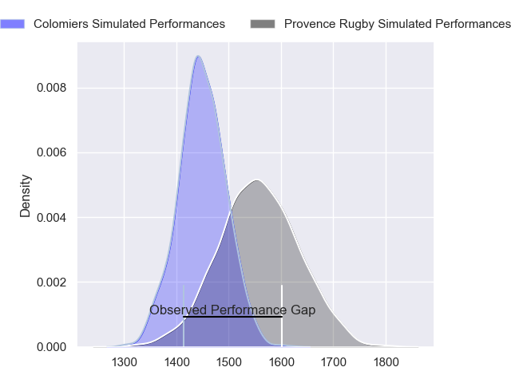
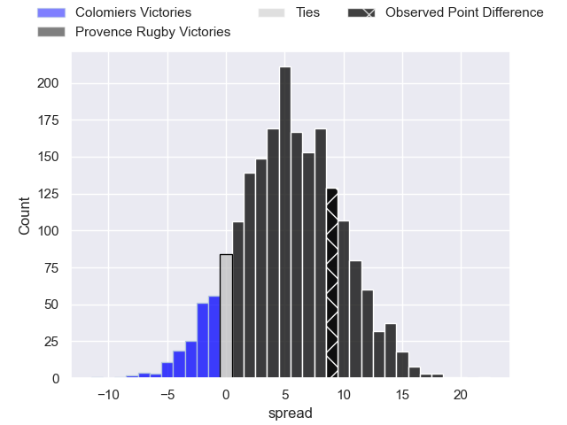
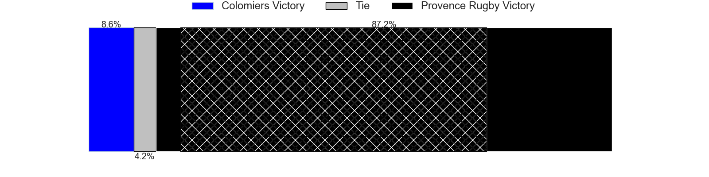
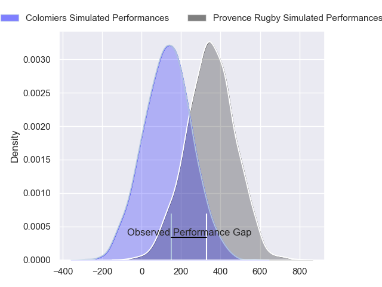
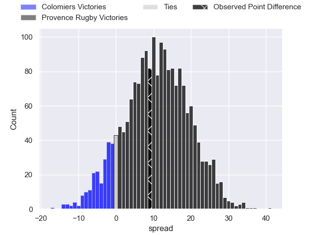
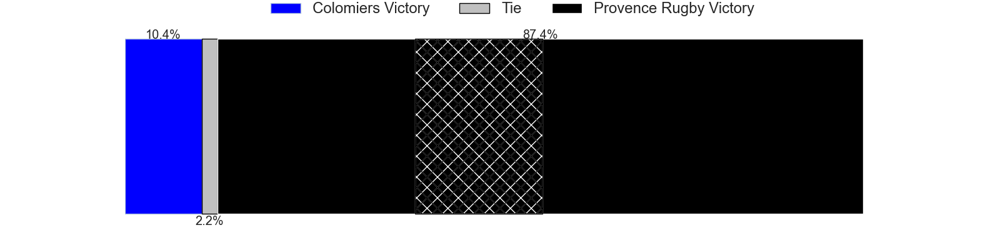

---  
layout: page  
title: Colomiers at Provence Rugby; 18-27  
date: 2024-03-01 18:00:00 -0500  
categories: "Pro D2 2023" match review  
---
# Colomiers at Provence Rugby; 18-27

# Club Level Predictions

The first set of predictions treats a club as the smallest object, as the club develops its members, organizes a gameplan, and deploys its players as needed for each match. This club model has a prediction of 0.645, which translates to predicting Provence Rugby to win by 5.3.

Our Over/Under is 47.5 - and combined with the spread above, we have a predicted scoreline of 21 to 26

Each club has a rating and a rating deviation (similar to a Glicko rating), and expected performances can be generated. This allows for simulated matches and spreads like the ones below.
## Projected Performances - Club Model

## Projected Spreads - Club Model

## Projected Results - Club Model

# Player Level Predictions - Version 2

Treating teams instead as an entity made up of the currently active players, I have ratings for each player in an altogether different system. These can be combined to form team ratings once teamsheets are announced, weighting starters a bit higher than the reserves. After the match is played, players can be weighted by their minutes on the field, allowing for an accurate measure of the team's composition. With these compiled team ratings, we can make predictions, measure inaccuracy, and update the individual player ratings.
## Prediction without Player Minutes: Provence Rugby by 11.0

Provence Rugby by 5.2 on a neutral pitch

## Projected Performances - Player Model

## Projected Spreads - Player Model

## Projected Results - Player Model

|   Away Minutes | Away Player        |   Away Percentile |   Number |   Home Percentile | Home Player           |   Home Minutes |
|---------------:|:-------------------|------------------:|---------:|------------------:|:----------------------|---------------:|
|             53 | Guillaume Tartas   |             75.93 |        1 |             75.84 | Julius Nostadt        |             48 |
|             53 | Andrew Ready       |             27.36 |        2 |             86.79 | Lucas Martin          |             80 |
|             53 | Michael Simutoga   |             85.01 |        3 |             99    | Tomas Francis         |             60 |
|             80 | Jean Thomas        |             59.06 |        4 |             58.94 | Charly Gambini        |             80 |
|             57 | Maxime Granouillet |             81.18 |        5 |             76.12 | Josh Tyrell           |             80 |
|             80 | Anthony Coletta    |             44.22 |        6 |             56.86 | Guillaume Piazzoli    |             80 |
|             80 | Jeremy Bechu       |             44.32 |        7 |             84.97 | Bilel Taieb           |             80 |
|             57 | Jorick Dastugue    |             61.74 |        8 |             71.83 | Teimana Harrison      |             57 |
|             63 | Ugo Seguela        |             64.07 |        9 |             49.9  | Arthur Coville        |             73 |
|             80 | Brett Herron       |              1.45 |       10 |             82.81 | Jimmy Gopperth        |             80 |
|             80 | Rodrigo Marta      |             97.11 |       11 |             36.76 | Léo Drouet            |             65 |
|             58 | Dorian Laborde     |             66.31 |       12 |             82.92 | Kaveinga Finau        |             80 |
|             80 | Martin Dulon       |             16.61 |       13 |             41.46 | Atila Septar          |             65 |
|             80 | Farell Delourmel   |             44.27 |       14 |             10.08 | Adrien Lapegue-Lafaye |             80 |
|             66 | Antoine Lere       |             40.43 |       15 |             77.51 | Enzo Selponi          |             80 |
|             27 | Thomas Dubois      |             31.15 |       16 |             32.43 | Nicolas Toth          |             32 |
|             27 | Thomas Larrieu     |             30.38 |       17 |             35.68 | Malohi Suta           |             23 |
|             27 | Marco Fepulea'i    |             22.71 |       18 |             72.66 | Federico Wegrzyn      |             20 |
|             23 | Louis Descoux      |             47.88 |       19 |             27.68 | Eto Bainivalu         |             15 |
|             23 | Waël Ponpon        |             32.22 |       20 |             81.51 | Louis Marrou          |             15 |
|             22 | Fabien Perrin      |             47.59 |       21 |             68.66 | Joris Cazenave        |              7 |
|             17 | Edoardo Gori       |             88.82 |       22 |            nan    | nan                   |            nan |
|             14 | Thomas Girard      |             50.96 |       23 |            nan    | nan                   |            nan |

