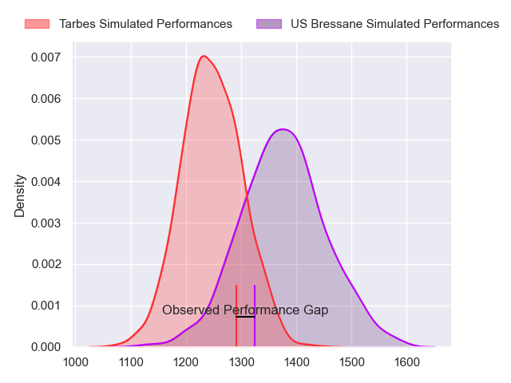
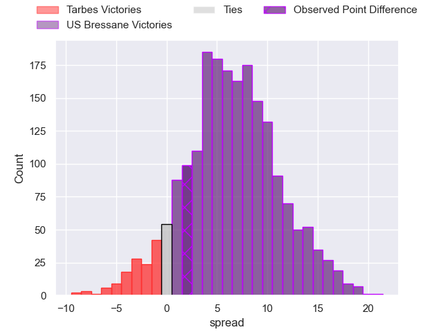
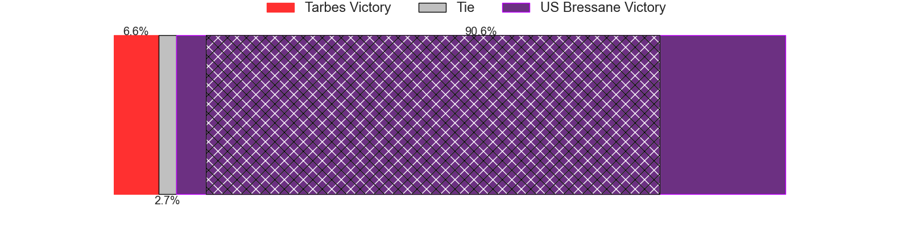
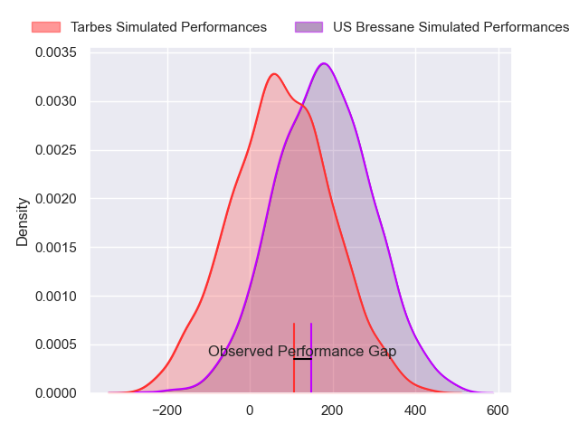
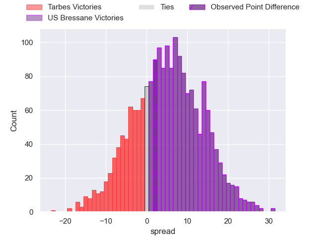

---  
layout: page  
title: Tarbes at US Bressane; 19-21  
date: 2024-03-01 18:00:00 -0500  
categories: "Nationale 2023" match review  
---
# Tarbes at US Bressane; 19-21

# Club Level Predictions

The first set of predictions treats a club as the smallest object, as the club develops its members, organizes a gameplan, and deploys its players as needed for each match. This club model has a prediction of 0.679, which translates to predicting US Bressane to win by 6.6.

Our Over/Under is 35.5 - and combined with the spread above, we have a predicted scoreline of 14 to 21

Each club has a rating and a rating deviation (similar to a Glicko rating), and expected performances can be generated. This allows for simulated matches and spreads like the ones below.
## Projected Performances - Club Model

## Projected Spreads - Club Model

## Projected Results - Club Model

# Player Level Predictions - Version 2

Treating teams instead as an entity made up of the currently active players, I have ratings for each player in an altogether different system. These can be combined to form team ratings once teamsheets are announced, weighting starters a bit higher than the reserves. After the match is played, players can be weighted by their minutes on the field, allowing for an accurate measure of the team's composition. With these compiled team ratings, we can make predictions, measure inaccuracy, and update the individual player ratings.
## Prediction without Player Minutes: US Bressane by 5.5

US Bressane by 1.6 on a neutral pitch

## Projected Performances - Player Model

## Projected Spreads - Player Model

## Projected Results - Player Model

|   Away Minutes | Away Player            |   Away Percentile |   Number |   Home Percentile | Home Player          |   Home Minutes |
|---------------:|:-----------------------|------------------:|---------:|------------------:|:---------------------|---------------:|
|             59 | Johan Mees Erasmus     |             44.14 |        1 |             74.02 | Vazha Kapanadze      |             62 |
|             52 | Florian Lamothe        |             61.32 |        2 |             13.4  | Louis Dasalmartini   |             52 |
|             52 | Alexandre Duny         |             54.13 |        3 |             16.62 | Atonio Ulutuipalelei |             62 |
|             80 | Léo Saint-Guilhem      |             78.82 |        4 |             65.53 | Thomas Déliance      |             62 |
|             59 | Baptiste Peytavi       |             74    |        5 |             14.12 | Josh Peters          |             80 |
|             80 | Alexis Armary          |             93.3  |        6 |             58.05 | Pierre Reynaud       |             80 |
|             59 | Jean Guicherd          |             73.3  |        7 |             84.22 | Lucas Lyons          |             80 |
|             59 | Filipe Manu            |             15.26 |        8 |             68.08 | Loic Baradel         |             18 |
|             52 | Mickael Thébault       |             70.26 |        9 |             56.09 | Jeremy Valencot      |             41 |
|             80 | Anthony Fuertes        |              7.99 |       10 |             76.27 | Thibault Olender     |             59 |
|             80 | Jone Tuva              |              3    |       11 |             38.37 | Élie De Fleurian     |             80 |
|             80 | Clement Latorre        |             54.18 |       12 |             29.33 | Maile Mamao          |             80 |
|             80 | Savenaca Rawaca        |             72.79 |       13 |              6.71 | Alexandre Badet      |             66 |
|             52 | Johan Paulet           |              3.32 |       14 |             36.55 | Thibaut Perrette     |             80 |
|             80 | Yon Camou              |             71.29 |       15 |             84.69 | Florent Massip       |             80 |
|             21 | Léo Baratgin           |            nan    |       16 |             26.98 | Quentin Drancourt    |             18 |
|             28 | Enzo Mondon            |             59.81 |       17 |             86.04 | Clement Jullien      |             28 |
|             28 | Aleksi Tchitchiashvili |             15.89 |       18 |             65.85 | Erich de Jager       |             18 |
|             21 | Léo Estaque            |             22.81 |       19 |            nan    | Grégoire Demangel    |             18 |
|             21 | Julien Cantan          |             22.77 |       20 |             50.38 | Nail Ait Naceur      |             62 |
|             21 | Jon Abadie             |             52.32 |       21 |             12.38 | Robin Graulle        |             39 |
|             28 | Anthony Meric          |              1.6  |       22 |              7.02 | Christian Lacombe    |             21 |
|             28 | Mathieu Berbizier      |             35.11 |       23 |            nan    | Samuel Hostalrich    |             14 |

