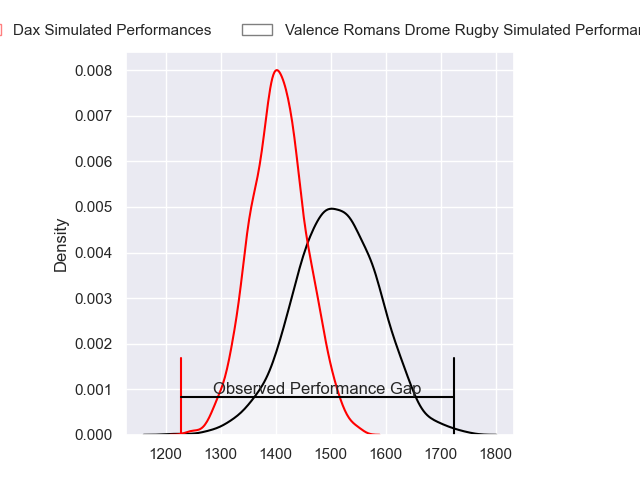
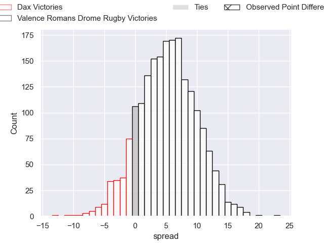
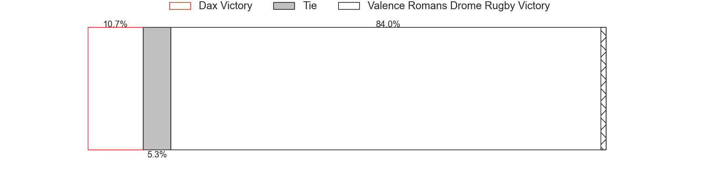
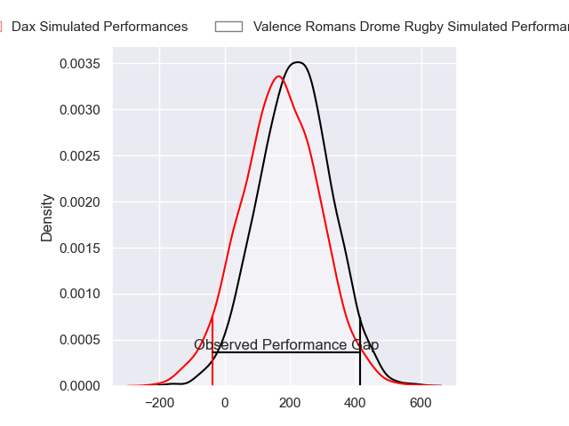
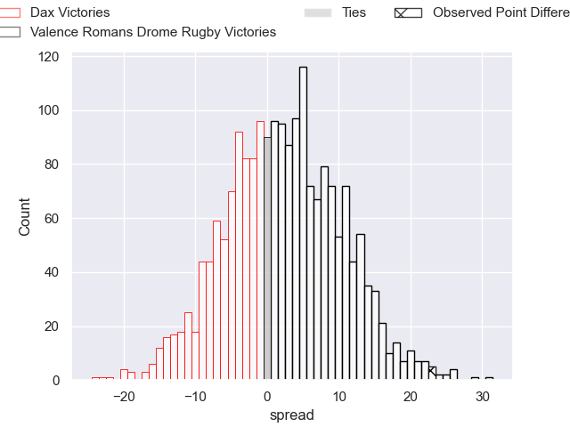
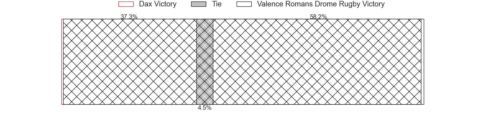

---  
layout: page  
title: Dax at Valence Romans Drome Rugby; 7-30  
date: 2024-03-01 18:00:00 -0500  
categories: "Pro D2 2023" match review  
---
# Dax at Valence Romans Drome Rugby; 7-30

# Club Level Predictions

The first set of predictions treats a club as the smallest object, as the club develops its members, organizes a gameplan, and deploys its players as needed for each match. This club model has a prediction of 0.64, which translates to predicting Valence Romans Drome Rugby to win by 5.1.

Our Over/Under is 40.5 - and combined with the spread above, we have a predicted scoreline of 18 to 23

Each club has a rating and a rating deviation (similar to a Glicko rating), and expected performances can be generated. This allows for simulated matches and spreads like the ones below.
## Projected Performances - Club Model

## Projected Spreads - Club Model

## Projected Results - Club Model

# Player Level Predictions - Version 2

Treating teams instead as an entity made up of the currently active players, I have ratings for each player in an altogether different system. These can be combined to form team ratings once teamsheets are announced, weighting starters a bit higher than the reserves. After the match is played, players can be weighted by their minutes on the field, allowing for an accurate measure of the team's composition. With these compiled team ratings, we can make predictions, measure inaccuracy, and update the individual player ratings.
## Prediction without Player Minutes: Valence Romans Drome Rugby by 2.5

Dax by 0.5 on a neutral pitch

## Projected Performances - Player Model

## Projected Spreads - Player Model

## Projected Results - Player Model

|   Away Minutes | Away Player           |   Away Percentile |   Number |   Home Percentile | Home Player         |   Home Minutes |
|---------------:|:----------------------|------------------:|---------:|------------------:|:--------------------|---------------:|
|             47 | Thibaud Dréan         |             53.36 |        1 |             41.2  | Anthony Aléo        |             52 |
|             47 | Maxime Delonca        |             40.57 |        2 |             77.74 | Dorian Marco Pena   |             57 |
|             47 | David Lolohea         |             18.06 |        3 |             39.84 | Gareth Milasinovich |             57 |
|             80 | Mattieu Bidau         |             55.53 |        4 |             43.53 | Ryan McCauley       |             80 |
|             47 | Mat Luamanu           |             66.47 |        5 |             59.88 | Yassine Maamry      |             58 |
|             80 | Jean-Baptiste Barrère |             15.98 |        6 |             50.65 | Axel Bruchet        |             80 |
|             53 | Théo Tremeau          |             51.51 |        7 |             82.4  | Thembelani Bholi    |             17 |
|             80 | Sam Wasley            |             31.69 |        8 |             85.45 | Ioane Iashagashvili |             80 |
|             59 | Paul Ravier           |             71.66 |        9 |             59.08 | Léopold Dupas       |             47 |
|             59 | Romuald Séguy         |             49.03 |       10 |             30.92 | Lucas Meret         |             80 |
|             80 | Jope Naceava          |             57.98 |       11 |             86.39 | Mosese Mawalu       |             80 |
|             80 | Alex McHenry          |             75.5  |       12 |             85.39 | Ben Neiceru         |             80 |
|             60 | Hugo Fourquet         |             83.16 |       13 |             78.09 | Anatole Pauvert     |             60 |
|             80 | Théo Gatelier         |             73.95 |       14 |             95.5  | Adam Vargas         |             80 |
|             80 | Maxime Oltmann        |              5.98 |       15 |             28.95 | George Worth        |             52 |
|             33 | Elvis Levi            |             45.09 |       16 |             32.4  | Loan Real           |             63 |
|             33 | Asa Faitotoa          |             48.28 |       17 |             78.64 | Thomas Lhusero      |             33 |
|             33 | Étienne Loiret        |             67.41 |       18 |             70.87 | Andrea Pontanier    |             28 |
|             33 | Nephi Leatigaga       |             16.06 |       19 |             81.64 | Joris Moura         |             28 |
|             27 | Ratu Nacika           |             26.89 |       20 |              2.83 | Cyril Deligny       |             23 |
|             21 | Simon Garrouteigt     |             78.04 |       21 |             23.5  | Chris Talakai       |             23 |
|             21 | Hugo Cerisier         |             64.01 |       22 |             69.18 | Florian Goumat      |             22 |
|             20 | Bastien Daguerre      |             61.25 |       23 |             10.48 | Mathieu Guillomot   |             20 |

