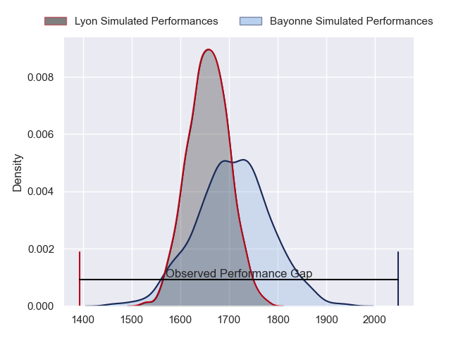
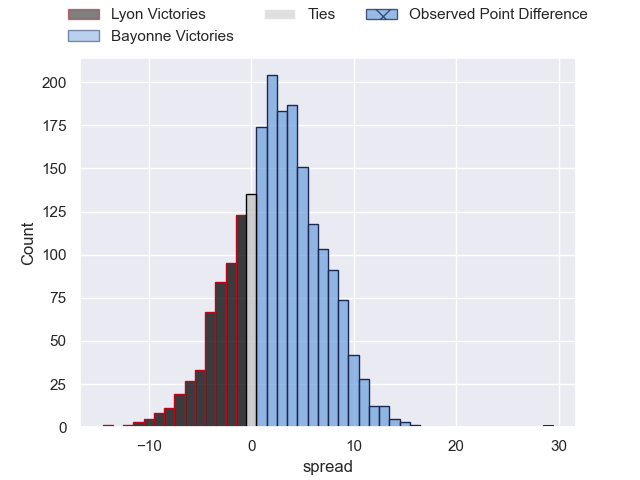
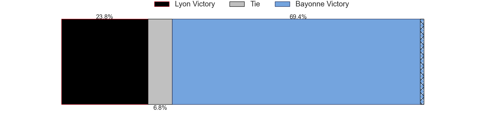
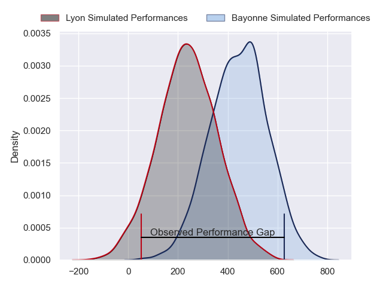
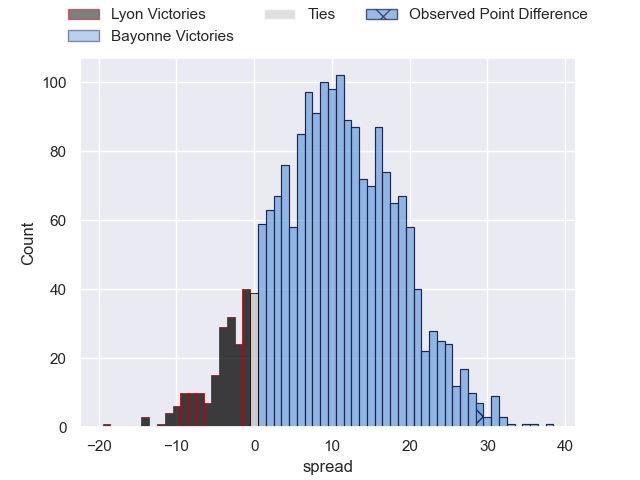
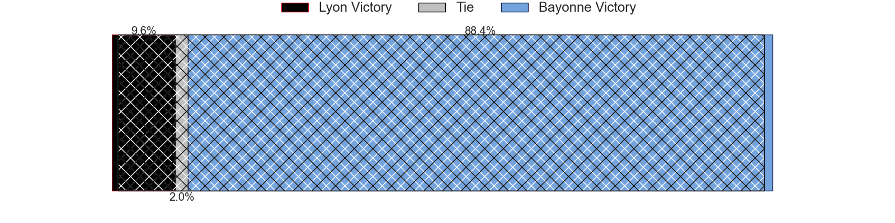

---  
layout: page  
title: Lyon at Bayonne; 10-39  
date: 2024-03-02 18:00:00 -0500  
categories: "Top 14 Orange 2023" match review  
---
# Lyon at Bayonne; 10-39

# Club Level Predictions

The first set of predictions treats a club as the smallest object, as the club develops its members, organizes a gameplan, and deploys its players as needed for each match. This club model has a prediction of 0.569, which translates to predicting Bayonne to win by 2.4.

Our Over/Under is 42.5 - and combined with the spread above, we have a predicted scoreline of 20 to 23

Each club has a rating and a rating deviation (similar to a Glicko rating), and expected performances can be generated. This allows for simulated matches and spreads like the ones below.
## Projected Performances - Club Model

## Projected Spreads - Club Model

## Projected Results - Club Model

# Player Level Predictions - Version 2

Treating teams instead as an entity made up of the currently active players, I have ratings for each player in an altogether different system. These can be combined to form team ratings once teamsheets are announced, weighting starters a bit higher than the reserves. After the match is played, players can be weighted by their minutes on the field, allowing for an accurate measure of the team's composition. With these compiled team ratings, we can make predictions, measure inaccuracy, and update the individual player ratings.
## Prediction without Player Minutes: Bayonne by 11.9

Bayonne by 3.8 on a neutral pitch

## Projected Performances - Player Model

## Projected Spreads - Player Model

## Projected Results - Player Model

|   Away Minutes | Away Player        |   Away Percentile |   Number |   Home Percentile | Home Player           |   Home Minutes |
|---------------:|:-------------------|------------------:|---------:|------------------:|:----------------------|---------------:|
|             60 | Jerome Rey         |             25.7  |        1 |             62.31 | Matis Perchaud        |             56 |
|             45 | Yanis Charcosset   |             50.94 |        2 |             91.7  | Facundo Bosch         |             56 |
|             54 | Feao Fotuaika      |             57.67 |        3 |             36.33 | Tevita Tatafu         |             65 |
|             84 | Felix Lambey       |             76.71 |        4 |             97.18 | Denis Marchois        |             49 |
|             57 | Alban Roussel      |             64.82 |        5 |             57.06 | Thomas Ceyte          |             84 |
|             84 | Joel Kpoku         |             50.49 |        6 |             51.24 | Pierre Huguet         |             49 |
|             60 | Liam Allen         |             64    |        7 |             92.86 | Baptiste Heguy        |             84 |
|             67 | Mickael Guillard   |             63.15 |        8 |             82.63 | Uzair Cassiem         |             84 |
|             60 | Baptiste Couilloud |             93.01 |        9 |             93.61 | Maxime Machenaud      |             67 |
|             84 | Leo Berdeu         |             62.95 |       10 |             94.92 | Camille Lopez         |             74 |
|             84 | Monty Ioane        |             98.39 |       11 |             91.21 | Remy Baget            |             84 |
|             65 | Kyle Godwin        |             67.26 |       12 |             43.46 | Guillaume Martocq     |             67 |
|             84 | Josiah Maraku      |             15.55 |       13 |             50.77 | Arnaud Erbinartegaray |             84 |
|             16 | Xavier Mignot      |             56.48 |       14 |             54.45 | Aurelien Callandret   |             84 |
|             84 | Thaakir Abrahams   |             15.79 |       15 |             24.4  | Cheikh Tiberghien     |             84 |
|             39 | Guillaume Marchand |             22.45 |       16 |             14.34 | Vincent Giudicelli    |             28 |
|             24 | Hamza Kaabeche     |              7.99 |       17 |             52.77 | Swan Cormenier        |             28 |
|             24 | Marvin Okuya       |             39.46 |       18 |             88    | Arthur Iturria        |             35 |
|             44 | Romain Taofifenua  |             48    |       19 |             95.46 | Remi Bourdeau         |             35 |
|             24 | Martin Page-Relo   |             79.04 |       20 |             60.28 | Gela Aprasidze        |             17 |
|             68 | Paddy Jackson      |             82.57 |       21 |            nan    | Tom Spring            |             10 |
|             19 | Alfred Parisien    |             61.13 |       22 |             91.99 | Yan Lestrade          |             17 |
|             30 | Valentin Simutoga  |            nan    |       23 |              3.72 | Pieter Scholtz        |             19 |

