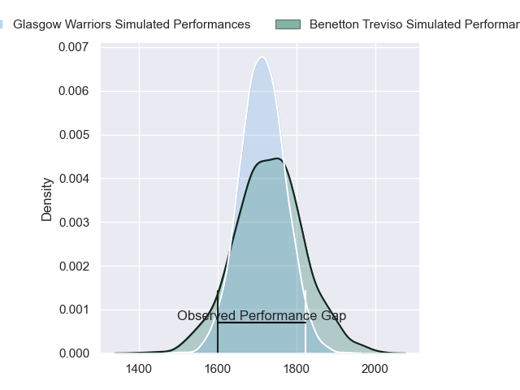
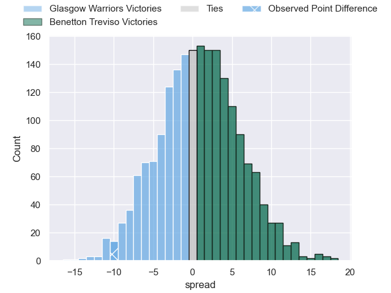
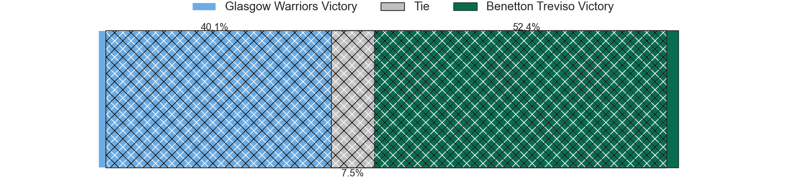
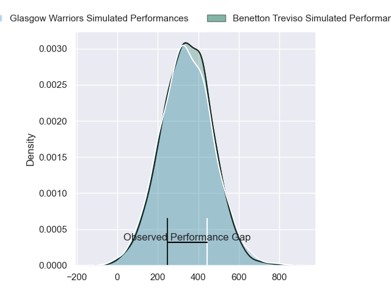
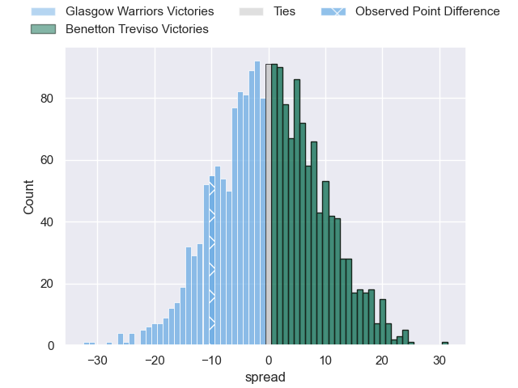
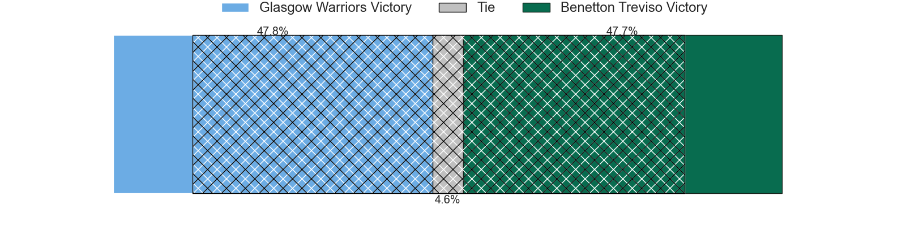

---  
layout: page  
title: Glasgow Warriors at Benetton Treviso; 19-9  
date: 2024-03-02 18:00:00 -0500  
categories: "United Rugby Championship 2023" match review  
---
# Glasgow Warriors at Benetton Treviso; 19-9

# Club Level Predictions

The first set of predictions treats a club as the smallest object, as the club develops its members, organizes a gameplan, and deploys its players as needed for each match. This club model has a prediction of 0.523, which translates to predicting Benetton Treviso to win by 0.8.

Our Over/Under is 43.5 - and combined with the spread above, we have a predicted scoreline of 22 to 22

Each club has a rating and a rating deviation (similar to a Glicko rating), and expected performances can be generated. This allows for simulated matches and spreads like the ones below.
## Projected Performances - Club Model

## Projected Spreads - Club Model

## Projected Results - Club Model

# Player Level Predictions - Version 2

Treating teams instead as an entity made up of the currently active players, I have ratings for each player in an altogether different system. These can be combined to form team ratings once teamsheets are announced, weighting starters a bit higher than the reserves. After the match is played, players can be weighted by their minutes on the field, allowing for an accurate measure of the team's composition. With these compiled team ratings, we can make predictions, measure inaccuracy, and update the individual player ratings.
## Prediction without Player Minutes: Benetton Treviso by 0.7

Glasgow Warriors by 4.4 on a neutral pitch

## Projected Performances - Player Model

## Projected Spreads - Player Model

## Projected Results - Player Model

|   Away Minutes | Away Player           |   Away Percentile |   Number |   Home Percentile | Home Player         |   Home Minutes |
|---------------:|:----------------------|------------------:|---------:|------------------:|:--------------------|---------------:|
|             61 | Nathan McBeth         |             55.4  |        1 |             90.1  | Thomas Gallo        |             78 |
|             61 | Johnny Matthews       |             37.55 |        2 |              1.13 | Siua Maile          |             69 |
|             80 | Lucio Sordoni         |             93.1  |        3 |             95.73 | Simone Ferrari      |             73 |
|             80 | Max Williamson        |             63.18 |        4 |             16.71 | Gideon Koegelenberg |             46 |
|             64 | Alex Samuel           |             60.47 |        5 |             79.06 | Eli Snyman          |             80 |
|             64 | Euan Ferrie           |             57.62 |        6 |             62.16 | Alessandro Izekor   |             78 |
|             78 | Tom Gordon            |             95.78 |        7 |             23.03 | Giovanni Pettinelli |             65 |
|             80 | Henco Venter          |             96.95 |        8 |             73.71 | Toa Halafihi        |             80 |
|             80 | Jamie Dobie           |             77.25 |        9 |             72.26 | Alessandro Garbisi  |             63 |
|             64 | Ross Thompson         |             56.9  |       10 |             78.21 | Tomas Albornoz      |             70 |
|             68 | Facundo Cordero       |             91.53 |       11 |             35.58 | Onisi Ratave        |             80 |
|             80 | Tom Jordan            |             56.89 |       12 |             64.08 | Marco Zanon         |             80 |
|             80 | Stafford McDowall     |             91.05 |       13 |             81.04 | Malakai Fekitoa     |             80 |
|             80 | Sebastian Cancelliere |             98.07 |       14 |             27.22 | Ignacio Mendy       |             80 |
|             80 | Josh McKay            |             48.09 |       15 |             74.16 | Jacob Umaga         |             80 |
|             19 | Gregor Hiddleston     |            nan    |       16 |             14.62 | Federico Zani       |             11 |
|             19 | Allan Dell            |            nan    |       17 |             81.47 | Ivan Nemer          |              2 |
|             10 | Oli Kebble            |             96.64 |       18 |             82.56 | Tiziano Pasquali    |              7 |
|             16 | Sintu Manjezi         |             64.24 |       19 |             30.05 | Riccardo Favretto   |              2 |
|             16 | Ally Miller           |            nan    |       20 |             79.53 | Edoardo Iachizzi    |             34 |
|              2 | Angus Fraser          |            nan    |       21 |             10.56 | Henry Time-Stowers  |             15 |
|              2 | Ben Afshar            |             49.3  |       22 |             19.56 | Andy Uren           |             17 |
|             16 | Duncan Weir           |             77.48 |       23 |             12.92 | Giacomo Da Re       |             10 |

