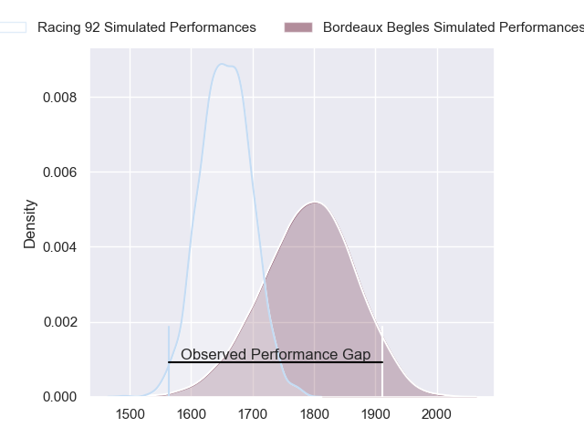
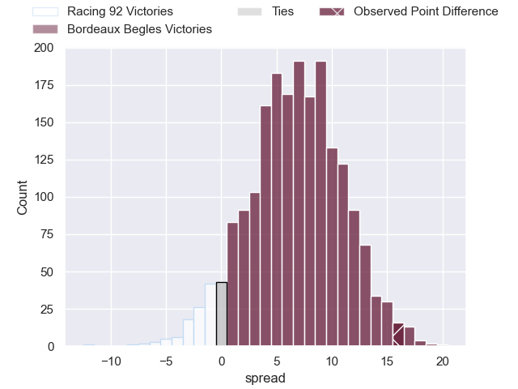
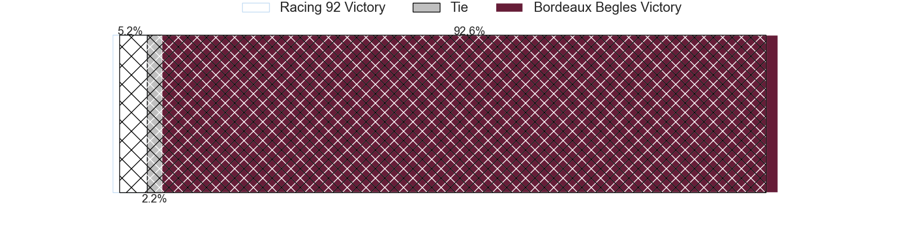
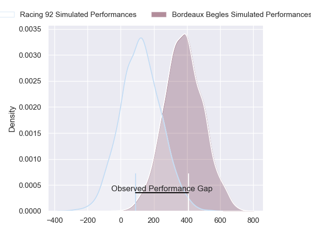
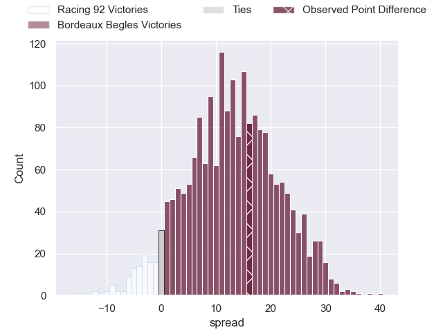
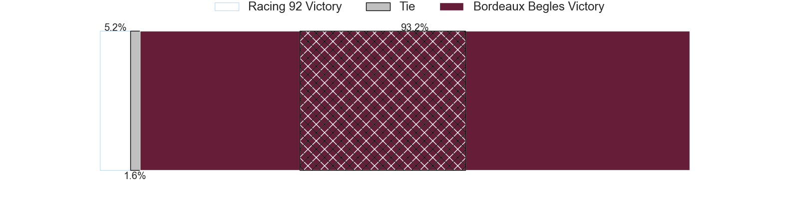

---  
layout: page  
title: Racing 92 at Bordeaux Begles; 5-21  
date: 2024-03-02 18:00:00 -0500  
categories: "Top 14 Orange 2023" match review  
---
# Racing 92 at Bordeaux Begles; 5-21

# Club Level Predictions

The first set of predictions treats a club as the smallest object, as the club develops its members, organizes a gameplan, and deploys its players as needed for each match. This club model has a prediction of 0.683, which translates to predicting Bordeaux Begles to win by 6.7.

Our Over/Under is 45.5 - and combined with the spread above, we have a predicted scoreline of 19 to 26

Each club has a rating and a rating deviation (similar to a Glicko rating), and expected performances can be generated. This allows for simulated matches and spreads like the ones below.
## Projected Performances - Club Model

## Projected Spreads - Club Model

## Projected Results - Club Model

# Player Level Predictions - Version 2

Treating teams instead as an entity made up of the currently active players, I have ratings for each player in an altogether different system. These can be combined to form team ratings once teamsheets are announced, weighting starters a bit higher than the reserves. After the match is played, players can be weighted by their minutes on the field, allowing for an accurate measure of the team's composition. With these compiled team ratings, we can make predictions, measure inaccuracy, and update the individual player ratings.
## Prediction without Player Minutes: Bordeaux Begles by 14.9

Bordeaux Begles by 7.6 on a neutral pitch

## Projected Performances - Player Model

## Projected Spreads - Player Model

## Projected Results - Player Model

|   Away Minutes | Away Player        |   Away Percentile |   Number |   Home Percentile | Home Player               |   Home Minutes |
|---------------:|:-------------------|------------------:|---------:|------------------:|:--------------------------|---------------:|
|             63 | Hassane Kolingar   |              6.17 |        1 |             69.6  | Jefferson Poirot          |             15 |
|             49 | Camille Chat       |             89.81 |        2 |             58.68 | Maxime Lamothe            |             63 |
|             51 | Trevor Nyakane     |             45.01 |        3 |             97.46 | Ben Tameifuna             |             68 |
|             55 | Fabien Sanconnie   |             20.71 |        4 |             51.06 | Alexandre Ricard          |             80 |
|             72 | Will Rowlands      |             22.71 |        5 |             98.59 | Adam Coleman              |             55 |
|             80 | Maxime Baudonne    |             31.97 |        6 |             73.87 | Bastien Vergnes Taillefer |             55 |
|             80 | Siya Kolisi        |             90.06 |        7 |             79.27 | Mahamadou Diaby           |             53 |
|             65 | Jordan Joseph      |             43.43 |        8 |             83.1  | Tevita Tatafu             |             80 |
|             80 | Max Spring         |             20.96 |        9 |             47.5  | Yann Lesgourgues          |             63 |
|             70 | Antoine Gibert     |             79.95 |       10 |             31.64 | Mateo Garcia              |             70 |
|             41 | Wame Naituvi       |              9.65 |       11 |             24.44 | Mael Moustin              |             80 |
|             80 | Henry Chavancy     |             97.76 |       12 |             20.97 | Pablo Uberti              |             80 |
|             80 | Francis Saili      |             15.43 |       13 |             31.57 | Nicolas Depoortere        |             80 |
|             80 | Henry Arundell     |              8.04 |       14 |             97.53 | Romain Buros              |             80 |
|             80 | Tristan Tedder     |             27.03 |       15 |             40.91 | Nans Ducuing              |             80 |
|             31 | Janick Tarrit      |             16.42 |       16 |             93.02 | Clement Maynadier         |             17 |
|             17 | Eddy Ben Arous     |             97.73 |       17 |             88.29 | Ugo Boniface              |             57 |
|              8 | Junior Kpoku       |            nan    |       18 |            nan    | Cyril Cazeaux             |             25 |
|             25 | Boris Palu         |             71.18 |       19 |             74.19 | Antoine Miquel            |             25 |
|             15 | Anthime Hemery     |             73.53 |       20 |             29.91 | Marko Gazzotti            |             27 |
|             10 | Olivier Klemenczak |              6.48 |       21 |              2.59 | Paul Abadie               |             17 |
|             39 | Donovan Taofifenua |             58.09 |       22 |             75.15 | Zack Holmes               |             10 |
|             29 | Cedate Gomes Sa    |             66.06 |       23 |            nan    | Toma'akino Taufa          |             20 |

