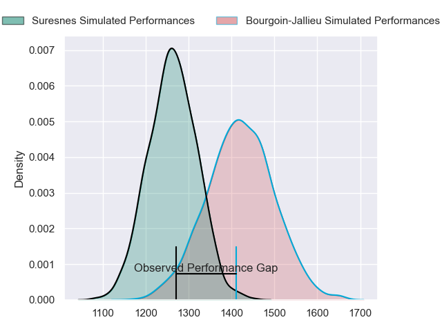
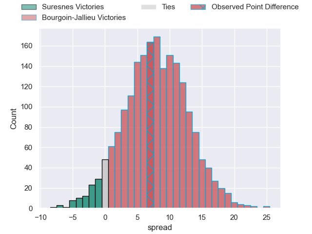
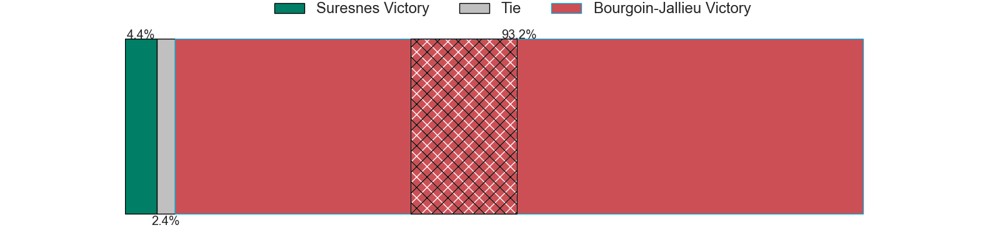
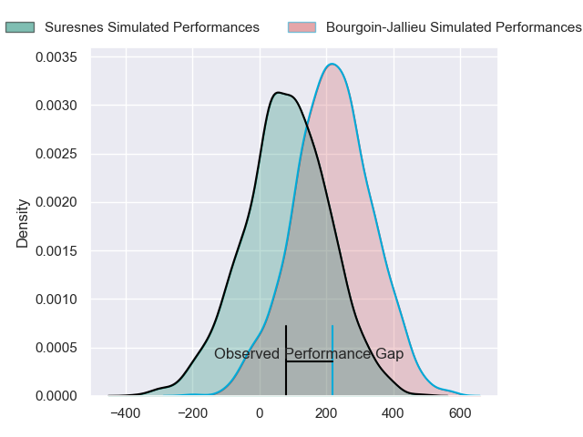
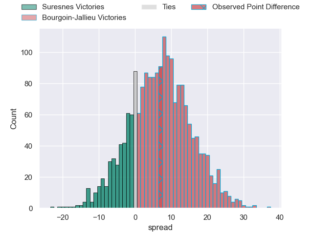
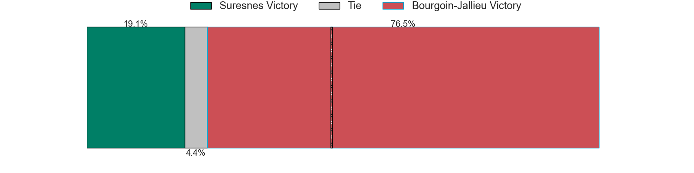

---  
layout: page  
title: Suresnes at Bourgoin-Jallieu; 24-31  
date: 2024-03-02 18:00:00 -0500  
categories: "Nationale 2023" match review  
---
# Suresnes at Bourgoin-Jallieu; 24-31

# Club Level Predictions

The first set of predictions treats a club as the smallest object, as the club develops its members, organizes a gameplan, and deploys its players as needed for each match. This club model has a prediction of 0.711, which translates to predicting Bourgoin-Jallieu to win by 7.9.

Our Over/Under is 39.5 - and combined with the spread above, we have a predicted scoreline of 16 to 24

Each club has a rating and a rating deviation (similar to a Glicko rating), and expected performances can be generated. This allows for simulated matches and spreads like the ones below.
## Projected Performances - Club Model

## Projected Spreads - Club Model

## Projected Results - Club Model

# Player Level Predictions - Version 2

Treating teams instead as an entity made up of the currently active players, I have ratings for each player in an altogether different system. These can be combined to form team ratings once teamsheets are announced, weighting starters a bit higher than the reserves. After the match is played, players can be weighted by their minutes on the field, allowing for an accurate measure of the team's composition. With these compiled team ratings, we can make predictions, measure inaccuracy, and update the individual player ratings.
## Prediction without Player Minutes: Bourgoin-Jallieu by 7.0

Suresnes by 0.5 on a neutral pitch

## Projected Performances - Player Model

## Projected Spreads - Player Model

## Projected Results - Player Model

|   Away Minutes | Away Player             |   Away Percentile |   Number |   Home Percentile | Home Player           |   Home Minutes |
|---------------:|:------------------------|------------------:|---------:|------------------:|:----------------------|---------------:|
|             59 | Sébastien Lafrancesca   |             88.73 |        1 |             52.06 | Romain Favaretto      |             62 |
|             55 | Jean-Étienne Lesueur    |              9.35 |        2 |             67.18 | Killian Tripier       |             57 |
|             80 | Leandro Mario Assi      |             88.36 |        3 |             33.73 | Osman Dimen           |             58 |
|             59 | Christopher van Leeuwen |              8.1  |        4 |             56.38 | Robin Gascou          |             48 |
|             80 | Yakine Djebarri         |             18    |        5 |             75.09 | Jonathan Kpoku        |             80 |
|             80 | Damien Bozic            |             16.52 |        6 |             43.28 | Kevin Chaudouard      |             80 |
|             71 | Wian Vosloo             |             78.96 |        7 |             63.22 | Theophile Cotte       |             80 |
|             80 | Louis-Mathieu Jazeix    |             42.23 |        8 |             32.04 | Poutasi Luafutu       |             59 |
|             80 | Théo Bachiri            |             54.81 |        9 |             56.03 | Martin Doan           |             65 |
|             80 | Victor Barnier          |             92.74 |       10 |             19.65 | Aviata Silago         |             40 |
|             80 | Ervin Muric             |              1.83 |       11 |             74.33 | Quentin Lefort        |             80 |
|             80 | Petero Tuwai            |             87.02 |       12 |             72.98 | Isaiah Leota          |             34 |
|             80 | JJ Taulagi              |              1.19 |       13 |             31.07 | Christopher Bosch     |             80 |
|             55 | Faraj Fartass           |             97.64 |       14 |             53.28 | Paul-Hugo Champ       |             80 |
|             80 | Goulwen Gueho           |              1.68 |       15 |              0.48 | Antoine Renaud        |             80 |
|             25 | Thomas Baudy            |             27.82 |       16 |             55.1  | Théo Lepage           |             46 |
|             25 | Anthony Bajart          |             49.81 |       17 |              5.59 | Remi Bouet            |             40 |
|             21 | Lucas Dycke             |             18.24 |       18 |             22.77 | Léandre Cotte         |             32 |
|             21 | Sacha Yahi              |             87.84 |       19 |             23.28 | Mohamed Khribache     |             23 |
|              9 | Youssouf Yatera         |             63.53 |       20 |             17.32 | Maxime Calliet        |             22 |
|            nan | nan                     |            nan    |       21 |             37.02 | Pieter Morton         |             21 |
|            nan | nan                     |            nan    |       22 |             55.55 | Oktay Yilmaz          |             18 |
|            nan | nan                     |            nan    |       23 |             83.84 | Tomas Munilla lo Duca |             15 |

