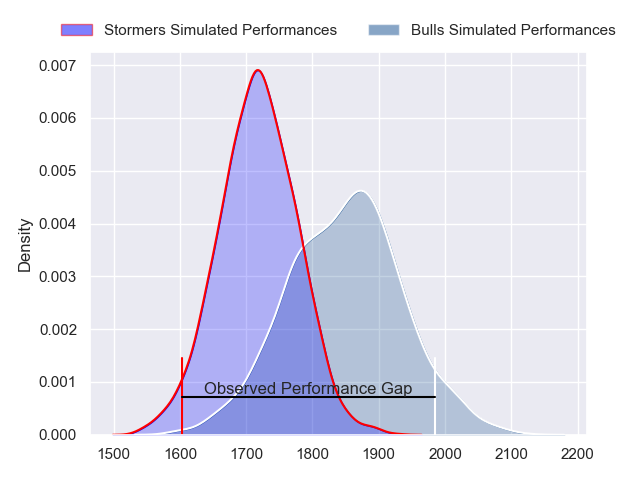
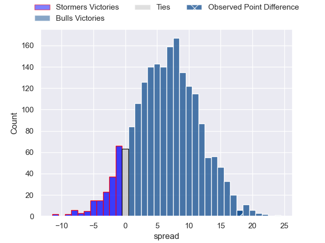
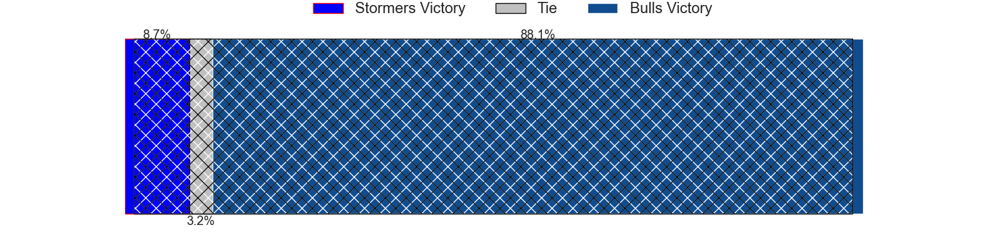
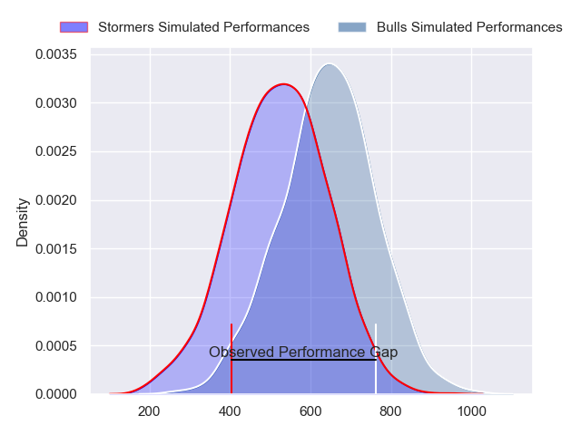
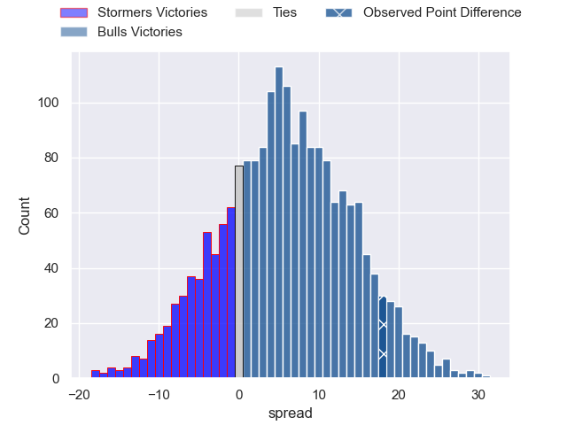
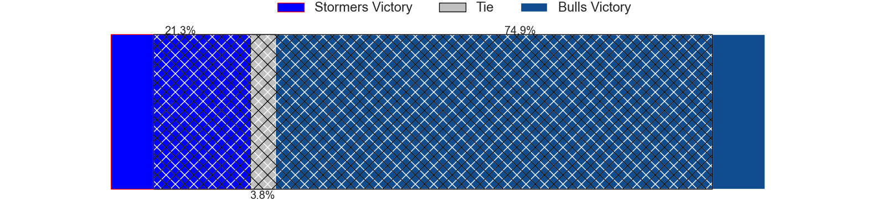

---  
layout: page  
title: Stormers at Bulls; 22-40  
date: 2024-03-02 18:00:00 -0500  
categories: "United Rugby Championship 2023" match review  
---
# Stormers at Bulls; 22-40

# Club Level Predictions

The first set of predictions treats a club as the smallest object, as the club develops its members, organizes a gameplan, and deploys its players as needed for each match. This club model has a prediction of 0.674, which translates to predicting Bulls to win by 6.4.

Our Over/Under is 66.5 - and combined with the spread above, we have a predicted scoreline of 30 to 36

Each club has a rating and a rating deviation (similar to a Glicko rating), and expected performances can be generated. This allows for simulated matches and spreads like the ones below.
## Projected Performances - Club Model

## Projected Spreads - Club Model

## Projected Results - Club Model

# Player Level Predictions - Version 2

Treating teams instead as an entity made up of the currently active players, I have ratings for each player in an altogether different system. These can be combined to form team ratings once teamsheets are announced, weighting starters a bit higher than the reserves. After the match is played, players can be weighted by their minutes on the field, allowing for an accurate measure of the team's composition. With these compiled team ratings, we can make predictions, measure inaccuracy, and update the individual player ratings.
## Prediction without Player Minutes: Bulls by 7.1

Bulls by 2.6 on a neutral pitch

## Projected Performances - Player Model

## Projected Spreads - Player Model

## Projected Results - Player Model

|   Away Minutes | Away Player       |   Away Percentile |   Number |   Home Percentile | Home Player                     |   Home Minutes |
|---------------:|:------------------|------------------:|---------:|------------------:|:--------------------------------|---------------:|
|             56 | Sti Sithole       |             93.31 |        1 |             94.87 | Gerhard Steenekamp              |             63 |
|             51 | Joseph Dweba      |             59.54 |        2 |             96.76 | Johan Grobbelaar                |             53 |
|             64 | Neethling Fouche  |             77.27 |        3 |             99.63 | Wilco Louw                      |             63 |
|             44 | Adre Smith        |             86.89 |        4 |             52.68 | Ruan Vermaak                    |             58 |
|             80 | Ruben van Heerden |             73.42 |        5 |             91.06 | Ruan Nortje                     |             80 |
|             52 | Deon Fourie       |             96.92 |        6 |             93.94 | Marco van Staden                |             66 |
|             80 | Evan Roos         |             86.01 |        7 |             78.74 | Reinhardt Ludwig                |             80 |
|             51 | Hacjivah Dayimani |             92.96 |        8 |             95.39 | Marcell Coetzee                 |             65 |
|             56 | Herschel Jantjies |             90.8  |        9 |             95.09 | Embrose Papier                  |             78 |
|             80 | Manie Libbok      |             78.61 |       10 |             85.07 | Johan Goosen                    |             80 |
|             80 | Leolin Zas        |             88.18 |       11 |             99.36 | Kurt-Lee Arendse                |             69 |
|             80 | Damian Willemse   |             95    |       12 |             95.24 | David Kriel                     |             80 |
|             64 | Daniel du Plessis |             87.98 |       13 |             58.21 | Stedman Gans                    |             61 |
|             80 | Ben Loader        |             91.19 |       14 |             99.89 | Canan Moodie                    |             80 |
|             80 | Warrick Gelant    |             99.04 |       15 |             87.29 | Devon Williams                  |             80 |
|             29 | Andre-Hugo Venter |             58.97 |       16 |             99.24 | Akker van der Merwe             |             27 |
|             24 | Brok Harris       |             99.91 |       17 |             75.44 | Simphiwe Matanzima              |             17 |
|             16 | Sazi Sandi        |            nan    |       18 |            nan    | Francois Klopper                |             17 |
|             36 | Salmaan Moerat    |             53.87 |       19 |            nan    | Jacob Frederick Nel Van Heerden |             22 |
|             29 | Ben-Jason Dixon   |             31.72 |       20 |            nan    | Nizaam Carr                     |             15 |
|             28 | Marcel Theunissen |             59.14 |       21 |            nan    | Zak Burger                      |              2 |
|             24 | Paul de Wet       |             85.89 |       22 |             98.08 | Willie le Roux                  |             30 |
|             16 | Sacha Mngomezulu  |             53.21 |       23 |            nan    | Celimpilo Gumede                |             14 |

