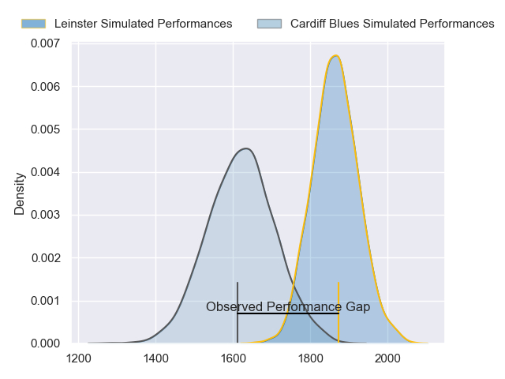
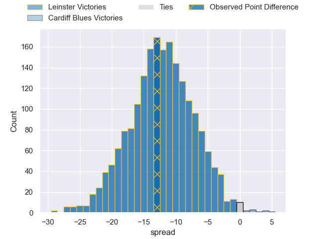
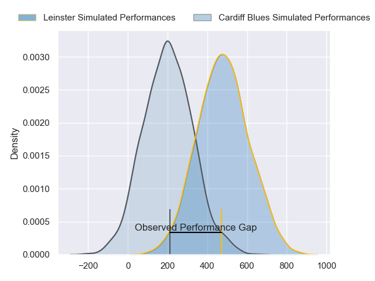
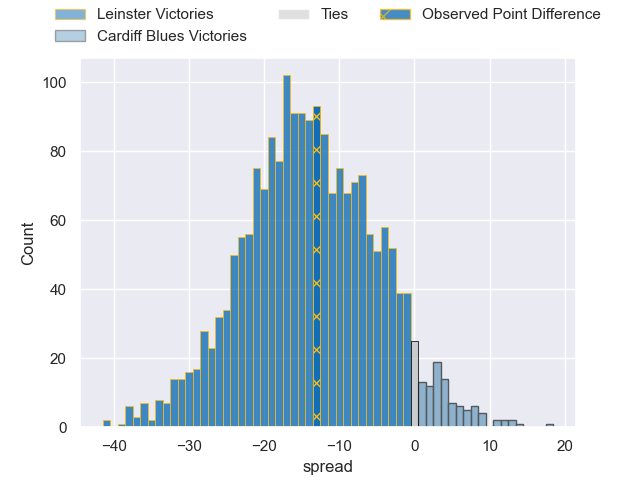

---  
layout: page  
title: Leinster at Cardiff Blues; 33-20  
date: 2024-03-02 18:00:00 -0500  
categories: "United Rugby Championship 2023" match review  
---
# Leinster at Cardiff Blues; 33-20

# Club Level Predictions

The first set of predictions treats a club as the smallest object, as the club develops its members, organizes a gameplan, and deploys its players as needed for each match. This club model has a prediction of 0.199, which translates to predicting Leinster to win by 12.3.

Our Over/Under is 40.5 - and combined with the spread above, we have a predicted scoreline of 26 to 14

Each club has a rating and a rating deviation (similar to a Glicko rating), and expected performances can be generated. This allows for simulated matches and spreads like the ones below.
## Projected Performances - Club Model

## Projected Spreads - Club Model

## Projected Results - Club Model

# Player Level Predictions - Version 2

Treating teams instead as an entity made up of the currently active players, I have ratings for each player in an altogether different system. These can be combined to form team ratings once teamsheets are announced, weighting starters a bit higher than the reserves. After the match is played, players can be weighted by their minutes on the field, allowing for an accurate measure of the team's composition. With these compiled team ratings, we can make predictions, measure inaccuracy, and update the individual player ratings.
## Prediction without Player Minutes: Leinster by 13.8

Leinster by 20.8 on a neutral pitch

## Projected Performances - Player Model

## Projected Spreads - Player Model

## Projected Results - Player Model

|   Away Minutes | Away Player        |   Away Percentile |   Number |   Home Percentile | Home Player        |   Home Minutes |
|---------------:|:-------------------|------------------:|---------:|------------------:|:-------------------|---------------:|
|             35 | Jack Boyle         |             50.95 |        1 |              8.9  | Rhys Carré         |             70 |
|             54 | Lee Barron         |             52.26 |        2 |             50    | Liam Belcher       |             70 |
|             52 | Thomas Clarkson    |             79.29 |        3 |             19.44 | Will Davies-King   |             57 |
|             80 | Ross Molony        |             94.82 |        4 |              8.71 | Shane Lewis-Hughes |             80 |
|             52 | Jason Jenkins      |             76.35 |        5 |             46.35 | Josh Turnbull      |             57 |
|             62 | Will Connors       |             82.27 |        6 |             32    | Ellis Jenkins      |             80 |
|             80 | Scott Penny        |             87.68 |        7 |             86.81 | Thomas Young       |             74 |
|             80 | Max Deegan         |             92.25 |        8 |             74.18 | Lopeti Timani      |              6 |
|             69 | Luke McGrath       |             98.8  |        9 |             38.92 | Ellis Bevan        |             70 |
|             69 | Ross Byrne         |             95.4  |       10 |             49.88 | Tinus de Beer      |             80 |
|             80 | Rob Russell        |             70.53 |       11 |              4.93 | Aled Summerhill    |             80 |
|             65 | Harry Byrne        |             88.93 |       12 |             39.46 | Ben Thomas         |             80 |
|             80 | Jamie Osborne      |             88.1  |       13 |             40.64 | Max Clark          |             80 |
|             80 | Liam Turner        |             53.48 |       14 |              1.93 | Owen Lane          |             80 |
|             80 | Jordan Larmour     |             89.71 |       15 |             37.32 | Jacob Beetham      |             25 |
|             26 | John McKee         |             72.83 |       16 |            nan    | Dafydd Hughes      |             10 |
|             45 | Michael Milne      |            nan    |       17 |            nan    | Rhys Barratt       |             10 |
|             28 | Michael Ala'alatoa |             95.28 |       18 |            nan    | Ciaran Parker      |             23 |
|             28 | Brian Deeny        |             54.12 |       19 |             74.05 | Ben Donnell        |             23 |
|             18 | Rhys Ruddock       |             99.68 |       20 |             75.35 | Alun Lawrence      |             74 |
|             11 | Ben Murphy         |            nan    |       21 |            nan    | Lucas de la Rua    |              6 |
|             11 | Sam Prendergast    |            nan    |       22 |            nan    | Matthew Aubrey     |             10 |
|             15 | Ben Brownlee       |            nan    |       23 |             92.34 | Uilisi Halaholo    |             55 |

