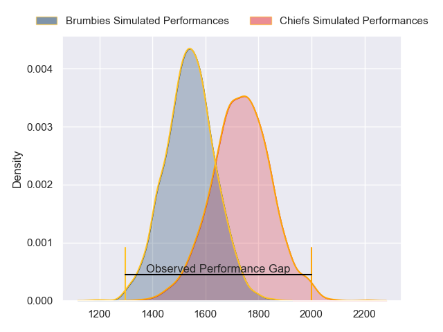
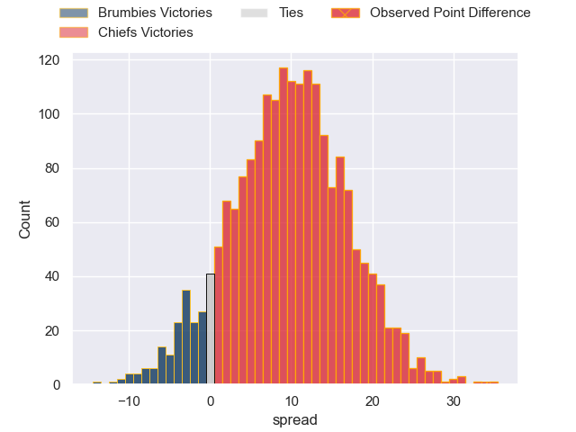
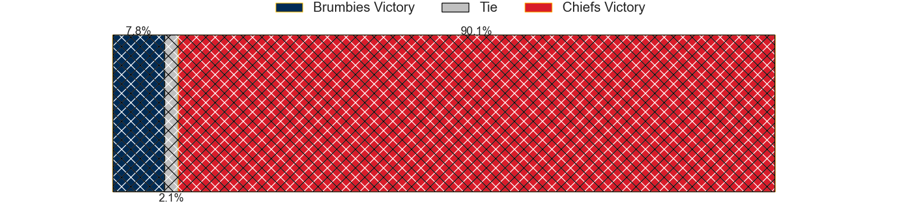
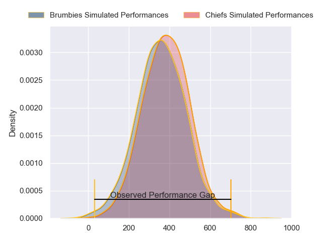
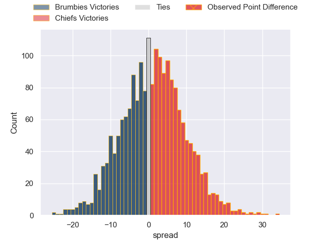
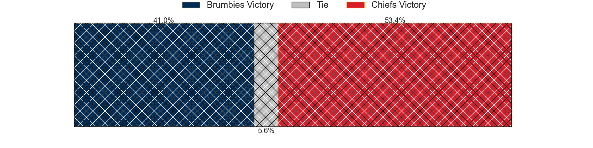

---  
layout: page  
title: Brumbies at Chiefs; 12-46  
date: 2024-03-02 18:00:00 -0500  
categories: "Super Rugby Pacific 2024" match review  
---
# Brumbies at Chiefs; 12-46

# Club Level Predictions

The first set of predictions treats a club as the smallest object, as the club develops its members, organizes a gameplan, and deploys its players as needed for each match. This club model has a prediction of 0.746, which translates to predicting Chiefs to win by 9.8.

Our Over/Under is 46.5 - and combined with the spread above, we have a predicted scoreline of 18 to 28

Each club has a rating and a rating deviation (similar to a Glicko rating), and expected performances can be generated. This allows for simulated matches and spreads like the ones below.
## Projected Performances - Club Model

## Projected Spreads - Club Model

## Projected Results - Club Model

# Player Level Predictions - Version 2

Treating teams instead as an entity made up of the currently active players, I have ratings for each player in an altogether different system. These can be combined to form team ratings once teamsheets are announced, weighting starters a bit higher than the reserves. After the match is played, players can be weighted by their minutes on the field, allowing for an accurate measure of the team's composition. With these compiled team ratings, we can make predictions, measure inaccuracy, and update the individual player ratings.
## Prediction without Player Minutes: Chiefs by 3.5

Brumbies by 1.1 on a neutral pitch

## Projected Performances - Player Model

## Projected Spreads - Player Model

## Projected Results - Player Model

|   Away Minutes | Away Player      |   Away Percentile |   Number |   Home Percentile | Home Player          |   Home Minutes |
|---------------:|:-----------------|------------------:|---------:|------------------:|:---------------------|---------------:|
|             48 | James Slipper    |             92.28 |        1 |             79.75 | Ollie Norris         |             52 |
|             48 | Lachlan Lonergan |              8.87 |        2 |             79.25 | Bradley Slater       |             50 |
|             54 | Sefo Kautai      |             18.98 |        3 |             83.65 | George Dyer          |             50 |
|             80 | Nick Frost       |             40.82 |        4 |             21.06 | Manaaki Selby-Rickit |             80 |
|             51 | Tom Hooper       |             68    |        5 |             86.59 | Tupou Vaa'i          |             61 |
|             80 | Rob Valetini     |             96.54 |        6 |             92.97 | Samipeni Finau       |             66 |
|             54 | Luke Reimer      |             58.7  |        7 |             42.27 | Kaylum Boshier       |             61 |
|             80 | Charlie Cale     |             29.11 |        8 |             91.08 | Luke Jacobson        |             80 |
|             64 | Ryan Lonergan    |             75.45 |        9 |             46.31 | Xavier Roe           |             58 |
|             80 | Noah Lolesio     |             76.51 |       10 |             96.85 | Damian McKenzie      |             80 |
|             80 | Corey Toole      |             28.83 |       11 |             29.58 | Etene Nanai-Seturo   |             80 |
|             55 | Ollie Sapsford   |             82.1  |       12 |             63.6  | Rameka Poihipi       |             80 |
|             80 | Len Ikitau       |             80.45 |       13 |             91.4  | Anton Lienert-Brown  |             78 |
|             80 | Andy Muirhead    |             93.25 |       14 |             87.89 | Liam Coombes-Fabling |             80 |
|             75 | Tom Wright       |             53.35 |       15 |             93.3  | Shaun Stevenson      |             61 |
|             32 | Billy Pollard    |             52.08 |       16 |             92.26 | Samisoni Taukei'aho  |             30 |
|             32 | Blake Schoupp    |             41.33 |       17 |             29.97 | Jared Proffit        |             30 |
|             26 | Rhys Van Nek     |             63.12 |       18 |             19.16 | Reuben O'Neill       |             30 |
|             29 | Cadeyrn Neville  |             98.24 |       19 |             94.35 | Naitoa Ah Kuoi       |             19 |
|             26 | Jahrome Brown    |             85.51 |       20 |             44.37 | Simon Parker         |             19 |
|             16 | Harrison Goddard |             13.17 |       21 |             70.66 | Cortez Ratima        |             22 |
|              5 | Declan Meredith  |            nan    |       22 |             55.45 | Josh Ioane           |             19 |
|             25 | Tamati Tua       |             45.47 |       23 |             72.67 | Daniel Rona          |             14 |

