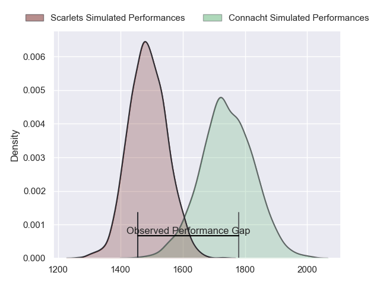
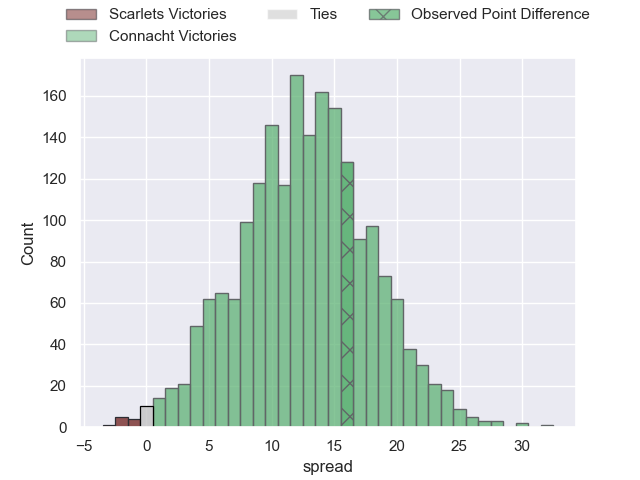
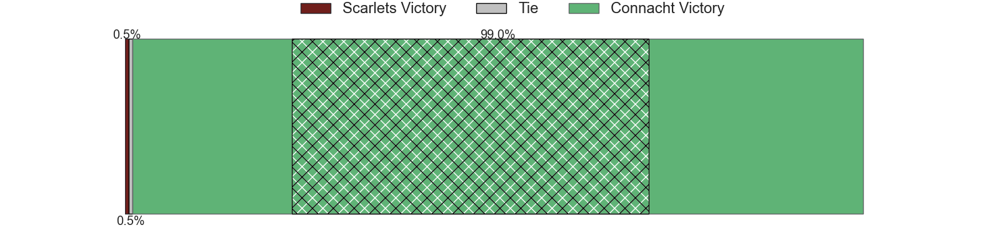
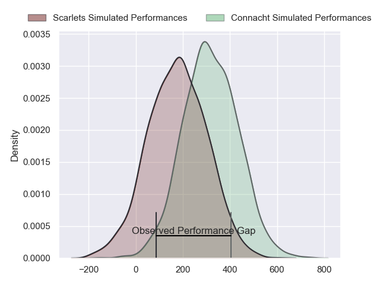
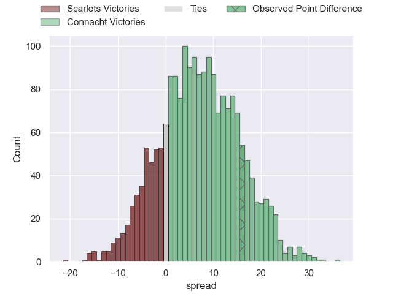
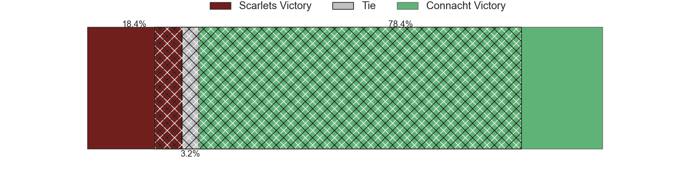

---  
layout: page  
title: Scarlets at Connacht; 10-26  
date: 2024-03-02 18:00:00 -0500  
categories: "United Rugby Championship 2023" match review  
---
# Scarlets at Connacht; 10-26

# Club Level Predictions

The first set of predictions treats a club as the smallest object, as the club develops its members, organizes a gameplan, and deploys its players as needed for each match. This club model has a prediction of 0.806, which translates to predicting Connacht to win by 12.6.

Our Over/Under is 47.5 - and combined with the spread above, we have a predicted scoreline of 18 to 30

Each club has a rating and a rating deviation (similar to a Glicko rating), and expected performances can be generated. This allows for simulated matches and spreads like the ones below.
## Projected Performances - Club Model

## Projected Spreads - Club Model

## Projected Results - Club Model

# Player Level Predictions - Version 2

Treating teams instead as an entity made up of the currently active players, I have ratings for each player in an altogether different system. These can be combined to form team ratings once teamsheets are announced, weighting starters a bit higher than the reserves. After the match is played, players can be weighted by their minutes on the field, allowing for an accurate measure of the team's composition. With these compiled team ratings, we can make predictions, measure inaccuracy, and update the individual player ratings.
## Prediction without Player Minutes: Connacht by 8.8

Connacht by 3.5 on a neutral pitch

## Projected Performances - Player Model

## Projected Spreads - Player Model

## Projected Results - Player Model

|   Away Minutes | Away Player      |   Away Percentile |   Number |   Home Percentile | Home Player           |   Home Minutes |
|---------------:|:-----------------|------------------:|---------:|------------------:|:----------------------|---------------:|
|             68 | Wyn Jones        |             61.62 |        1 |             97.91 | Peter Dooley          |             54 |
|             73 | Shaun Evans      |             39.43 |        2 |             50.57 | Eoin de Buitléar      |             54 |
|             59 | Sam Wainwright   |             21.78 |        3 |             77.22 | Jack Aungier          |             54 |
|             68 | Alex Craig       |             21.41 |        4 |             89.41 | Niall Murray          |             80 |
|             59 | Jac Price        |              5.88 |        5 |             52    | Gavin Thornbury       |             47 |
|             80 | Sam Lousi        |             69.87 |        6 |             64.36 | Cian Prendergast      |             80 |
|             80 | Dan Davis        |             69.44 |        7 |             61.12 | Shamus Hurley-Langton |             54 |
|             80 | Vaea Fifita      |             95.54 |        8 |             24.41 | Sean Jansen           |             63 |
|             68 | Efan Jones       |             32.53 |        9 |             81.84 | Caolin Blade          |             77 |
|             73 | Dan Jones        |             68.36 |       10 |             90.58 | JJ Hanrahan           |             69 |
|             80 | Steffan Evans    |             80.71 |       11 |             12.65 | Andrew Smith          |             80 |
|             80 | Eddie James      |             22.61 |       12 |             34.51 | Cathal Forde          |             74 |
|             80 | Johnny Williams  |             69.73 |       13 |             57.13 | David Hawkshaw        |             80 |
|             68 | Tomi Lewis       |             22.83 |       14 |             51.13 | Byron Ralston         |             80 |
|             80 | Ioan Nicholas    |             13.88 |       15 |             85.89 | Tiernan O'Halloran    |             74 |
|              7 | Eduan Swart      |             26.79 |       16 |             54.72 | Dave Heffernan        |             26 |
|             12 | Steffan Thomas   |            nan    |       17 |             89.29 | Denis Buckley         |             26 |
|             21 | Joe Jones        |            nan    |       18 |            nan    | Sam Illo              |             26 |
|             21 | Morgan Jones     |            nan    |       19 |             63.29 | Oisin Dowling         |             33 |
|             12 | Ben Williams     |            nan    |       20 |             19.72 | Sean O'Brien          |             17 |
|             12 | Archie Hughes    |             31.14 |       21 |             33.73 | Michael McDonald      |              9 |
|              7 | Charlie Titcombe |            nan    |       22 |             93    | Jack Carty            |             17 |
|             12 | Ryan Conbeer     |            nan    |       23 |             83.15 | Conor Oliver          |             26 |

