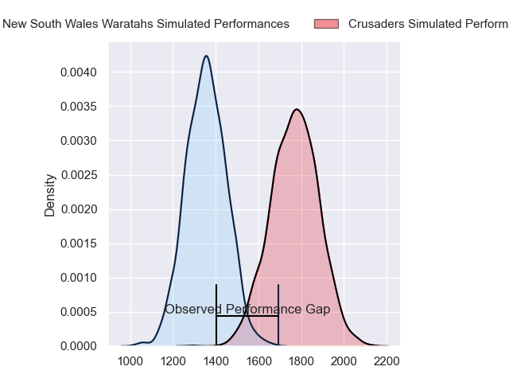
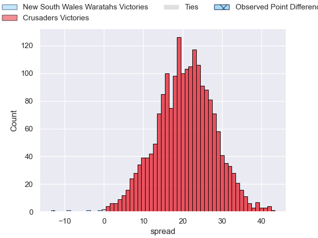
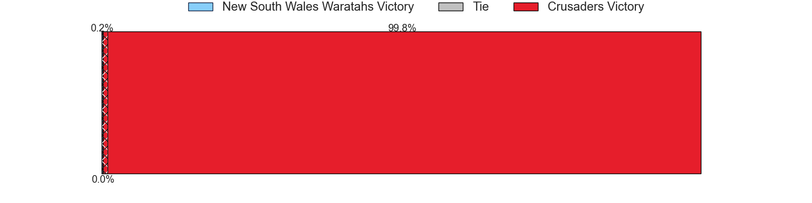
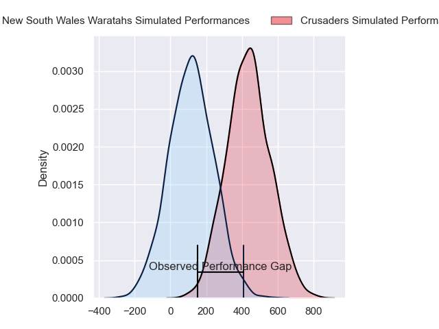
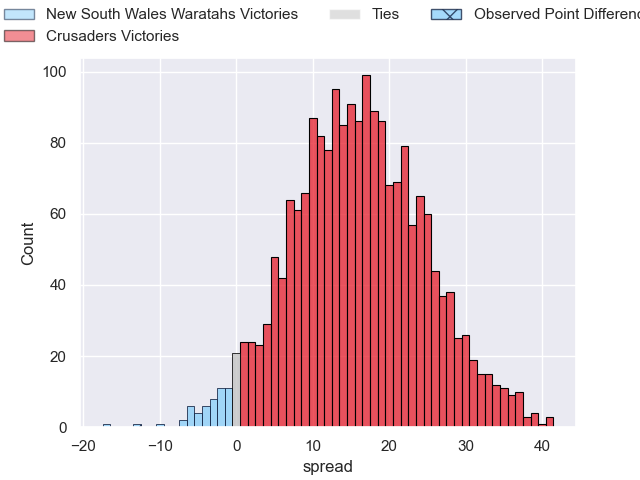
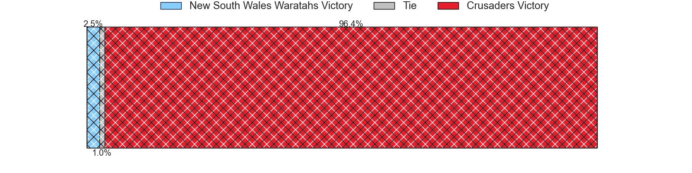

---  
layout: page  
title: New South Wales Waratahs at Crusaders; 37-24  
date: 2024-03-02 18:00:00 -0500  
categories: "Super Rugby Pacific 2024" match review  
---
# New South Wales Waratahs at Crusaders; 37-24

# Club Level Predictions

The first set of predictions treats a club as the smallest object, as the club develops its members, organizes a gameplan, and deploys its players as needed for each match. This club model has a prediction of 0.907, which translates to predicting Crusaders to win by 20.7.

Our Over/Under is 39.5 - and combined with the spread above, we have a predicted scoreline of 9 to 30

Each club has a rating and a rating deviation (similar to a Glicko rating), and expected performances can be generated. This allows for simulated matches and spreads like the ones below.
## Projected Performances - Club Model

## Projected Spreads - Club Model

## Projected Results - Club Model

# Player Level Predictions - Version 2

Treating teams instead as an entity made up of the currently active players, I have ratings for each player in an altogether different system. These can be combined to form team ratings once teamsheets are announced, weighting starters a bit higher than the reserves. After the match is played, players can be weighted by their minutes on the field, allowing for an accurate measure of the team's composition. With these compiled team ratings, we can make predictions, measure inaccuracy, and update the individual player ratings.
## Prediction without Player Minutes: Crusaders by 17.0

Crusaders by 12.7 on a neutral pitch

## Projected Performances - Player Model

## Projected Spreads - Player Model

## Projected Results - Player Model

|   Away Minutes | Away Player              |   Away Percentile |   Number |   Home Percentile | Home Player          |   Home Minutes |
|---------------:|:-------------------------|------------------:|---------:|------------------:|:---------------------|---------------:|
|             59 | Angus Bell               |             90.92 |        1 |              9.9  | George Bower         |             57 |
|             69 | Mahe Vailanu             |             23.77 |        2 |             22.64 | George Bell          |             69 |
|             62 | Harry Johnson-Holmes     |             72.84 |        3 |              2.54 | Fletcher Newell      |             57 |
|             80 | Jed Holloway             |             40.71 |        4 |             95.06 | Scott Barrett        |             80 |
|             59 | Hugh Sinclair            |             28    |        5 |             82.94 | Quinten Strange      |             52 |
|             42 | Fergus Lee-Warner        |             26.27 |        6 |             54.49 | Dom Gardiner         |             80 |
|             80 | Charlie Gamble           |             76.22 |        7 |             75.14 | Tom Christie         |             80 |
|             80 | Langi Gleeson            |             70.89 |        8 |             75.59 | Cullen Grace         |             52 |
|             80 | Jake Gordon              |             91.22 |        9 |             52.69 | Noah Hotham          |             48 |
|             80 | Tane Edmed               |             41.65 |       10 |             13.8  | Taha Kemara          |             59 |
|             41 | Dylan Pietsch            |             77.06 |       11 |             36.12 | Macca Springer       |             80 |
|             80 | Joey Walton              |             85.63 |       12 |             97.29 | David Havili         |             80 |
|             69 | Harry Wilson             |             47.11 |       13 |             74.09 | Levi Aumua           |             59 |
|             80 | Mark Nawaqanitawase      |             51.88 |       14 |             84.67 | Sevu Reece           |             80 |
|             80 | Max Jorgensen            |             74.4  |       15 |             22.01 | Chay Fihaki          |             80 |
|             11 | Julian Heaven            |            nan    |       16 |             95.28 | Quentin MacDonald    |             11 |
|             21 | Hayden Thompson-Stringer |             93.46 |       17 |             77.66 | Joe Moody            |             23 |
|             28 | Daniel Botha             |            nan    |       18 |             79.56 | Owen Franks          |             23 |
|             21 | Miles Amatosero          |              5.18 |       19 |            nan    | Jamie Hannah         |             28 |
|             28 | Ned Hanigan              |             46.24 |       20 |             40.38 | Christian Lio-Willie |             28 |
|              0 | Teddy Wilson             |            nan    |       21 |             92.81 | Mitchell Drummond    |             32 |
|             11 | Mosese Tuipulotu         |             21.44 |       22 |             98.47 | Ryan Crotty          |             21 |
|             39 | Triston Reilly           |            nan    |       23 |             57.95 | Dallas McLeod        |             21 |

