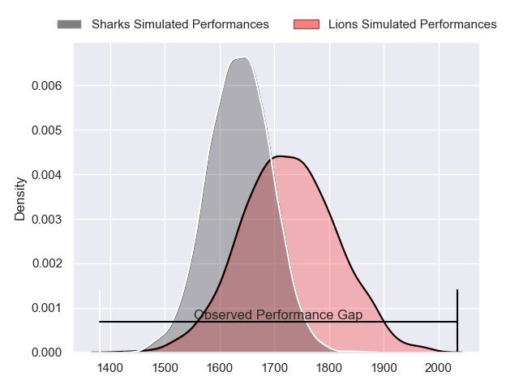
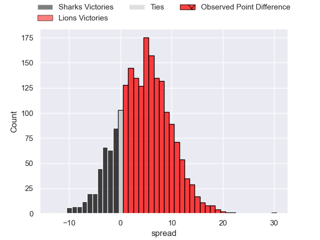
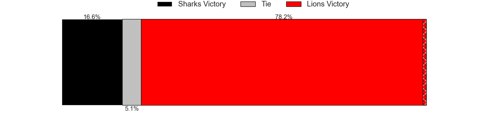
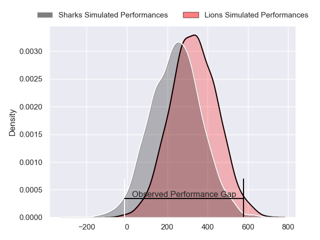
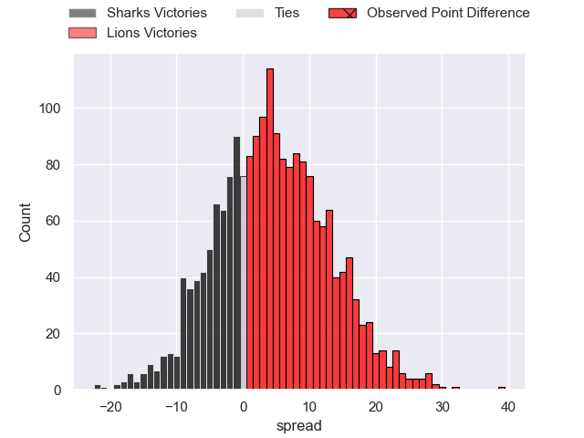
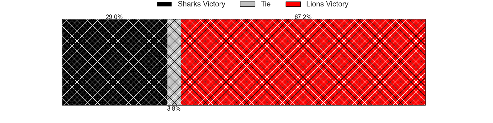

---  
layout: page  
title: Sharks at Lions; 10-40  
date: 2024-03-02 18:00:00 -0500  
categories: "United Rugby Championship 2023" match review  
---
# Sharks at Lions; 10-40

# Club Level Predictions

The first set of predictions treats a club as the smallest object, as the club develops its members, organizes a gameplan, and deploys its players as needed for each match. This club model has a prediction of 0.62, which translates to predicting Lions to win by 4.3.

Our Over/Under is 64.5 - and combined with the spread above, we have a predicted scoreline of 30 to 34

Each club has a rating and a rating deviation (similar to a Glicko rating), and expected performances can be generated. This allows for simulated matches and spreads like the ones below.
## Projected Performances - Club Model

## Projected Spreads - Club Model

## Projected Results - Club Model

# Player Level Predictions - Version 2

Treating teams instead as an entity made up of the currently active players, I have ratings for each player in an altogether different system. These can be combined to form team ratings once teamsheets are announced, weighting starters a bit higher than the reserves. After the match is played, players can be weighted by their minutes on the field, allowing for an accurate measure of the team's composition. With these compiled team ratings, we can make predictions, measure inaccuracy, and update the individual player ratings.
## Prediction without Player Minutes: Lions by 6.8

Lions by 3.0 on a neutral pitch

## Projected Performances - Player Model

## Projected Spreads - Player Model

## Projected Results - Player Model

|   Away Minutes | Away Player        |   Away Percentile |   Number |   Home Percentile | Home Player            |   Home Minutes |
|---------------:|:-------------------|------------------:|---------:|------------------:|:-----------------------|---------------:|
|             61 | Ntuthuko Mchunu    |             31.62 |        1 |             79.01 | Jean-Pierre Smith      |             66 |
|             67 | Bongi Mbonambi     |             96.37 |        2 |             61.45 | PJ Botha               |             59 |
|             46 | Coenie Oosthuizen  |             99.45 |        3 |             63.61 | Asenathi Ntlabakanye   |             59 |
|             61 | Corne Rahl         |             36.83 |        4 |             83.08 | Etienne Oosthuizen     |             80 |
|             80 | Gerbrandt Grobler  |             14.06 |        5 |             54.35 | Darrien-Lane Landsberg |             47 |
|             69 | James Venter       |             56.83 |        6 |             53.19 | JC Pretorius           |             80 |
|             71 | Vincent Tshituka   |             83.37 |        7 |             90.53 | Ruan Venter            |             61 |
|             48 | George Cronje      |             36.41 |        8 |             97.33 | Francke Horn           |             80 |
|             70 | Grant Williams     |             51.53 |        9 |             94.27 | Sanele Nohamba         |             52 |
|             80 | Siya Masuku        |             40.8  |       10 |             61.69 | Jordan Hendrikse       |             80 |
|             29 | Aphiwe Dyantyi     |              2.04 |       11 |             85.82 | Edwill van der Merwe   |             80 |
|             80 | Francois Venter    |             41.67 |       12 |             89.17 | Marius Louw            |             59 |
|             80 | Ethan Hooker       |             30.71 |       13 |             65.95 | Henco van Wyk          |             17 |
|             80 | Eduan Keyter       |             30.72 |       14 |             42.53 | Richard Kriel          |             80 |
|             80 | Aphelele Fassi     |             86.33 |       15 |             87.05 | Quan Horn              |             80 |
|             22 | Fez Mbatha         |             87.79 |       16 |             69.85 | Jaco Visagie           |             21 |
|             19 | Dian Bleuler       |            nan    |       17 |            nan    | Corne Fourie           |             14 |
|             34 | Khwezi Mona        |            nan    |       18 |            nan    | Conraad van Vuuren     |             21 |
|             19 | Pieter Labuschagne |             12.33 |       19 |             90.82 | Reinhard Nothnagel     |             33 |
|             13 | Tinotenda Mavesere |            nan    |       20 |            nan    | Emmanuel Tshituka      |             19 |
|             30 | Phepsi Buthelezi   |             45.15 |       21 |             33.92 | Hanru Sirgel           |             21 |
|             10 | Tiaan Fourie       |            nan    |       22 |             83.64 | Morne van den Berg     |             28 |
|             51 | Curwin Bosch       |             84.83 |       23 |             11.55 | Erich Cronje           |             63 |

