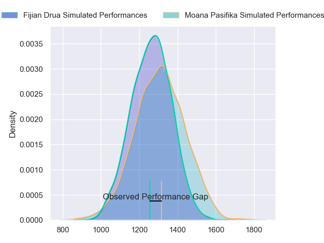
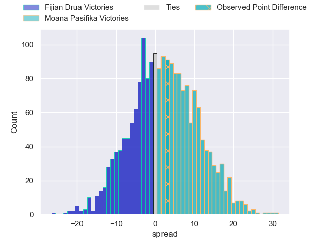
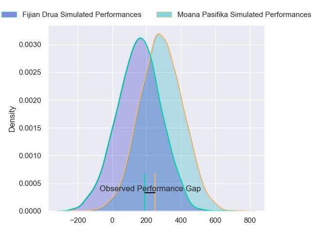
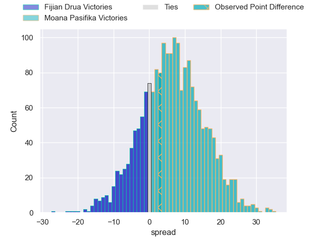
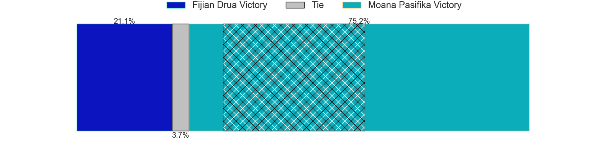

---  
layout: page  
title: Fijian Drua at Moana Pasifika; 36-39  
date: 2024-03-02 18:00:00 -0500  
categories: "Super Rugby Pacific 2024" match review  
---
# Fijian Drua at Moana Pasifika; 36-39

# Club Level Predictions

The first set of predictions treats a club as the smallest object, as the club develops its members, organizes a gameplan, and deploys its players as needed for each match. This club model has a prediction of 0.557, which translates to predicting Moana Pasifika to win by 2.1.

Our Over/Under is 66.5 - and combined with the spread above, we have a predicted scoreline of 32 to 34

Each club has a rating and a rating deviation (similar to a Glicko rating), and expected performances can be generated. This allows for simulated matches and spreads like the ones below.
## Projected Performances - Club Model

## Projected Spreads - Club Model

## Projected Results - Club Model

# Player Level Predictions - Version 2

Treating teams instead as an entity made up of the currently active players, I have ratings for each player in an altogether different system. These can be combined to form team ratings once teamsheets are announced, weighting starters a bit higher than the reserves. After the match is played, players can be weighted by their minutes on the field, allowing for an accurate measure of the team's composition. With these compiled team ratings, we can make predictions, measure inaccuracy, and update the individual player ratings.
## Prediction without Player Minutes: Moana Pasifika by 7.6

Moana Pasifika by 5.3 on a neutral pitch

## Projected Performances - Player Model

## Projected Spreads - Player Model

## Projected Results - Player Model

|   Away Minutes | Away Player             |   Away Percentile |   Number |   Home Percentile | Home Player           |   Home Minutes |
|---------------:|:------------------------|------------------:|---------:|------------------:|:----------------------|---------------:|
|             53 | Livai Natave            |             37.93 |        1 |             51.18 | Abraham Pole          |             62 |
|             80 | Tevita Ikanivere        |             84.72 |        2 |             75.28 | Sama Malolo           |             21 |
|             53 | Mesake Doge             |             21.32 |        3 |             79.85 | Sione Mafileo         |             68 |
|             52 | Mesake Vocevoce         |             49.18 |        4 |             95.29 | Tom Savage            |             67 |
|             21 | Isoa Nasilasila         |             75.06 |        5 |             44    | Allan Craig           |             80 |
|             80 | Etonia Waqa             |             49.78 |        6 |             94.38 | Jacob Norris          |             80 |
|             69 | Elia Canakaivata        |             54.75 |        7 |             37.58 | Sione Havili Talitui  |             67 |
|             80 | Meli Derenalagi         |             32.16 |        8 |             38.97 | Lotu Inisi            |             70 |
|             69 | Frank Lomani            |             48.7  |        9 |              5.19 | Ere Enari             |             62 |
|             80 | Isaiah Ravula           |             44.44 |       10 |             54.35 | William Havili        |             62 |
|             80 | Epeli Momo              |             43.94 |       11 |              3.54 | Viliami Fine          |             70 |
|             60 | Apisalome Vota          |             45.23 |       12 |             99.18 | Julian Savea          |             80 |
|             80 | Iosefo Masi             |             69.96 |       13 |             39.46 | Henry Taefu           |             80 |
|             80 | Selestino Ravutaumada   |             79.53 |       14 |             88    | Nigel Ah Wong         |             80 |
|             57 | Isikeli Rabitu          |             38.76 |       15 |             23.92 | Danny Toala           |             80 |
|             11 | Mesu Dolokoto           |            nan    |       16 |             20.63 | Samiuela Moli         |             59 |
|             27 | Haereiti Hetet          |             90.02 |       17 |            nan    | Sateki Latu           |             18 |
|             27 | Jone Koroiduadua        |             38.29 |       18 |            nan    | Sekope Kepu           |             22 |
|             59 | Te Ahiwaru Cirikidaveta |             58.12 |       19 |            nan    | Ola Tauelangi         |             13 |
|             28 | Vilive Miramira         |             65.01 |       20 |            nan    | Irie Papuni           |             13 |
|             11 | Simione Kuruvoli        |             50.3  |       21 |            nan    | Aisea Halo            |             18 |
|             20 | Kemu Valetini           |            nan    |       22 |             87.2  | Christian Leali'ifano |             18 |
|             23 | Iliesa Junior Ratuva    |            nan    |       23 |             58.84 | Kyren Taumoefolau     |             10 |

