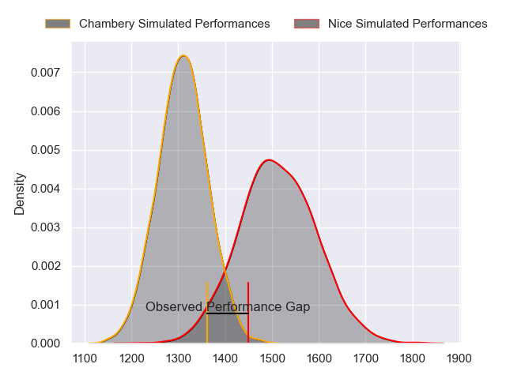
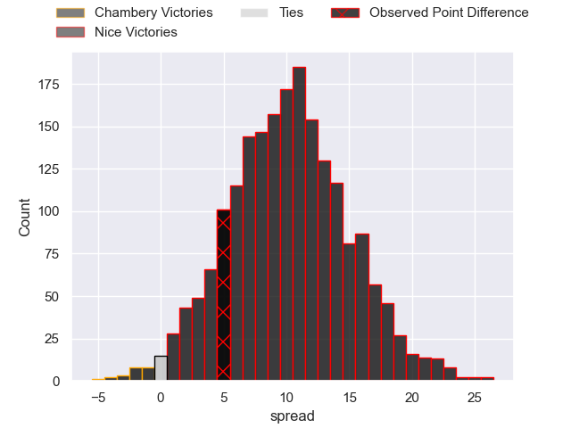
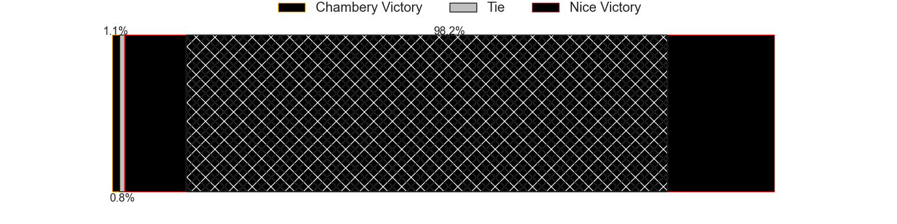
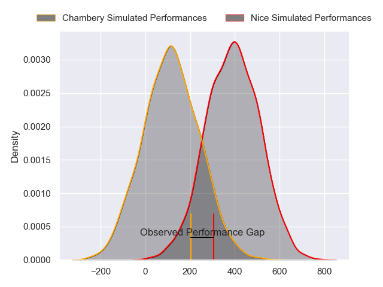
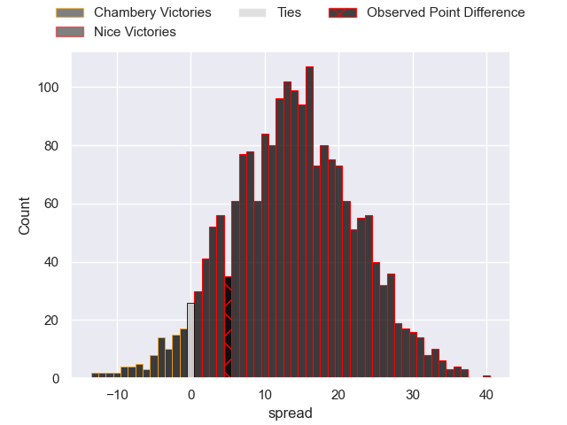
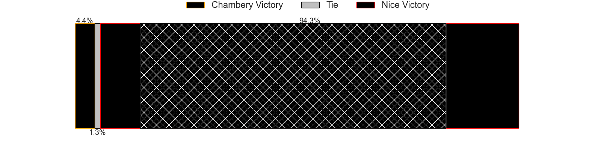

---  
layout: page  
title: Chambery at Nice; 12-17  
date: 2024-03-02 18:00:00 -0500  
categories: "Nationale 2023" match review  
---
# Chambery at Nice; 12-17

# Club Level Predictions

The first set of predictions treats a club as the smallest object, as the club develops its members, organizes a gameplan, and deploys its players as needed for each match. This club model has a prediction of 0.76, which translates to predicting Nice to win by 10.1.

Our Over/Under is 42.5 - and combined with the spread above, we have a predicted scoreline of 16 to 26

Each club has a rating and a rating deviation (similar to a Glicko rating), and expected performances can be generated. This allows for simulated matches and spreads like the ones below.
## Projected Performances - Club Model

## Projected Spreads - Club Model

## Projected Results - Club Model

# Player Level Predictions - Version 2

Treating teams instead as an entity made up of the currently active players, I have ratings for each player in an altogether different system. These can be combined to form team ratings once teamsheets are announced, weighting starters a bit higher than the reserves. After the match is played, players can be weighted by their minutes on the field, allowing for an accurate measure of the team's composition. With these compiled team ratings, we can make predictions, measure inaccuracy, and update the individual player ratings.
## Prediction without Player Minutes: Nice by 15.1

Nice by 12.3 on a neutral pitch

## Projected Performances - Player Model

## Projected Spreads - Player Model

## Projected Results - Player Model

|   Away Minutes | Away Player                  |   Away Percentile |   Number |   Home Percentile | Home Player               |   Home Minutes |
|---------------:|:-----------------------------|------------------:|---------:|------------------:|:--------------------------|---------------:|
|             17 | Géraud Clermont              |             83.96 |        1 |             86.53 | Sunia Vola                |             59 |
|             56 | Gauthier Brute de Remur      |             81.68 |        2 |             84.92 | Sione Anga'aelangi        |             66 |
|             50 | Zauri Tevdorashvili          |             16.04 |        3 |             66.73 | Luvuyo Pupuma             |             66 |
|             80 | Fabien Witz                  |             68.89 |        4 |             42.43 | Yann Tivoli               |             79 |
|             68 | Steyl Barnard                |             71.99 |        5 |             99.88 | Tom Murday                |             64 |
|             80 | Matheo Triki                 |             80.62 |        6 |             70.26 | Arthur Vignolles          |             80 |
|             50 | Thomas Coignat               |             70.59 |        7 |             43.45 | Bastien Berenguel         |             80 |
|             80 | Taniela Matakaiongo          |             55.34 |        8 |             91.99 | Laijiasa Bolenaivalu      |             36 |
|             80 | Thibault Dufau               |             20.86 |        9 |             27.2  | Matéo Jeune-Joly          |             55 |
|             64 | Victor Pisano                |             35.07 |       10 |             45.02 | Mathis Viard              |             80 |
|             56 | Arthur Nennig                |             89.04 |       11 |             93.02 | Simon Delas               |             80 |
|             80 | Mickael Blanc                |             13.45 |       12 |             82.38 | Romain Riguet             |             71 |
|             80 | Emmanuel Vaitulukina         |             44.76 |       13 |             11.19 | Luca Cutayar              |             80 |
|             80 | Va'aufauese Apelu Maliko     |             50.05 |       14 |             96.78 | Andrzej Charlat           |             80 |
|             80 | Jean-Luc Alewyn Cilliers     |             80.1  |       15 |             90.65 | David Odiete              |             80 |
|             63 | Enzo Segui                   |             37.12 |       16 |             55.42 | Martin Freytes            |             44 |
|             30 | Giorgi Pertaia               |             76.9  |       17 |             89.16 | Jules Solinas             |             25 |
|             30 | Pierre-Nicolas Dance         |            nan    |       18 |              3.48 | Jules Martinez            |             21 |
|             24 | Paul Baptiste Florent Altier |             61.39 |       19 |              4.17 | Thibault Rey              |             16 |
|             24 | Julien Primault              |             44.47 |       20 |              9.62 | Nicolas Ciancio           |             14 |
|             16 | Jules Dorrival               |             37.41 |       21 |             64.89 | Santiago Benjamin Ovejero |             14 |
|             12 | Ahmed Tidiane Kane           |             49.58 |       22 |             91.07 | Nathan Courtade           |              9 |
|            nan | nan                          |            nan    |       23 |              9.47 | Johann Afonso Grundlingh  |              1 |

