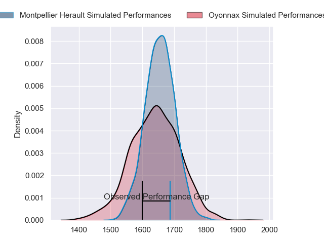
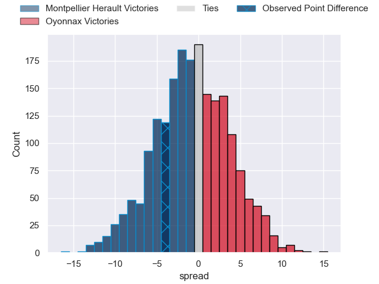
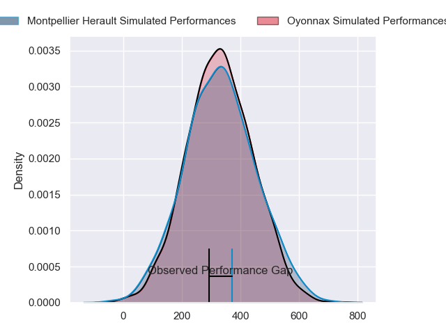
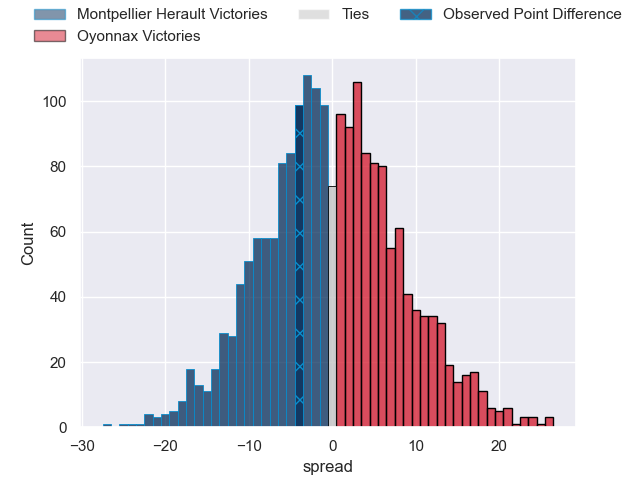

---  
layout: page  
title: Montpellier Herault at Oyonnax; 39-35  
date: 2024-03-02 18:00:00 -0500  
categories: "Top 14 Orange 2023" match review  
---
# Montpellier Herault at Oyonnax; 39-35

# Club Level Predictions

The first set of predictions treats a club as the smallest object, as the club develops its members, organizes a gameplan, and deploys its players as needed for each match. This club model has a prediction of 0.483, which translates to predicting Montpellier Herault to win by 0.6.

Our Over/Under is 45.5 - and combined with the spread above, we have a predicted scoreline of 23 to 23

Each club has a rating and a rating deviation (similar to a Glicko rating), and expected performances can be generated. This allows for simulated matches and spreads like the ones below.
## Projected Performances - Club Model

## Projected Spreads - Club Model

## Projected Results - Club Model

# Player Level Predictions - Version 2

Treating teams instead as an entity made up of the currently active players, I have ratings for each player in an altogether different system. These can be combined to form team ratings once teamsheets are announced, weighting starters a bit higher than the reserves. After the match is played, players can be weighted by their minutes on the field, allowing for an accurate measure of the team's composition. With these compiled team ratings, we can make predictions, measure inaccuracy, and update the individual player ratings.
## Prediction without Player Minutes: Montpellier Herault by 0.8

Montpellier Herault by 8.4 on a neutral pitch

## Projected Performances - Player Model

## Projected Spreads - Player Model

## Projected Results - Player Model

|   Away Minutes | Away Player                 |   Away Percentile |   Number |   Home Percentile | Home Player        |   Home Minutes |
|---------------:|:----------------------------|------------------:|---------:|------------------:|:-------------------|---------------:|
|             61 | Baptiste Erdocio            |             12.74 |        1 |             84.6  | Tommy Raynaud      |             49 |
|             61 | Christopher Tolofua         |             95.42 |        2 |             35.5  | Teddy Durand       |             61 |
|             53 | Harry Williams              |             96.98 |        3 |             50.78 | Christopher Vaotoa |             61 |
|             68 | Yacouba Camara              |             94.99 |        4 |             97.85 | Phoenix Battye     |             80 |
|             80 | Tyler Duguid                |             69.85 |        5 |             43.74 | Ewan Johnson       |             54 |
|             74 | Nicolaas Janse van Rensburg |             90.2  |        6 |             58.37 | Kevin Lebreton     |             80 |
|             50 | Lenni Nouchi                |             59.58 |        7 |             30.29 | Loic Credoz        |             65 |
|             57 | Sam Simmonds                |             75.97 |        8 |             13.83 | Loic Godener       |             63 |
|             61 | Leo Coly                    |             67.89 |        9 |             85.28 | Charlie Cassang    |             80 |
|             80 | Louis Carbonel              |             71.64 |       10 |             91.04 | Domingo Miotti     |             80 |
|             80 | Masivesi Dakuwaqa           |             84.21 |       11 |             47.69 | Enzo Reybier       |             80 |
|              8 | Jan Serfontein              |             81.9  |       12 |             77.38 | Theo Millet        |             80 |
|             73 | Auguste Cadot               |             68.69 |       13 |             20.95 | Pedro Bettencourt  |             49 |
|             80 | Julien Tisseron             |             64.34 |       14 |             70.68 | Daniel Ikpefan     |             59 |
|             80 | Anthony Bouthier            |             81.29 |       15 |             40.29 | Justin Bouraux     |             76 |
|             19 | Brandon Paenga-Amosa        |             85.69 |       16 |              1.53 | Manu Leiataua      |             19 |
|             19 | Enzo Forletta               |             76.99 |       17 |             33.82 | Rory Sutherland    |             31 |
|             30 | Paul Willemse               |             70.8  |       18 |             22.05 | Steve Mafi         |             27 |
|             30 | Marco Tauleigne             |             89.56 |       19 |             68.83 | Rory Grice         |             31 |
|             18 | Alexandre Becognee          |             48.13 |       20 |            nan    | Ilan El Khattabi   |              0 |
|             19 | Cobus Reinach               |             94.48 |       21 |             73.45 | Lucas Mensa        |             31 |
|             72 | Arthur Vincent              |             66.43 |       22 |             20.3  | Gavin Stark        |             25 |
|             27 | Lasha Macharashvili         |             58.57 |       23 |             42.71 | Thibault Berthaud  |             19 |

