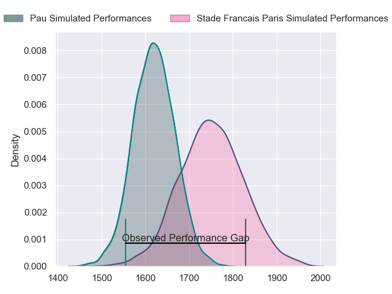
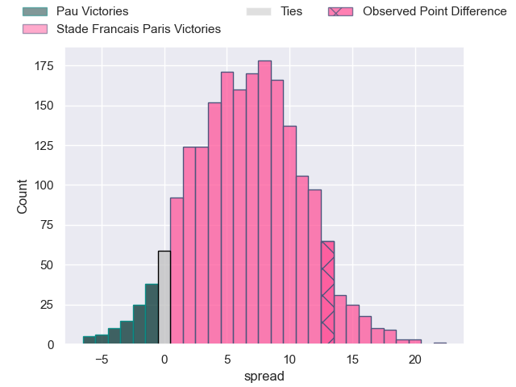
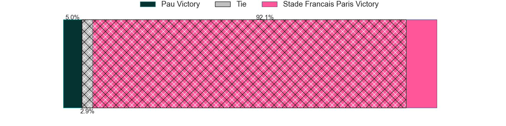
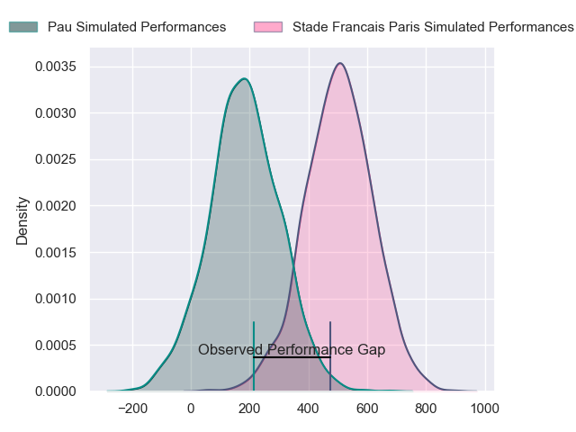
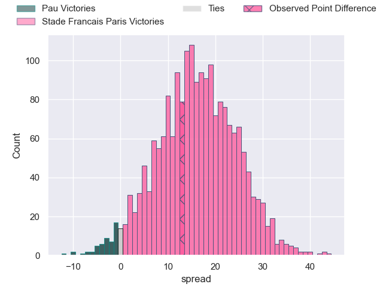
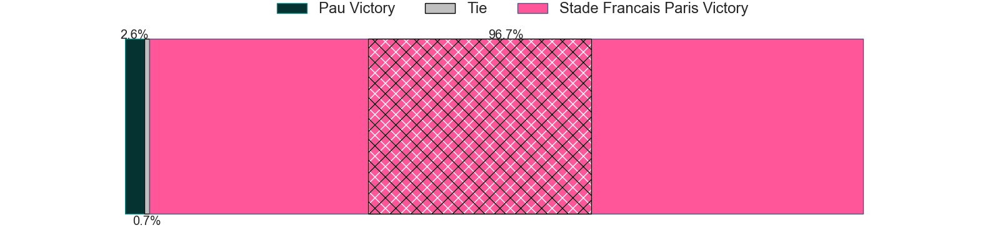

---  
layout: page  
title: Pau at Stade Francais Paris; 12-25  
date: 2024-03-02 18:00:00 -0500  
categories: "Top 14 Orange 2023" match review  
---
# Pau at Stade Francais Paris; 12-25

# Club Level Predictions

The first set of predictions treats a club as the smallest object, as the club develops its members, organizes a gameplan, and deploys its players as needed for each match. This club model has a prediction of 0.677, which translates to predicting Stade Francais Paris to win by 6.5.

Our Over/Under is 47.5 - and combined with the spread above, we have a predicted scoreline of 21 to 27

Each club has a rating and a rating deviation (similar to a Glicko rating), and expected performances can be generated. This allows for simulated matches and spreads like the ones below.
## Projected Performances - Club Model

## Projected Spreads - Club Model

## Projected Results - Club Model

# Player Level Predictions - Version 2

Treating teams instead as an entity made up of the currently active players, I have ratings for each player in an altogether different system. These can be combined to form team ratings once teamsheets are announced, weighting starters a bit higher than the reserves. After the match is played, players can be weighted by their minutes on the field, allowing for an accurate measure of the team's composition. With these compiled team ratings, we can make predictions, measure inaccuracy, and update the individual player ratings.
## Prediction without Player Minutes: Stade Francais Paris by 17.4

Stade Francais Paris by 9.3 on a neutral pitch

## Projected Performances - Player Model

## Projected Spreads - Player Model

## Projected Results - Player Model

|   Away Minutes | Away Player          |   Away Percentile |   Number |   Home Percentile | Home Player             |   Home Minutes |
|---------------:|:---------------------|------------------:|---------:|------------------:|:------------------------|---------------:|
|             50 | Siegfried Fisi'ihoi  |             47.59 |        1 |             49.86 | Clement Castets         |             51 |
|             51 | Youri Delhommel      |             56.23 |        2 |             29.62 | Lucas Peyresblanques    |             64 |
|             41 | Guram Papidze        |             13.9  |        3 |             95.64 | Francisco Gomez Kodela  |             51 |
|             58 | Guillaume Ducat      |             18.94 |        4 |             51.18 | Paul Gabrillagues       |             81 |
|             29 | Lekima Tagitagivalu  |             70.47 |        5 |             83.88 | Baptiste Pesenti        |             51 |
|             58 | Martin Puech         |             42.7  |        6 |              6.27 | Mathieu Hirigoyen       |             59 |
|             81 | Reece Hewat          |             67.03 |        7 |             95.89 | Sekou Macalou           |             81 |
|             81 | Sacha Zegueur        |             51.17 |        8 |             89.2  | Giovanni Habel-Kueffner |             81 |
|             62 | Dan Robson           |             98.6  |        9 |             97.01 | Brad Weber              |             81 |
|             50 | Thibault Debaes      |             46.25 |       10 |             84.75 | Zack Henry              |             58 |
|             81 | Aminiasi Tuimaba     |             82.21 |       11 |             90.14 | Lester Etien            |             58 |
|             81 | Jale Vatubua         |             44.17 |       12 |             52.41 | Pierre Boudehent        |             81 |
|             81 | Elliot Roudil        |             21.2  |       13 |             91.76 | Jeremy Ward             |             81 |
|             81 | Thomas Carol         |             70.63 |       14 |             49.62 | Peniasi Dakuwaqa        |             81 |
|             81 | Theo Attissogbe      |             42.34 |       15 |             75.12 | Leo Barre               |             81 |
|             30 | Lucas Rey            |             15.28 |       16 |             96.98 | Mickael Ivaldi          |             17 |
|             31 | Simon-Pierre Chauvac |             37.87 |       17 |             74.57 | Moses Alo-Emile         |             30 |
|             23 | Hugo Auradou         |             63.06 |       18 |             86.35 | JJ van der Mescht       |             30 |
|             52 | Fabrice Metz         |             81.41 |       19 |             78.27 | Romain Briatte          |             22 |
|             23 | Thibaut Hamonou      |             27.46 |       20 |             17.96 | Jules Gimbert           |              0 |
|             19 | Thibault Daubagna    |             88.42 |       21 |             92.11 | Joe Marchant            |             23 |
|             31 | Axel Desperes        |             57.87 |       22 |             72.4  | Joris Segonds           |             23 |
|             40 | Nicolas Corato       |              8.63 |       23 |            nan    | Giorgi Melikidze        |             30 |

