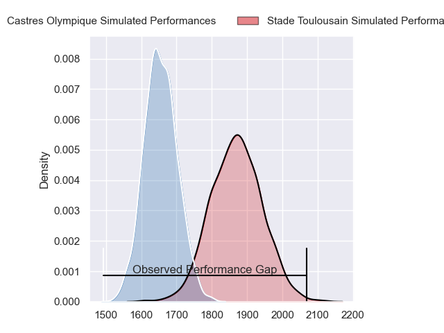
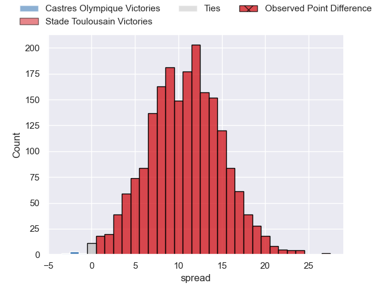
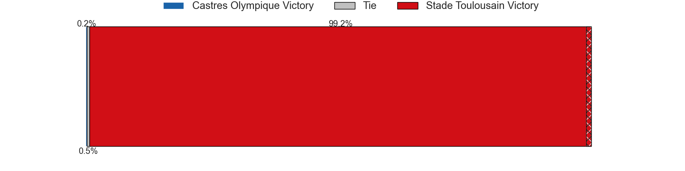
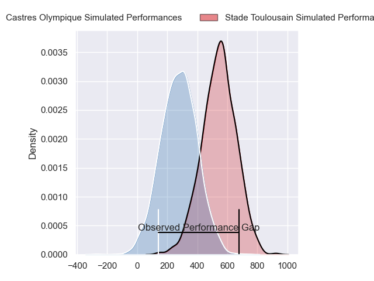
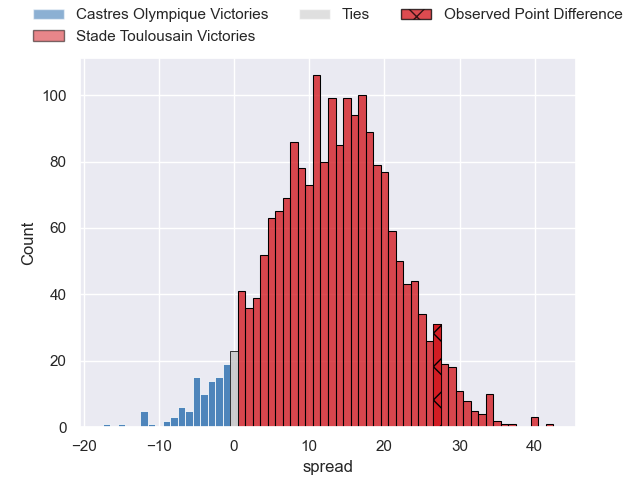
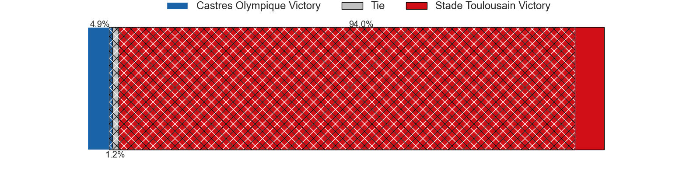

---  
layout: page  
title: Castres Olympique at Stade Toulousain; 6-33  
date: 2024-03-02 18:00:00 -0500  
categories: "Top 14 Orange 2023" match review  
---
# Castres Olympique at Stade Toulousain; 6-33

# Club Level Predictions

The first set of predictions treats a club as the smallest object, as the club develops its members, organizes a gameplan, and deploys its players as needed for each match. This club model has a prediction of 0.771, which translates to predicting Stade Toulousain to win by 10.7.

Our Over/Under is 39.5 - and combined with the spread above, we have a predicted scoreline of 14 to 25

Each club has a rating and a rating deviation (similar to a Glicko rating), and expected performances can be generated. This allows for simulated matches and spreads like the ones below.
## Projected Performances - Club Model

## Projected Spreads - Club Model

## Projected Results - Club Model

# Player Level Predictions - Version 2

Treating teams instead as an entity made up of the currently active players, I have ratings for each player in an altogether different system. These can be combined to form team ratings once teamsheets are announced, weighting starters a bit higher than the reserves. After the match is played, players can be weighted by their minutes on the field, allowing for an accurate measure of the team's composition. With these compiled team ratings, we can make predictions, measure inaccuracy, and update the individual player ratings.
## Prediction without Player Minutes: Stade Toulousain by 15.8

Stade Toulousain by 8.4 on a neutral pitch

## Projected Performances - Player Model

## Projected Spreads - Player Model

## Projected Results - Player Model

|   Away Minutes | Away Player                |   Away Percentile |   Number |   Home Percentile | Home Player          |   Home Minutes |
|---------------:|:---------------------------|------------------:|---------:|------------------:|:---------------------|---------------:|
|             51 | Lois Guerois-Galisson      |             64.34 |        1 |             87.75 | David Ainu'u         |             61 |
|             62 | Gaetan Barlot              |             40.94 |        2 |             80.19 | Guillaume Cramont    |             60 |
|             51 | Henry Thomas               |             64.79 |        3 |             68.33 | Joel Merkler         |             60 |
|             51 | Gauthier Maravat           |              6    |        4 |             73.88 | Richie Arnold        |             60 |
|             80 | Tom Staniforth             |             82.12 |        5 |             80.59 | Emmanuel Meafou      |             65 |
|             53 | Mathieu Babillot           |             51.19 |        6 |             73.97 | Leo Banos            |             60 |
|             80 | Baptiste Cope              |             56.8  |        7 |             76.03 | Joshua Brennan       |             51 |
|             62 | Yann Peysson               |             54.69 |        8 |             91.55 | Jack Willis          |             72 |
|             59 | Jeremy Fernandez           |             32.14 |        9 |             63.27 | Paul Graou           |             80 |
|             80 | Louis Le Brun              |             75.36 |       10 |             97.34 | Juan Cruz Mallia     |             80 |
|             80 | Nathanael Hulleu           |             87.14 |       11 |             98.18 | Matthis Lebel        |             80 |
|             49 | Jack Goodhue               |             97.06 |       12 |             59.13 | Pita Ahki            |             60 |
|             80 | Vilimoni Botitu            |             62.78 |       13 |             89.16 | Pierre-Louis Barassi |             80 |
|             80 | Josaia Raisuqe             |             76.1  |       14 |             74.17 | Setareki Bituniyata  |             80 |
|             80 | Pierre Popelin             |             68.66 |       15 |             99.76 | Blair Kinghorn       |             60 |
|             18 | Loris Zarantonello         |             53.02 |       16 |             18.87 | Ian Boubila          |             20 |
|             29 | Antoine Tichit             |             85.57 |       17 |             45.55 | Rodrigue Neti        |             27 |
|             29 | Leone Nakarawa             |             95.53 |       18 |            nan    | Clement Verge        |             20 |
|             27 | Baptiste Delaporte         |             85.96 |       19 |             87.9  | Thibaud Flament      |             35 |
|             18 | Nick Champion de Crespigny |             48.6  |       20 |             59.39 | Mathis Castro        |             29 |
|             21 | Gauthier Doubrere          |            nan    |       21 |             58.78 | Paul Costes          |             20 |
|             31 | Adrea Cocagi               |             90.11 |       22 |             94.96 | Arthur Retiere       |             20 |
|             29 | Wilfrid Hounkpatin         |            nan    |       23 |            nan    | Paul Mallez          |             20 |

