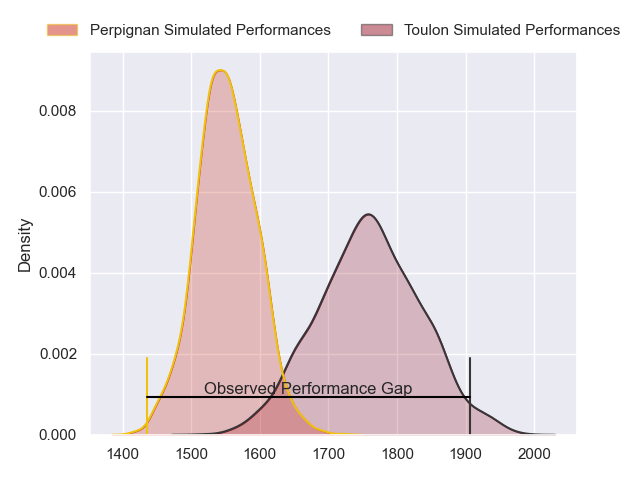
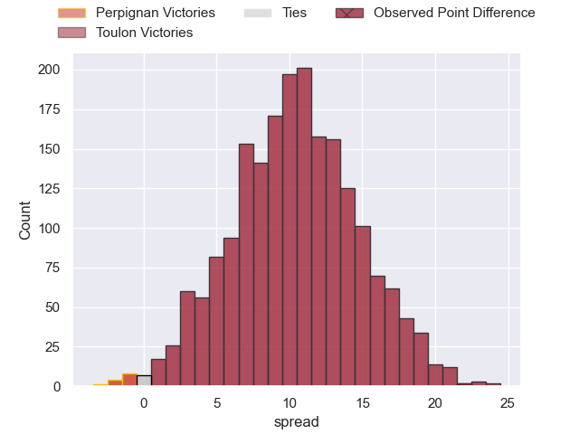
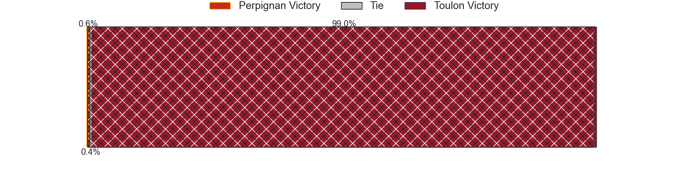
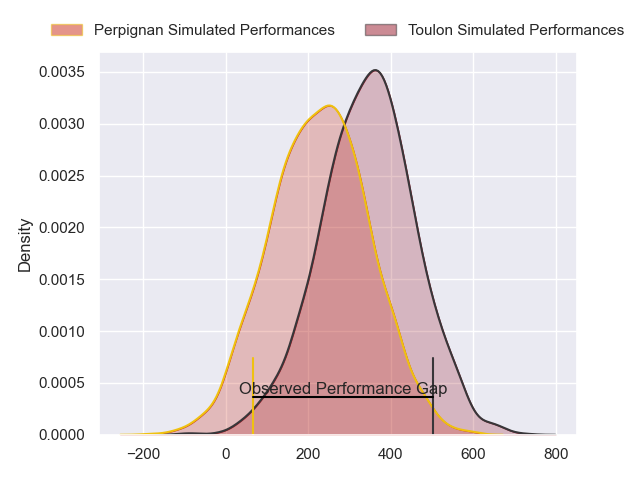
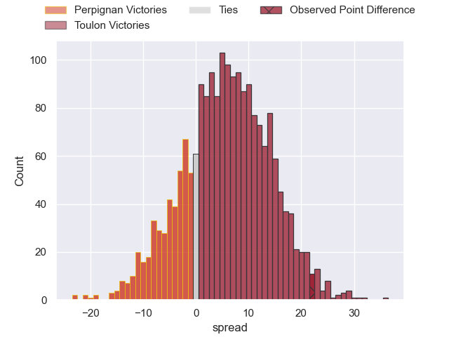
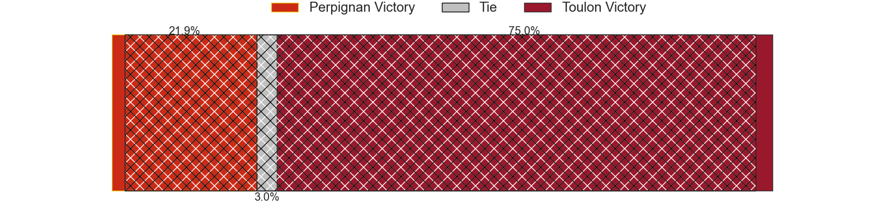

---  
layout: page  
title: Perpignan at Toulon; 22-44  
date: 2024-03-02 18:00:00 -0500  
categories: "Top 14 Orange 2023" match review  
---
# Perpignan at Toulon; 22-44

# Club Level Predictions

The first set of predictions treats a club as the smallest object, as the club develops its members, organizes a gameplan, and deploys its players as needed for each match. This club model has a prediction of 0.769, which translates to predicting Toulon to win by 10.5.

Our Over/Under is 51.5 - and combined with the spread above, we have a predicted scoreline of 20 to 31

Each club has a rating and a rating deviation (similar to a Glicko rating), and expected performances can be generated. This allows for simulated matches and spreads like the ones below.
## Projected Performances - Club Model

## Projected Spreads - Club Model

## Projected Results - Club Model

# Player Level Predictions - Version 2

Treating teams instead as an entity made up of the currently active players, I have ratings for each player in an altogether different system. These can be combined to form team ratings once teamsheets are announced, weighting starters a bit higher than the reserves. After the match is played, players can be weighted by their minutes on the field, allowing for an accurate measure of the team's composition. With these compiled team ratings, we can make predictions, measure inaccuracy, and update the individual player ratings.
## Prediction without Player Minutes: Toulon by 5.6

Perpignan by 1.3 on a neutral pitch

## Projected Performances - Player Model

## Projected Spreads - Player Model

## Projected Results - Player Model

|   Away Minutes | Away Player           |   Away Percentile |   Number |   Home Percentile | Home Player            |   Home Minutes |
|---------------:|:----------------------|------------------:|---------:|------------------:|:-----------------------|---------------:|
|             52 | Giorgi Tetrashvili    |              2.75 |        1 |             88.18 | Dany Priso             |             52 |
|             65 | Ignacio Ruiz          |             57.25 |        2 |             34.92 | Teddy Baubigny         |             64 |
|             48 | Arthur Joly           |             36.48 |        3 |             48.4  | Beka Gigashvili        |             64 |
|             80 | Tristan Labouteley    |             11.08 |        4 |             78.31 | David Ribbans          |             80 |
|             48 | Mathieu Tanguy        |             49.82 |        5 |             78.19 | Brian Alainu'uese      |             58 |
|             80 | Lucas Bachelier       |             29.19 |        6 |             52.2  | Matteo Le Corvec       |             71 |
|             40 | Jacobus van Tonder    |             73.18 |        7 |             47.03 | Esteban Abadie         |             80 |
|             80 | Joaquin Oviedo        |             79.13 |        8 |             84.95 | Facundo Isa            |             67 |
|             65 | Sadek Deghmache       |              7.57 |        9 |             75.87 | Ben White              |             66 |
|             65 | Tommaso Allan         |             80.1  |       10 |             77.11 | Enzo Herve             |             65 |
|             80 | Mathieu Acebes        |             94.31 |       11 |             87    | Jiuta Wainiqolo        |             80 |
|             44 | Jeronimo de la Fuente |             99.76 |       12 |             55.95 | Duncan Paia'aua        |             66 |
|             80 | Afusipa Taumoepeau    |             56.9  |       13 |             86.9  | Leicester Fainga'anuku |             80 |
|             80 | Tavite Veredamu       |             70.89 |       14 |             33.62 | Gael Drean             |             80 |
|             80 | Louis Dupichot        |             61.15 |       15 |             69.06 | Melvyn Jaminet         |             80 |
|             15 | Seilala Lam           |             89.31 |       16 |             90.84 | Jack Singleton         |             16 |
|             28 | Xavier Chiocci        |             41.34 |       17 |             11.64 | Bruce Devaux           |             28 |
|             32 | Marvin Orie           |             91.3  |       18 |             70.44 | Swan Rebbadj           |             22 |
|             40 | Lucas Velarte         |             14.32 |       19 |             82.71 | Selevasio Tolofua      |             22 |
|             36 | Alivereti Duguivalu   |             12.98 |       20 |            nan    | Jeremy Sinzelle        |             15 |
|             15 | Tom Ecochard          |             85.07 |       21 |             65.64 | Jules Danglot          |             14 |
|             15 | Jake McIntyre         |             89.05 |       22 |             49.64 | Seta Tuicuvu           |             14 |
|             32 | Nemo Roelofse         |             56.37 |       23 |             10.63 | Kieran Brookes         |             16 |

