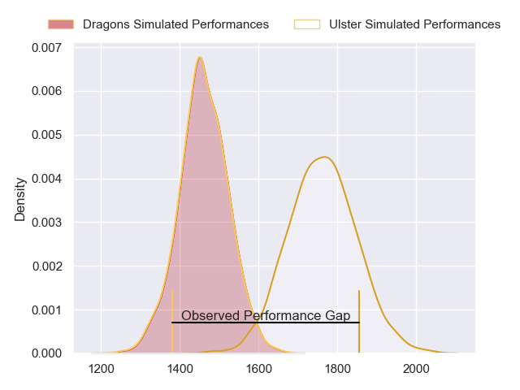
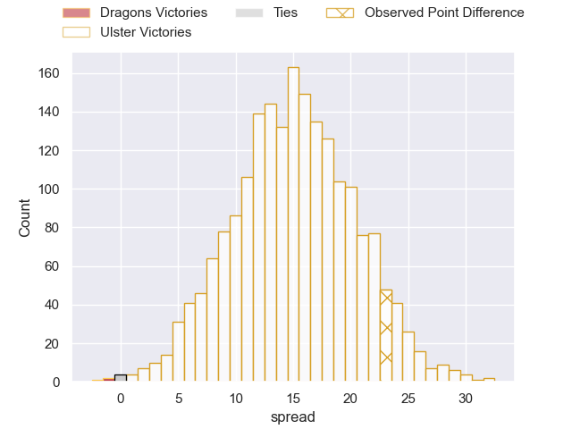
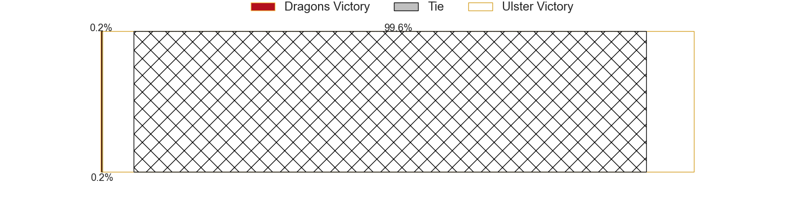
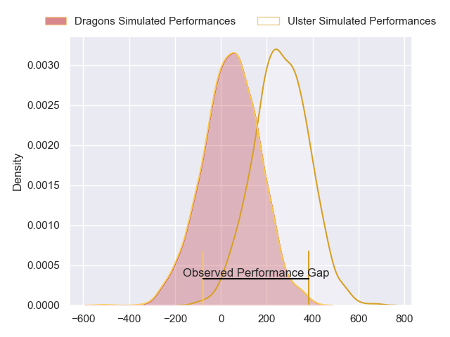
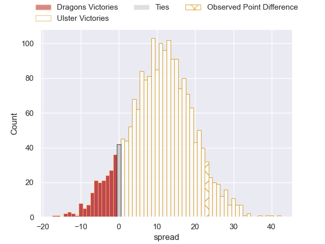
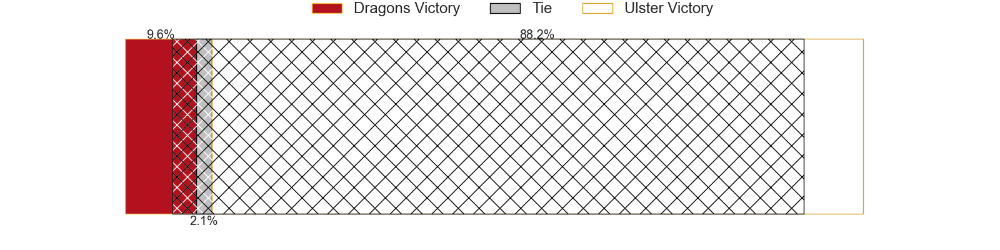

---  
layout: page  
title: Dragons at Ulster; 26-49  
date: 2024-03-02 18:00:00 -0500  
categories: "United Rugby Championship 2023" match review  
---
# Dragons at Ulster; 26-49

# Club Level Predictions

The first set of predictions treats a club as the smallest object, as the club develops its members, organizes a gameplan, and deploys its players as needed for each match. This club model has a prediction of 0.849, which translates to predicting Ulster to win by 15.3.

Our Over/Under is 43.5 - and combined with the spread above, we have a predicted scoreline of 14 to 30

Each club has a rating and a rating deviation (similar to a Glicko rating), and expected performances can be generated. This allows for simulated matches and spreads like the ones below.
## Projected Performances - Club Model

## Projected Spreads - Club Model

## Projected Results - Club Model

# Player Level Predictions - Version 2

Treating teams instead as an entity made up of the currently active players, I have ratings for each player in an altogether different system. These can be combined to form team ratings once teamsheets are announced, weighting starters a bit higher than the reserves. After the match is played, players can be weighted by their minutes on the field, allowing for an accurate measure of the team's composition. With these compiled team ratings, we can make predictions, measure inaccuracy, and update the individual player ratings.
## Prediction without Player Minutes: Ulster by 11.6

Ulster by 5.1 on a neutral pitch

## Projected Performances - Player Model

## Projected Spreads - Player Model

## Projected Results - Player Model

|   Away Minutes | Away Player       |   Away Percentile |   Number |   Home Percentile | Home Player        |   Home Minutes |
|---------------:|:------------------|------------------:|---------:|------------------:|:-------------------|---------------:|
|             54 | Rodrigo Martinez  |             38.86 |        1 |             92.67 | Steven Kitshoff    |             54 |
|             61 | James Benjamin    |             13.17 |        2 |              2.48 | Tom Stewart        |             69 |
|             54 | Chris Coleman     |             30.06 |        3 |             18.79 | Tom O'Toole        |             69 |
|             80 | Sean Lonsdale     |             23.72 |        4 |             52.21 | Cormac Izuchukwu   |             54 |
|             80 | Matthew Screech   |              1.67 |        5 |             61.86 | Harry Sheridan     |             80 |
|             80 | Dan Lydiate       |             26.76 |        6 |             72.47 | David McCann       |             80 |
|             20 | Harry Taylor      |             39.32 |        7 |             93.83 | Marcus Rea         |             54 |
|             80 | Taine Basham      |             31.31 |        8 |             62.14 | Nick Timoney       |             80 |
|             55 | Dane Blacker      |             10.22 |        9 |             79.35 | John Cooney        |             80 |
|             80 | Will Reed         |             25.37 |       10 |             29.6  | Billy Burns        |             54 |
|             80 | Corey Baldwin     |             36.52 |       11 |             47.37 | Mike Lowry         |             80 |
|             48 | Aneurin Owen      |             58.93 |       12 |             52.14 | Jude Postlethwaite |             69 |
|             80 | Steffan Hughes    |             77.62 |       13 |             16.79 | James Hume         |             80 |
|             70 | Joe Westwood      |             36.41 |       14 |             72.82 | Ethan McIlroy      |             80 |
|             80 | Ewan Rosser       |             33.57 |       15 |             63.55 | Will Addison       |             54 |
|             19 | Brodie Coghlan    |            nan    |       16 |             34.16 | John Andrew        |             11 |
|             26 | Aki Seiuli        |             10.54 |       17 |             30.52 | Andrew Warwick     |             26 |
|             26 | Luke Yendle       |            nan    |       18 |            nan    | Scott Wilson       |             11 |
|             49 | Barny Langton     |            nan    |       19 |             32.78 | Kieran Treadwell   |             26 |
|             11 | George Nott       |            nan    |       20 |             66.96 | Sean Reffell       |             26 |
|             25 | Gonzalo Bertranou |             72.8  |       21 |             16.16 | Nathan Doak        |             26 |
|             32 | Harri Ackerman    |            nan    |       22 |             87.74 | Luke Marshall      |             11 |
|             10 | Huw Anderson      |            nan    |       23 |             50.27 | Jacob Stockdale    |             26 |

