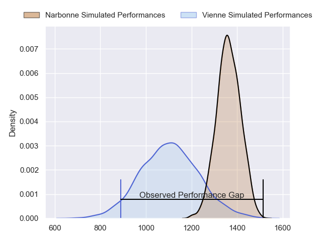
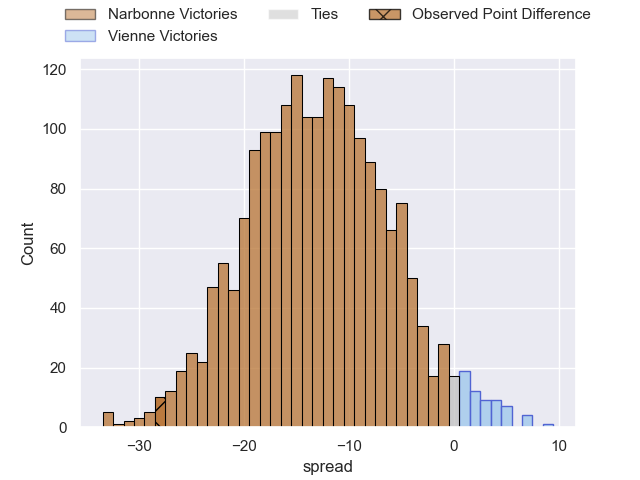
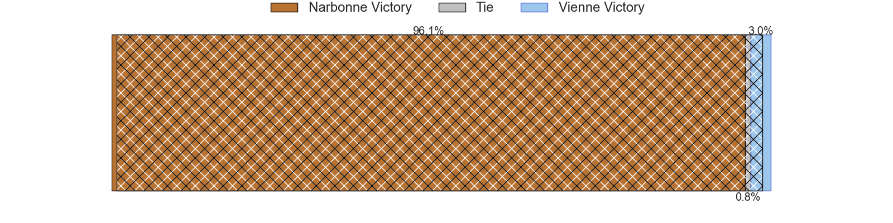
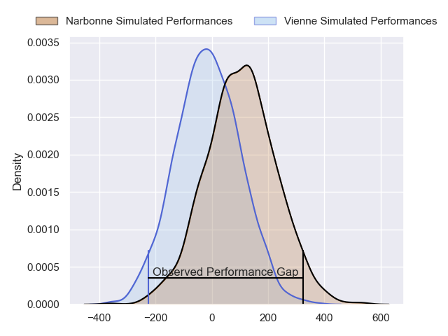
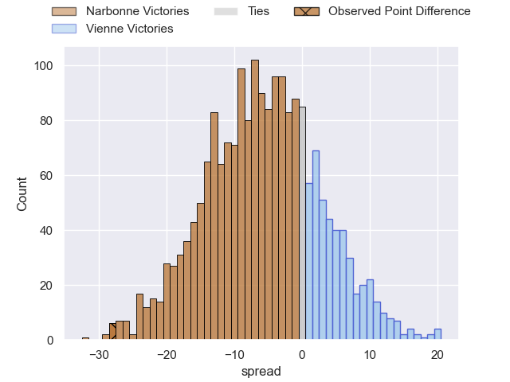
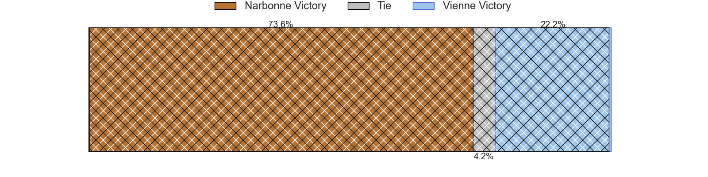

---  
layout: page  
title: Narbonne at Vienne; 43-15  
date: 2024-03-02 18:00:00 -0500  
categories: "Nationale 2023" match review  
---
# Narbonne at Vienne; 43-15

# Club Level Predictions

The first set of predictions treats a club as the smallest object, as the club develops its members, organizes a gameplan, and deploys its players as needed for each match. This club model has a prediction of 0.186, which translates to predicting Narbonne to win by 13.0.

Our Over/Under is 40.5 - and combined with the spread above, we have a predicted scoreline of 27 to 14

Each club has a rating and a rating deviation (similar to a Glicko rating), and expected performances can be generated. This allows for simulated matches and spreads like the ones below.
## Projected Performances - Club Model

## Projected Spreads - Club Model

## Projected Results - Club Model

# Player Level Predictions - Version 2

Treating teams instead as an entity made up of the currently active players, I have ratings for each player in an altogether different system. These can be combined to form team ratings once teamsheets are announced, weighting starters a bit higher than the reserves. After the match is played, players can be weighted by their minutes on the field, allowing for an accurate measure of the team's composition. With these compiled team ratings, we can make predictions, measure inaccuracy, and update the individual player ratings.
## Prediction without Player Minutes: Narbonne by 5.7

Narbonne by 8.0 on a neutral pitch

## Projected Performances - Player Model

## Projected Spreads - Player Model

## Projected Results - Player Model

|   Away Minutes | Away Player            |   Away Percentile |   Number |   Home Percentile | Home Player            |   Home Minutes |
|---------------:|:-----------------------|------------------:|---------:|------------------:|:-----------------------|---------------:|
|             49 | Geoffrey Moise         |             27.68 |        1 |             14.02 | Louan Capuano          |             47 |
|             63 | Mehdi Boundjema        |             88.36 |        2 |              7.25 | Axel Benjamin          |             47 |
|             53 | Mohammed Loukia        |             34.28 |        3 |             32.91 | Corentin Durand        |             47 |
|             80 | Leva Fifita            |             18.71 |        4 |             23.12 | Pierre Chapelle        |             53 |
|             53 | Dennis Visser          |             32.54 |        5 |              9.06 | Ciaran O'Flynn         |             58 |
|             80 | Thibault Clauzade      |             55.07 |        6 |             34.58 | Guillaume Moroldo      |             80 |
|             80 | Bill Caffo             |             24.78 |        7 |             43.39 | Steven Giroud          |             80 |
|             53 | Baptiste Abescat-Leroy |             52.97 |        8 |              2.2  | Léon Peyrat            |             53 |
|             53 | Pablo Barbaste         |             69.33 |        9 |             25.36 | Malory Piet            |             80 |
|             80 | Tom Chauvet            |             39.05 |       10 |              5.72 | Enzo Ravanello         |             58 |
|             38 | Étienne Ducom          |             19.66 |       11 |              7.3  | Martin Arfi            |             80 |
|             80 | Théo Mias              |             39.88 |       12 |              5.48 | Matthias Giovale       |             80 |
|             68 | Ambrose Curtis         |             68.57 |       13 |             15.15 | Pierre Mollard         |             80 |
|             80 | Pierre-Hugo Ducom      |             32.33 |       14 |             52.31 | Mathieu Bonnet-Gonnnet |             80 |
|             80 | Thibault Santoro       |             52.76 |       15 |              5.76 | Tom Richard            |             47 |
|             31 | Benito Delacruz        |             52.89 |       16 |              6.05 | Benjamin Robin         |             33 |
|             17 | Clément Esteriola      |             25.19 |       17 |              4.39 | Dimitri Gibierge       |             33 |
|             27 | Jamie Hagan            |             67    |       18 |             21.91 | Guram Kavtidze         |             33 |
|             27 | Mauro Rebussone        |             70.68 |       19 |              2.75 | Charles Massot         |             27 |
|             27 | Arthur Christienne     |             55.95 |       20 |             15.26 | Antoine Frambourg      |             22 |
|             27 | Josh Valentine         |             95.71 |       21 |             12.14 | Théo Minodier          |             27 |
|             42 | Peter Betham           |             98.93 |       22 |             26.79 | Anzize Said Omar       |             22 |
|             12 | Gilles Bosch           |              3.98 |       23 |             31.58 | Hippolyte Massa        |             33 |

