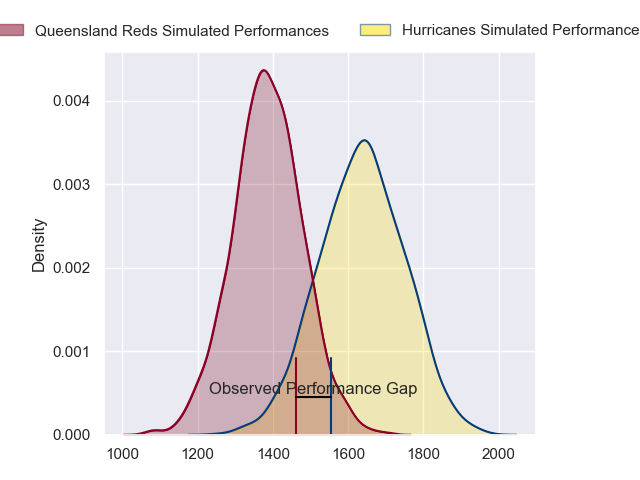
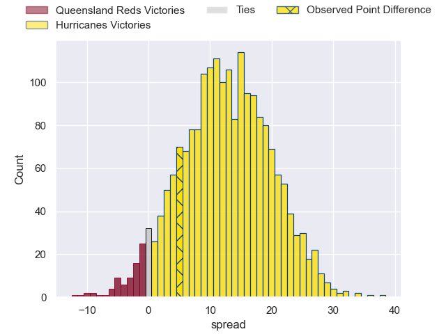
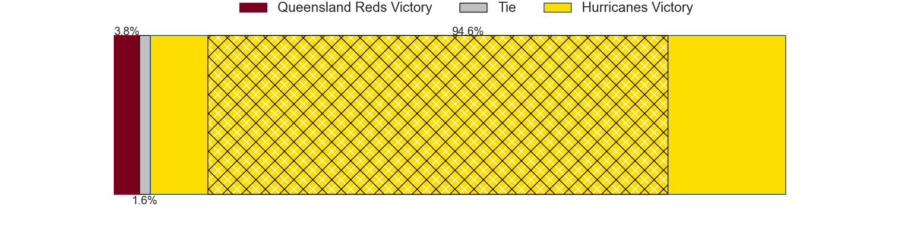
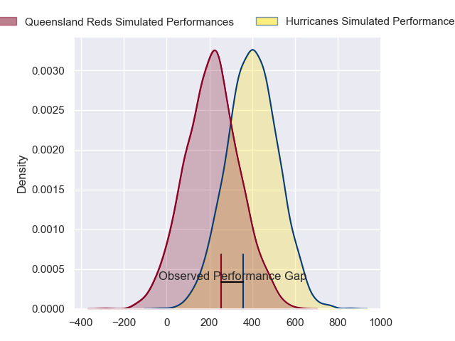
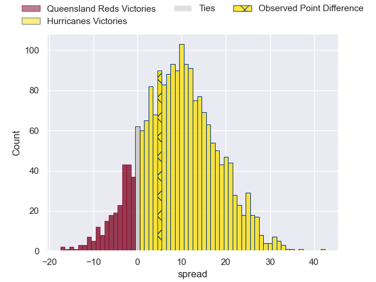
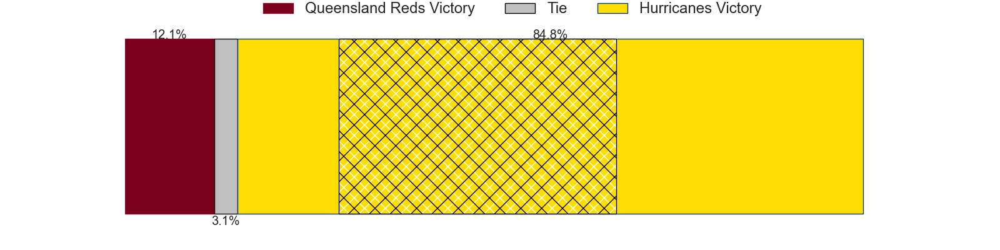

---  
layout: page  
title: Queensland Reds at Hurricanes; 33-38  
date: 2024-03-03 18:00:00 -0500  
categories: "Super Rugby Pacific 2024" match review  
---
# Queensland Reds at Hurricanes; 33-38

# Club Level Predictions

The first set of predictions treats a club as the smallest object, as the club develops its members, organizes a gameplan, and deploys its players as needed for each match. This club model has a prediction of 0.8, which translates to predicting Hurricanes to win by 12.6.

Our Over/Under is 53.5 - and combined with the spread above, we have a predicted scoreline of 20 to 33

Each club has a rating and a rating deviation (similar to a Glicko rating), and expected performances can be generated. This allows for simulated matches and spreads like the ones below.
## Projected Performances - Club Model

## Projected Spreads - Club Model

## Projected Results - Club Model

# Player Level Predictions - Version 2

Treating teams instead as an entity made up of the currently active players, I have ratings for each player in an altogether different system. These can be combined to form team ratings once teamsheets are announced, weighting starters a bit higher than the reserves. After the match is played, players can be weighted by their minutes on the field, allowing for an accurate measure of the team's composition. With these compiled team ratings, we can make predictions, measure inaccuracy, and update the individual player ratings.
## Prediction without Player Minutes: Hurricanes by 11.1

Hurricanes by 6.7 on a neutral pitch

## Projected Performances - Player Model

## Projected Spreads - Player Model

## Projected Results - Player Model

|   Away Minutes | Away Player               |   Away Percentile |   Number |   Home Percentile | Home Player          |   Home Minutes |
|---------------:|:--------------------------|------------------:|---------:|------------------:|:---------------------|---------------:|
|             32 | Alex Hodgman              |             59.21 |        1 |             93.77 | Xavier Numia         |             52 |
|             73 | Matt Faessler             |             69.27 |        2 |             94.27 | Asafo Aumua          |             73 |
|             48 | Zane Nonggorr             |             69.57 |        3 |             92.3  | Tyrel Lomax          |             52 |
|             63 | Ryan Smith                |             30.87 |        4 |             76.4  | Caleb Delany         |             63 |
|             87 | Seru Uru                  |             56.5  |        5 |             95.83 | Isaia Walker-Leawere |             87 |
|             87 | Liam Wright               |             95.81 |        6 |              0.99 | TK Howden            |             67 |
|             87 | Fraser McReight           |             93.28 |        7 |             92.51 | Peter Lakai          |             87 |
|             72 | Harry Wilson              |             59.22 |        8 |              1.7  | Brayden Iose         |             87 |
|             87 | Tate McDermott            |             79.75 |        9 |             49.08 | Cam Roigard          |             69 |
|             87 | Tom Lynagh                |             76.87 |       10 |             12.19 | Brett Cameron        |             87 |
|             87 | Jock Campbell             |             57.31 |       11 |             95.49 | Kini Naholo          |             69 |
|             57 | Hunter Paisami            |             75.48 |       12 |             95.6  | Jordie Barrett       |             87 |
|             87 | Josh Flook                |             30.48 |       13 |             88.57 | Billy Proctor        |             87 |
|             81 | Suliasi Vunivalu          |             33.3  |       14 |             76.48 | Joshua Moorby        |             87 |
|             58 | Jordan Petaia             |             88.01 |       15 |             92.57 | Ruben Love           |             87 |
|             14 | Josh Nasser               |            nan    |       16 |             26.91 | James O'Reilly       |             14 |
|             55 | Peni Ravai Kovekalou      |             40.79 |       17 |             86.62 | Pouri Rakete-Stones  |             35 |
|             39 | Sef Fa'agase              |             73.88 |       18 |             62.6  | Pasilio Tosi         |             35 |
|             24 | Cormac Daly               |            nan    |       19 |             72.23 | Justin Sangster      |             24 |
|             15 | John Bryant               |            nan    |       20 |            nan    | Veveni Lasaqa        |             20 |
|              6 | Kalani Thomas             |             64.21 |       21 |             59.92 | Jordi Viljoen        |             18 |
|             29 | Harry McLaughlin-Phillips |            nan    |       22 |             84.17 | Riley Higgins        |             18 |
|             30 | Mac Grealy                |             71.97 |       23 |             85.5  | Salesi Rayasi        |              0 |

