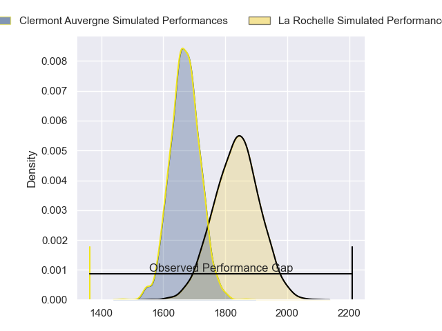
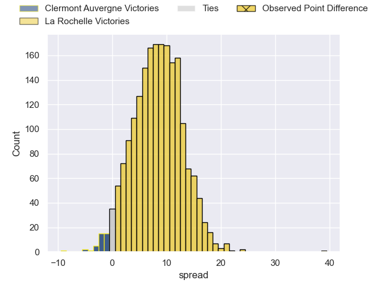
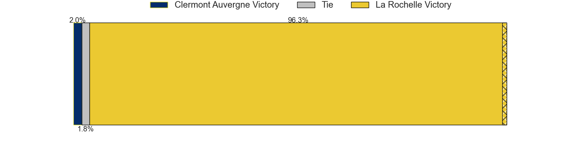
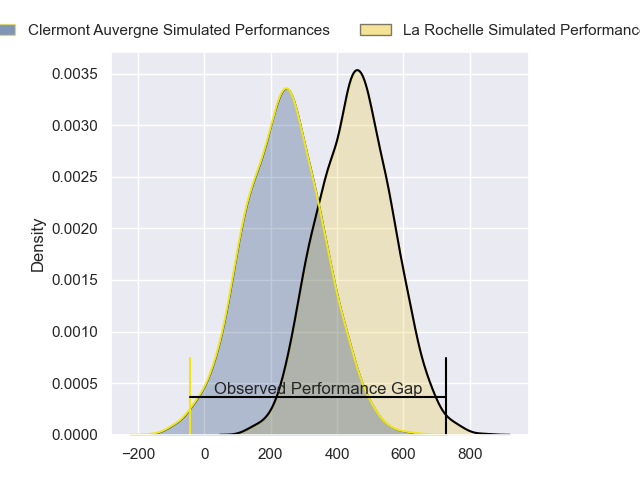
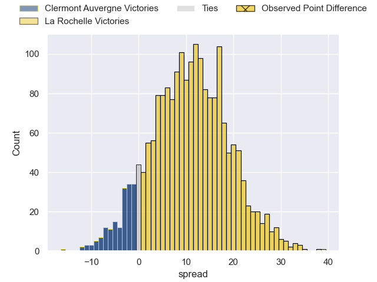
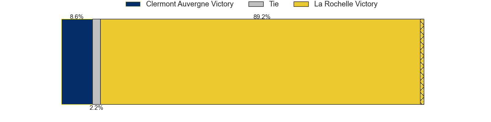

---  
layout: page  
title: Clermont Auvergne at La Rochelle; 3-42  
date: 2024-03-03 18:00:00 -0500  
categories: "Top 14 Orange 2023" match review  
---
# Clermont Auvergne at La Rochelle; 3-42

# Club Level Predictions

The first set of predictions treats a club as the smallest object, as the club develops its members, organizes a gameplan, and deploys its players as needed for each match. This club model has a prediction of 0.722, which translates to predicting La Rochelle to win by 8.4.

Our Over/Under is 45.5 - and combined with the spread above, we have a predicted scoreline of 18 to 27

Each club has a rating and a rating deviation (similar to a Glicko rating), and expected performances can be generated. This allows for simulated matches and spreads like the ones below.
## Projected Performances - Club Model

## Projected Spreads - Club Model

## Projected Results - Club Model

# Player Level Predictions - Version 2

Treating teams instead as an entity made up of the currently active players, I have ratings for each player in an altogether different system. These can be combined to form team ratings once teamsheets are announced, weighting starters a bit higher than the reserves. After the match is played, players can be weighted by their minutes on the field, allowing for an accurate measure of the team's composition. With these compiled team ratings, we can make predictions, measure inaccuracy, and update the individual player ratings.
## Prediction without Player Minutes: La Rochelle by 12.1

La Rochelle by 5.0 on a neutral pitch

## Projected Performances - Player Model

## Projected Spreads - Player Model

## Projected Results - Player Model

|   Away Minutes | Away Player          |   Away Percentile |   Number |   Home Percentile | Home Player           |   Home Minutes |
|---------------:|:---------------------|------------------:|---------:|------------------:|:----------------------|---------------:|
|             48 | Daniel Bibi Biziwu   |             13.52 |        1 |             38.38 | Louis Penverne        |             59 |
|             43 | Folau Fainga'a       |             93.58 |        2 |             71.13 | Quentin Lespiaucq     |             57 |
|             61 | Rabah Slimani        |             84.94 |        3 |              3.99 | Georges-Henri Colombe |             51 |
|             80 | Thibaud Lanen        |             76    |        4 |             88.71 | Thomas Lavault        |             74 |
|             80 | Peceli Yato          |             27.06 |        5 |             58.82 | Remi Picquette        |             65 |
|             48 | Killian Tixeront     |             68.57 |        6 |             30.24 | Judicael Cancoriet    |             66 |
|             80 | Marcos Kremer        |             77.11 |        7 |             97.62 | Levani Botia          |             47 |
|             61 | Pita Gus Sowakula    |             86.62 |        8 |             65.49 | Yoan Tanga            |             80 |
|             48 | Baptiste Jauneau     |             36.13 |        9 |             98.2  | Tawera Kerr-Barlow    |             51 |
|             48 | Benjamin Urdapilleta |             86.23 |       10 |             55.8  | Antoine Hastoy        |             80 |
|             80 | Alivereti Raka       |             17.15 |       11 |             98.82 | Dillyn Leyds          |             80 |
|             48 | Pierre Fouyssac      |             18.73 |       12 |             80.68 | Jules Favre           |             74 |
|             80 | Leon Darricarrere    |             46.05 |       13 |             68.55 | Ulupano Seuteni       |             80 |
|             80 | Yerim Fall           |             35.8  |       14 |             89.5  | Teddy Thomas          |             61 |
|             80 | Joris Jurand         |             72.73 |       15 |             99.28 | Brice Dulin           |             80 |
|             37 | Robin Couly          |            nan    |       16 |             89.06 | Tolu Latu             |             29 |
|             32 | Giorgi Beria         |             44.65 |       17 |            nan    | Alexandre Kaddouri    |             21 |
|             19 | Paul Jedrasiak       |            nan    |       18 |             37.88 | Thomas Ployet         |             14 |
|             32 | Lucas Dessaigne      |             85.21 |       19 |             45.57 | Matthias Haddad       |             21 |
|             32 | Sebastien Bezy       |             92.61 |       20 |            nan    | Oscar Jegou           |             33 |
|             32 | Jules Plisson        |             81.4  |       21 |             80.17 | Thomas Berjon         |             29 |
|             32 | Theo Giral           |            nan    |       22 |             51.94 | Ihaia West            |             19 |
|             19 | Henzo Kiteau         |            nan    |       23 |             85.12 | Joel Sclavi           |             29 |

