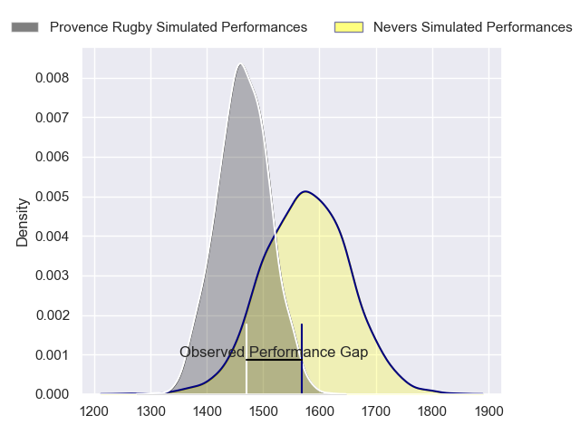
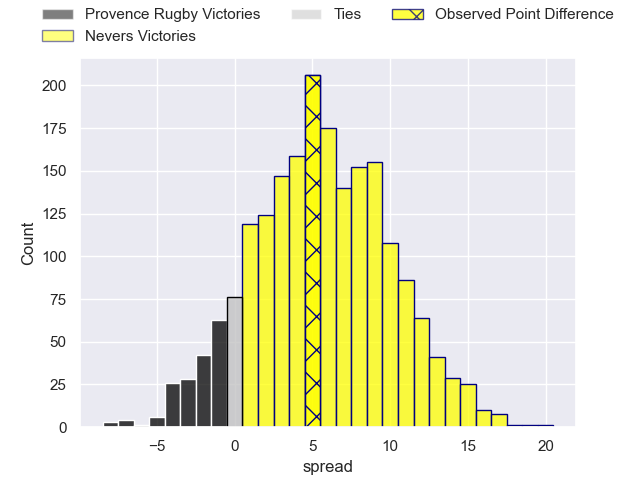
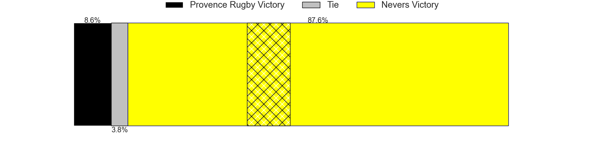
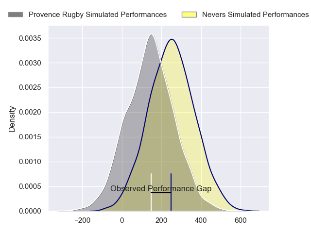
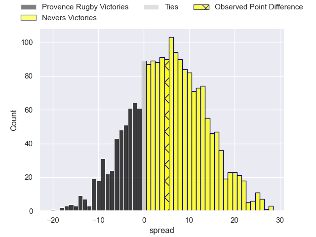
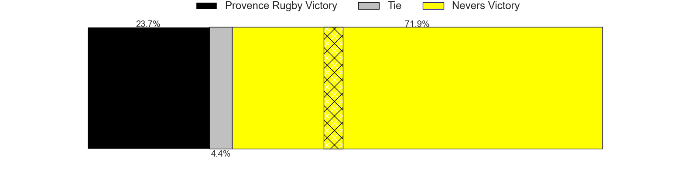

---  
layout: page  
title: Provence Rugby at Nevers; 22-27  
date: 2024-03-07 18:00:00 -0500  
categories: "Pro D2 2023" match review  
---
# Provence Rugby at Nevers; 22-27

# Club Level Predictions

The first set of predictions treats a club as the smallest object, as the club develops its members, organizes a gameplan, and deploys its players as needed for each match. This club model has a prediction of 0.653, which translates to predicting Nevers to win by 5.5.

Our Over/Under is 45.5 - and combined with the spread above, we have a predicted scoreline of 20 to 26

Each club has a rating and a rating deviation (similar to a Glicko rating), and expected performances can be generated. This allows for simulated matches and spreads like the ones below.
## Projected Performances - Club Model

## Projected Spreads - Club Model

## Projected Results - Club Model

# Player Level Predictions - Version 2

Treating teams instead as an entity made up of the currently active players, I have ratings for each player in an altogether different system. These can be combined to form team ratings once teamsheets are announced, weighting starters a bit higher than the reserves. After the match is played, players can be weighted by their minutes on the field, allowing for an accurate measure of the team's composition. With these compiled team ratings, we can make predictions, measure inaccuracy, and update the individual player ratings.
## Prediction without Player Minutes: Nevers by 6.4

Nevers by 2.7 on a neutral pitch

## Projected Performances - Player Model

## Projected Spreads - Player Model

## Projected Results - Player Model

|   Away Minutes | Away Player           |   Away Percentile |   Number |   Home Percentile | Home Player              |   Home Minutes |
|---------------:|:----------------------|------------------:|---------:|------------------:|:-------------------------|---------------:|
|             48 | Julius Nostadt        |             75.8  |        1 |             57.47 | Tornike Mataradze        |             55 |
|             55 | Loick Jammes          |              2.1  |        2 |             63.55 | Elia Elia                |             60 |
|             45 | Federico Wegrzyn      |             63.34 |        3 |             63.43 | Ilia Kaikatsishvili      |             35 |
|             80 | Jérôme Dufour         |             74.37 |        4 |              8.22 | Christiaan van der Merwe |             57 |
|             80 | Josh Tyrell           |             77.12 |        5 |             36.23 | Kevin Noah               |             41 |
|             48 | Teimana Harrison      |             75    |        6 |             79.3  | Luka Plataret            |             80 |
|             48 | Jessy Jegerlehner     |              2.31 |        7 |             89.87 | Hugues Bastide           |             56 |
|             55 | Malohi Suta           |             30.34 |        8 |             62.38 | Steven David             |             80 |
|             58 | Arthur Coville        |             51.12 |        9 |             12.27 | Hugo Bouyssou            |             74 |
|             80 | Jimmy Gopperth        |             82.59 |       10 |             73.63 | Yohan Le Bourhis         |             60 |
|             80 | Léo Drouet            |             37.59 |       11 |             52.85 | Arthur Mathiron          |             80 |
|             80 | Kaveinga Finau        |             82.5  |       12 |             86.79 | Rudy Derrieux            |             80 |
|             80 | Atila Septar          |             43.21 |       13 |             75.83 | Alifereti Loaloa         |             80 |
|             80 | Adrien Lapegue-Lafaye |             10.2  |       14 |             62.51 | Christian Ambadiang      |             80 |
|             51 | Enzo Selponi          |             78.66 |       15 |             68.82 | Dylan Jaminet            |             80 |
|             32 | Nicolas Toth          |             31.71 |       16 |            nan    | Aselo Ikahehegi          |             45 |
|             32 | Charly Gambini        |             58.28 |       17 |             55.9  | Chris Gabriel            |             39 |
|             32 | Guillaume Piazzoli    |             56.39 |       18 |             72.78 | Kamaliele Tufele         |             25 |
|             35 | Tomas Francis         |             98.99 |       19 |             85.02 | Julien Kazubek           |             24 |
|             29 | Dorian Lavernhe       |             37.26 |       20 |             48.27 | Lado Chachanidze         |             23 |
|             25 | Jean Charles Orioli   |             48.28 |       21 |             15.65 | Jonathan Maiau           |             20 |
|             25 | Carl Axtens           |             25.44 |       22 |             38.81 | Shaun Reynolds           |             20 |
|             22 | Joris Cazenave        |             68.92 |       23 |             15.95 | Guillaume Manevy         |              6 |

