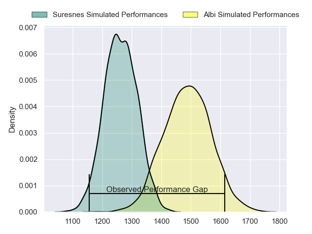
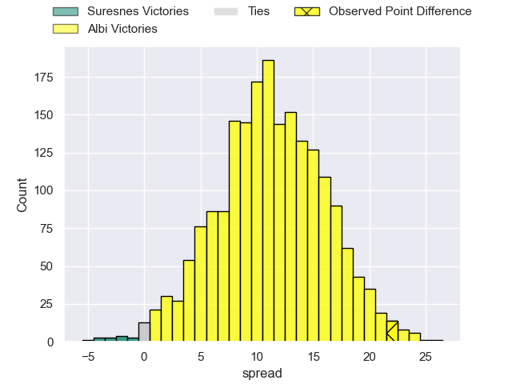
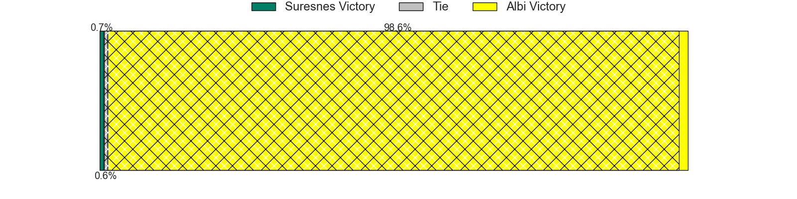
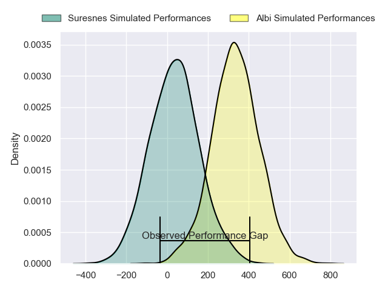
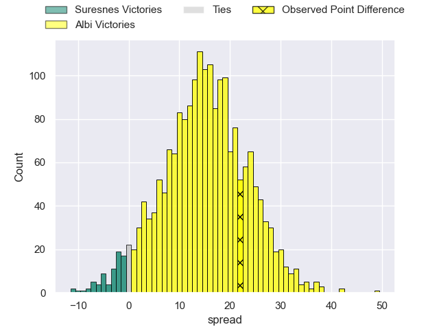
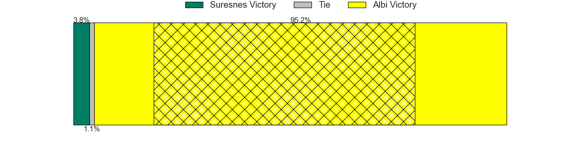

---  
layout: page  
title: Suresnes at Albi; 12-34  
date: 2024-03-08 18:00:00 -0500  
categories: "Nationale 2023" match review  
---
# Suresnes at Albi; 12-34

# Club Level Predictions

The first set of predictions treats a club as the smallest object, as the club develops its members, organizes a gameplan, and deploys its players as needed for each match. This club model has a prediction of 0.782, which translates to predicting Albi to win by 11.3.

Our Over/Under is 39.5 - and combined with the spread above, we have a predicted scoreline of 14 to 26

Each club has a rating and a rating deviation (similar to a Glicko rating), and expected performances can be generated. This allows for simulated matches and spreads like the ones below.
## Projected Performances - Club Model

## Projected Spreads - Club Model

## Projected Results - Club Model

# Player Level Predictions - Version 2

Treating teams instead as an entity made up of the currently active players, I have ratings for each player in an altogether different system. These can be combined to form team ratings once teamsheets are announced, weighting starters a bit higher than the reserves. After the match is played, players can be weighted by their minutes on the field, allowing for an accurate measure of the team's composition. With these compiled team ratings, we can make predictions, measure inaccuracy, and update the individual player ratings.
## Prediction without Player Minutes: Albi by 14.8

Albi by 7.9 on a neutral pitch

## Projected Performances - Player Model

## Projected Spreads - Player Model

## Projected Results - Player Model

|   Away Minutes | Away Player             |   Away Percentile |   Number |   Home Percentile | Home Player             |   Home Minutes |
|---------------:|:------------------------|------------------:|---------:|------------------:|:------------------------|---------------:|
|             40 | Lucas Dycke             |             18.24 |        1 |             56.92 | Lucas Pindor            |             61 |
|             40 | Anthony Bajart          |             49.81 |        2 |             89.12 | Romain Maurice          |             80 |
|             46 | Leandro Mario Assi      |             88.36 |        3 |             89.64 | Dimitri Tchapnga        |             51 |
|             40 | Sacha Yahi              |             87.84 |        4 |             47.2  | Guillem Calmon          |             80 |
|             80 | Yakine Djebarri         |             18    |        5 |             13.95 | Jacques Engelbrecht     |             61 |
|             51 | Florian Desbordes       |             60.13 |        6 |             60.79 | Vincent Calas           |             51 |
|             80 | Wian Vosloo             |             78.96 |        7 |             53.96 | Luke Stringer           |             80 |
|             80 | Louis-Mathieu Jazeix    |             42.23 |        8 |             83.25 | Sandrick Maciotta       |             80 |
|             48 | Thomas Lacroix          |             20.25 |        9 |             95.5  | Théo Vidal              |             61 |
|             80 | Tanguy Lacoste          |             13.68 |       10 |             86.07 | Benjamin Pehau          |             80 |
|             80 | Ervin Muric             |              1.83 |       11 |             66.6  | Sean Robinson           |             80 |
|             80 | JJ Taulagi              |              1.19 |       12 |             41.55 | Jarrod Poi              |             51 |
|             80 | Victor Barnier          |             92.74 |       13 |              8.81 | James Haydn Tedder      |             80 |
|             58 | Alexis Clement          |             37.92 |       14 |             78.84 | Simon Hartmann          |             80 |
|             80 | Thomas Baudy            |             27.82 |       15 |             36.21 | Téo Dospital            |             66 |
|             40 | Elias Coulibaly         |             26.21 |       16 |             65.54 | Dylan Jacquot           |             19 |
|             40 | Hayam El Bibouji        |             77.48 |       17 |             78.37 | Jean Baptiste De Clercq |             29 |
|             34 | Victor Damian Arias     |             14.57 |       18 |             25.86 | Dion Evrard Oulai       |             19 |
|             40 | Christopher van Leeuwen |              8.1  |       19 |             72.82 | Camille Jarreau         |             29 |
|             29 | Damien Bozic            |             16.52 |       20 |             82.82 | Gilen Queheille         |             19 |
|             32 | Théo Bachiri            |             54.81 |       21 |             79.62 | Enzo Marzocca           |             14 |
|             22 | Jean Chezeau            |             75.12 |       22 |             66.19 | Gabriel Aviragnet       |             29 |

