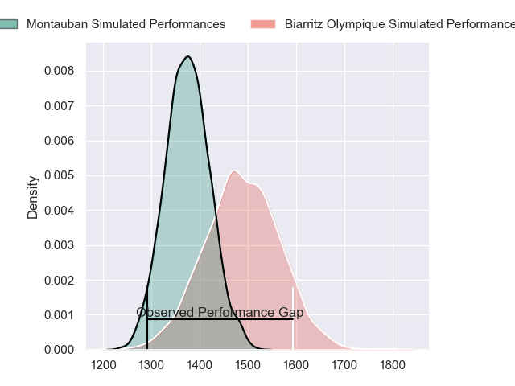
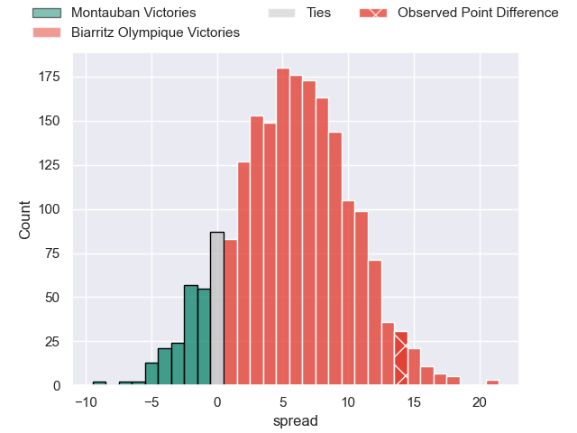
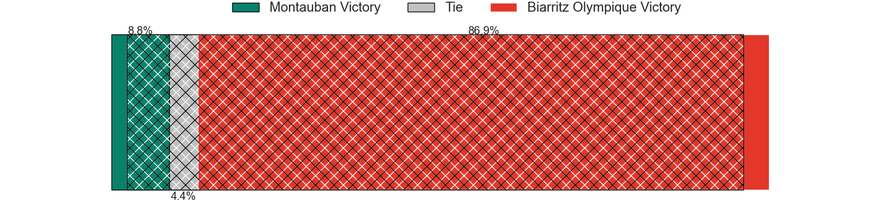
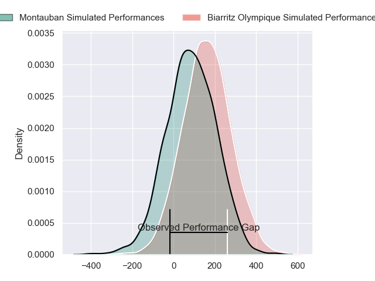
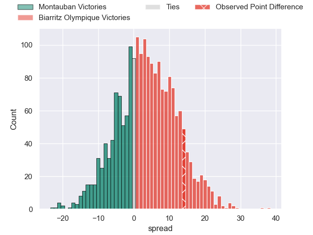
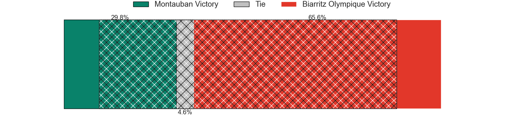

---  
layout: page  
title: Montauban at Biarritz Olympique; 19-33  
date: 2024-03-08 18:00:00 -0500  
categories: "Pro D2 2023" match review  
---
# Montauban at Biarritz Olympique; 19-33

# Club Level Predictions

The first set of predictions treats a club as the smallest object, as the club develops its members, organizes a gameplan, and deploys its players as needed for each match. This club model has a prediction of 0.657, which translates to predicting Biarritz Olympique to win by 5.7.

Our Over/Under is 44.5 - and combined with the spread above, we have a predicted scoreline of 19 to 25

Each club has a rating and a rating deviation (similar to a Glicko rating), and expected performances can be generated. This allows for simulated matches and spreads like the ones below.
## Projected Performances - Club Model

## Projected Spreads - Club Model

## Projected Results - Club Model

# Player Level Predictions - Version 2

Treating teams instead as an entity made up of the currently active players, I have ratings for each player in an altogether different system. These can be combined to form team ratings once teamsheets are announced, weighting starters a bit higher than the reserves. After the match is played, players can be weighted by their minutes on the field, allowing for an accurate measure of the team's composition. With these compiled team ratings, we can make predictions, measure inaccuracy, and update the individual player ratings.
## Prediction without Player Minutes: Biarritz Olympique by 5.1

Montauban by 3.7 on a neutral pitch

## Projected Performances - Player Model

## Projected Spreads - Player Model

## Projected Results - Player Model

|   Away Minutes | Away Player         |   Away Percentile |   Number |   Home Percentile | Home Player        |   Home Minutes |
|---------------:|:--------------------|------------------:|---------:|------------------:|:-------------------|---------------:|
|             54 | Thomas Bue          |             21.54 |        1 |             39.69 | Killian Taofifenua |             57 |
|             41 | Ru-Hann Greyling    |             17.37 |        2 |             43.13 | Luteru Tolai       |             80 |
|             54 | Mirian Burduli      |              3.85 |        3 |             82.31 | Mohamed Haouas     |             61 |
|             80 | Frank Bradshaw      |             86.29 |        4 |              3.34 | Adrian Motoc       |             80 |
|             54 | Kevin Gimeno        |              4.29 |        5 |             65.91 | Nafi Ma'afu        |             57 |
|             41 | Karl Wilkins        |             10.57 |        6 |             36.12 | Dave O'Callaghan   |             61 |
|             80 | Stéphane Munoz      |             30.4  |        7 |             53.74 | Simon Augry        |             80 |
|             47 | Quentin Witt        |             24.03 |        8 |             41.02 | Temo Matiu         |             80 |
|             47 | Shaun Venter        |              4.29 |        9 |             31.29 | Pierre Pages       |             68 |
|             80 | Tedo Abzhandadze    |             57.46 |       10 |              9.45 | Billy Searle       |             80 |
|             80 | Yvan Reilhac        |             35.02 |       11 |             53.06 | Gervais Cordin     |             71 |
|             47 | Dan Goggin          |             75.12 |       12 |              7.02 | Francois Vergnaud  |             47 |
|             80 | Maxime Mathy        |             11.31 |       13 |             19.52 | Vincent Martin     |             80 |
|             80 | Josua Vici          |             22.34 |       14 |             19.76 | Zach Kibirige      |             80 |
|             80 | Semesa Rokoduguni   |             82.97 |       15 |             70.5  | Joe Jonas          |             80 |
|             39 | Badri Alkhazashvili |             15.27 |       16 |             59.95 | Ilian Perraux      |             33 |
|             39 | Kyllian Ringuet     |             32.38 |       17 |             20.35 | Kevin Tougne       |             23 |
|             33 | Otar Giorgadze      |             63.88 |       18 |             69.01 | Charlie Matthews   |             23 |
|             33 | Jérôme Bosviel      |             81.09 |       19 |             20.81 | Tornike Jalagonia  |             19 |
|             26 | Lucas Seyrolle      |             12.1  |       20 |              5.22 | Alfie Petch        |             19 |
|             26 | Dimitri Vaotoa      |             30.04 |       21 |             47.24 | Imanol Biscay      |             12 |
|             26 | Tietie Tuimauga     |             55.09 |       22 |             57.57 | Baptiste Fariscot  |              9 |
|             33 | Alexis Bernadet     |             59.71 |       23 |            nan    | nan                |            nan |

