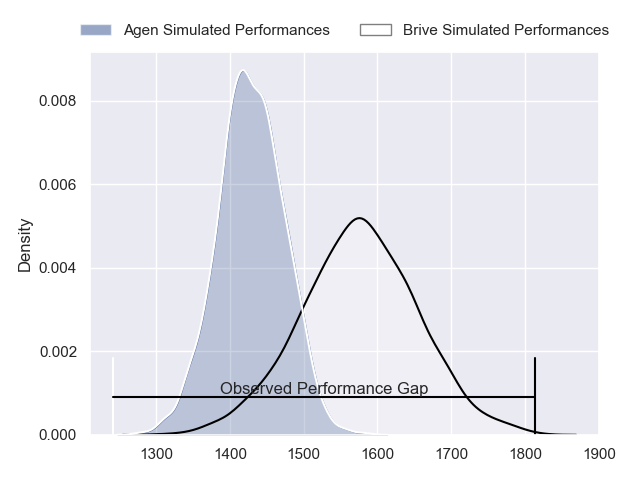
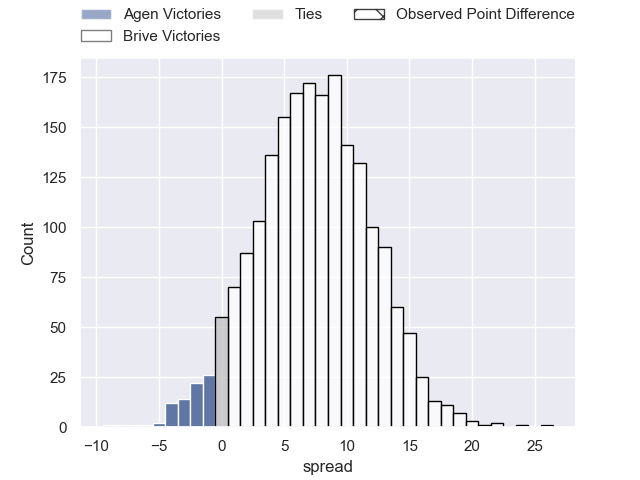
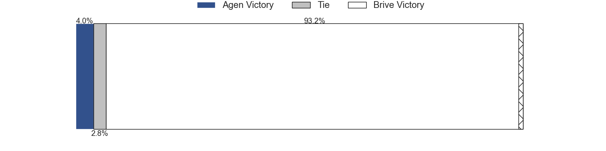
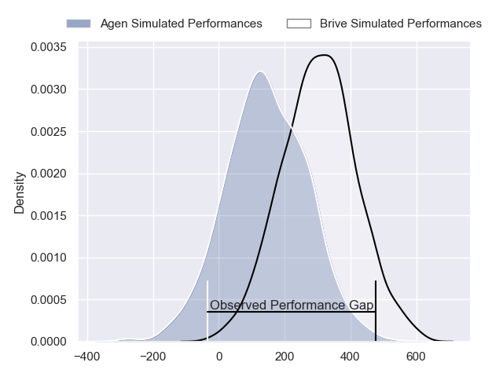
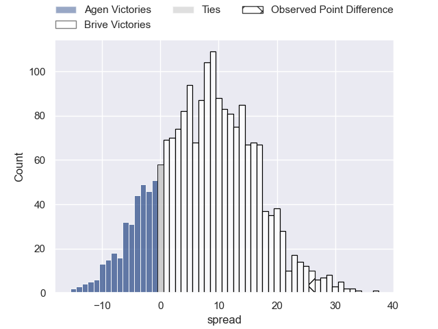
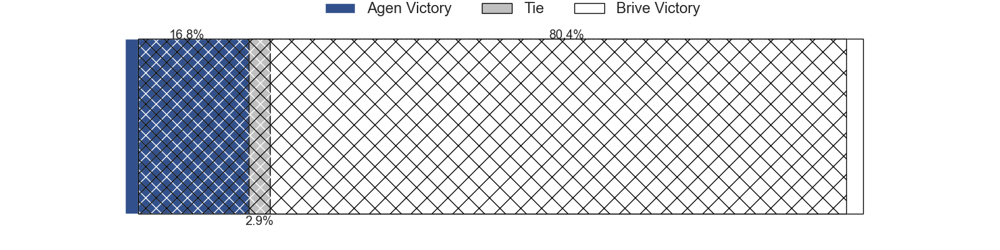

---  
layout: page  
title: Agen at Brive; 3-29  
date: 2024-03-08 18:00:00 -0500  
categories: "Pro D2 2023" match review  
---
# Agen at Brive; 3-29

# Club Level Predictions

The first set of predictions treats a club as the smallest object, as the club develops its members, organizes a gameplan, and deploys its players as needed for each match. This club model has a prediction of 0.7, which translates to predicting Brive to win by 7.4.

Our Over/Under is 41.5 - and combined with the spread above, we have a predicted scoreline of 17 to 25

Each club has a rating and a rating deviation (similar to a Glicko rating), and expected performances can be generated. This allows for simulated matches and spreads like the ones below.
## Projected Performances - Club Model

## Projected Spreads - Club Model

## Projected Results - Club Model

# Player Level Predictions - Version 2

Treating teams instead as an entity made up of the currently active players, I have ratings for each player in an altogether different system. These can be combined to form team ratings once teamsheets are announced, weighting starters a bit higher than the reserves. After the match is played, players can be weighted by their minutes on the field, allowing for an accurate measure of the team's composition. With these compiled team ratings, we can make predictions, measure inaccuracy, and update the individual player ratings.
## Prediction without Player Minutes: Brive by 8.9

Brive by 1.1 on a neutral pitch

## Projected Performances - Player Model

## Projected Spreads - Player Model

## Projected Results - Player Model

|   Away Minutes | Away Player                   |   Away Percentile |   Number |   Home Percentile | Home Player               |   Home Minutes |
|---------------:|:------------------------------|------------------:|---------:|------------------:|:--------------------------|---------------:|
|             57 | Florent Guion                 |             22.46 |        1 |             75.25 | Hugo Reilhes              |             60 |
|             57 | Pierre Jouvin                 |             22.52 |        2 |             42.37 | Benjamin Boudou           |             43 |
|             60 | Alex Burin                    |             66.45 |        3 |             15.03 | Marcel van der Merwe      |             60 |
|             80 | Joe Maksymiw                  |              9.3  |        4 |             71.04 | Asier Usarraga            |             80 |
|             51 | Corentin Vernet               |             39.93 |        5 |             37.07 | Julien Delannoy           |             53 |
|             80 | Matthieu Bonnet               |             60.46 |        6 |             73.9  | Retief Marais             |             80 |
|             51 | Valentin Gayraud              |             38.33 |        7 |             33.04 | Matthieu Voisin           |             60 |
|             60 | Martin Devergie               |             23.3  |        8 |             86.41 | Ross Moriarty             |             53 |
|             80 | Theo Idjellidaine             |             24.54 |        9 |             38.24 | Leo Carbonneau            |             80 |
|             80 | Ben Volavola                  |             37.81 |       10 |             30.85 | Tom Raffy                 |             80 |
|             80 | Henry Purdy                   |             91.84 |       11 |             68.53 | Asaeli Tuivuaka           |             80 |
|             80 | Theo Belan                    |             63.21 |       12 |             90.95 | Stuart Olding             |             80 |
|             60 | Jean-Marcelin Buttin          |             36.43 |       13 |             37.86 | Paula Walisolio           |             63 |
|             80 | Timilai Rokoduru              |             53.49 |       14 |             78.73 | Arthur Bonneval           |             67 |
|             51 | Romain Darchen                |             45.56 |       15 |             61.87 | Mathis Ferté              |             80 |
|             29 | William Demotte               |             89.99 |       16 |             34.35 | Lucas da Silva            |             37 |
|             29 | Arnaud Duputs                 |             86.78 |       17 |             51.94 | Taniela Sadrugu           |             27 |
|             29 | Emile Dayral                  |             19.4  |       18 |             70.2  | Tevita Ratuva             |             27 |
|             23 | Richard Barrington            |             63.24 |       19 |             91.41 | Said Hireche              |             20 |
|             23 | Mike Sosene-Feagai            |             13.93 |       20 |            nan    | Nathan Fraissenon         |             20 |
|             20 | Antoine Erbani                |             95.37 |       21 |             16.59 | Francisco Coria Marchetti |             20 |
|             20 | Théo Sauzaret                 |             59.03 |       22 |             55.36 | Guillaume Galletier       |             17 |
|             20 | Inoke Nalaga Kurukuruvakatini |             15.9  |       23 |             66.46 | Julien Blanc              |             13 |

