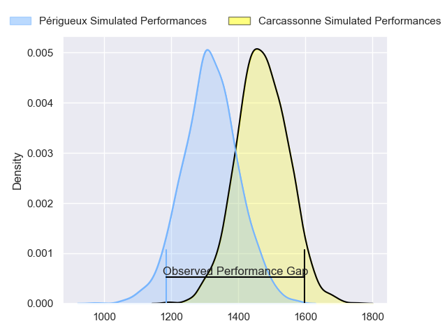
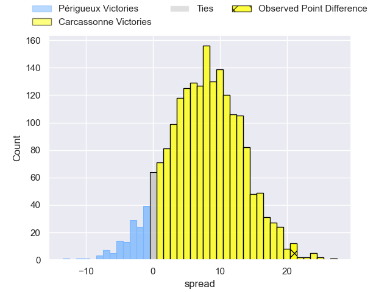
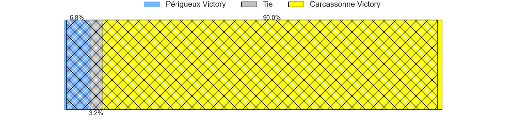
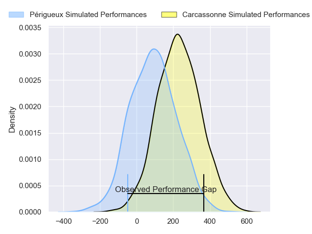
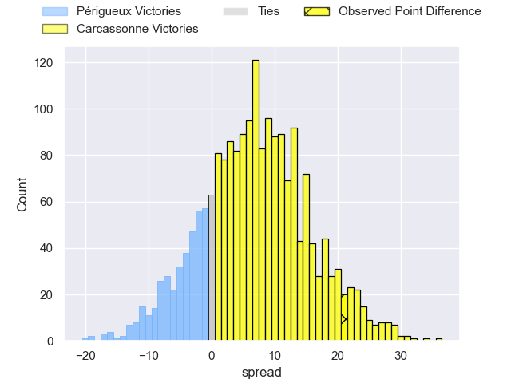
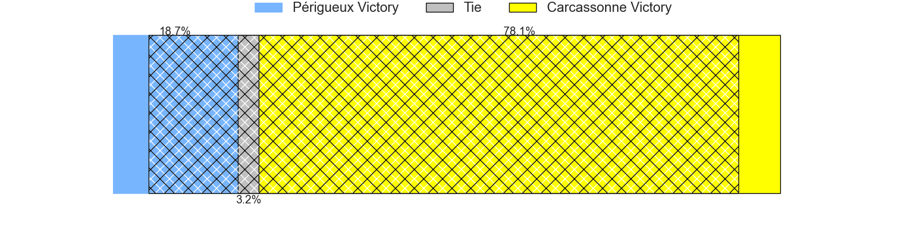

---  
layout: page  
title: Perigueux at Carcassonne; 0-21  
date: 2024-03-08 18:00:00 -0500  
categories: "Nationale 2023" match review  
---
# Perigueux at Carcassonne; 0-21

# Club Level Predictions

The first set of predictions treats a club as the smallest object, as the club develops its members, organizes a gameplan, and deploys its players as needed for each match. This club model has a prediction of 0.706, which translates to predicting Carcassonne to win by 7.9.

Our Over/Under is 44.5 - and combined with the spread above, we have a predicted scoreline of 18 to 26

Each club has a rating and a rating deviation (similar to a Glicko rating), and expected performances can be generated. This allows for simulated matches and spreads like the ones below.
## Projected Performances - Club Model

## Projected Spreads - Club Model

## Projected Results - Club Model

# Player Level Predictions - Version 2

Treating teams instead as an entity made up of the currently active players, I have ratings for each player in an altogether different system. These can be combined to form team ratings once teamsheets are announced, weighting starters a bit higher than the reserves. After the match is played, players can be weighted by their minutes on the field, allowing for an accurate measure of the team's composition. With these compiled team ratings, we can make predictions, measure inaccuracy, and update the individual player ratings.
## Prediction without Player Minutes: Carcassonne by 7.8

Carcassonne by 1.8 on a neutral pitch

## Projected Performances - Player Model

## Projected Spreads - Player Model

## Projected Results - Player Model

|   Away Minutes | Away Player        |   Away Percentile |   Number |   Home Percentile | Home Player           |   Home Minutes |
|---------------:|:-------------------|------------------:|---------:|------------------:|:----------------------|---------------:|
|             58 | Jason Tindiliere   |             20.62 |        1 |             92.76 | Andrei Ursache        |             75 |
|             40 | Lucas Marijon      |             64.5  |        2 |             57.63 | Raphael Carbou        |             61 |
|             58 | Anthony Pelmard    |             48.49 |        3 |             79.29 | Fabien Lorenzon       |             61 |
|             58 | Richard Fourcade   |             18.83 |        4 |             23.24 | Romain Manchia        |             80 |
|             61 | Jaco Willemse      |             18.24 |        5 |             35.88 | Clément Fontaine      |             80 |
|             80 | Hendri Storm       |             37.56 |        6 |             83.59 | Gary Graham           |             48 |
|             80 | Clement Lanen      |             14.87 |        7 |             72.8  | Etienne Herjean       |             80 |
|             61 | Afaesetiti Amosa   |             88.35 |        8 |             65.05 | Romain Guyot          |             69 |
|             80 | Matteo Bordenave   |             25.15 |        9 |              0.61 | Martin Landajo        |             80 |
|             58 | Greg Hutley        |             54.48 |       10 |             77.36 | Gabin Michet          |             80 |
|             44 | Arthur Duhau       |             80.34 |       11 |             79.7  | Clement Egiziano      |             80 |
|             80 | Fred Hickes        |             81.79 |       12 |             18.45 | Jordan Puletua        |             80 |
|             80 | Nicolas Piaton     |             25.12 |       13 |             63.45 | Pierre Aguillon       |             10 |
|             80 | Pierre Tournebize  |             10.1  |       14 |             81.95 | Léo Darrelatour       |             69 |
|             80 | Thibault Rabourdin |              8.39 |       15 |             72.18 | Maxime Gianet         |             80 |
|             22 | Emilien Borges     |            nan    |       16 |            nan    | Yan Arnold            |              5 |
|             40 | Baptiste Arvouet   |             32.06 |       17 |             65.46 | Luka Petriashvili     |             19 |
|             22 | Kalaveti Tawake    |             57.1  |       18 |             45.37 | Florent Lorenzon      |             19 |
|             22 | Damien Lavergne    |             19.34 |       19 |             49.76 | Ferdinand Dreno       |             32 |
|             19 | Madioke Konate     |             12.04 |       20 |             36.67 | Valentin Sese         |             11 |
|             19 | Pierre Rousserie   |             52.32 |       21 |             24.17 | Sakiusa Bureitakiyaca |             70 |
|             22 | Yann Caillat       |             24.88 |       22 |             28.86 | Damien Añon           |             11 |
|             36 | Gaëtan Chapon      |             38.45 |       23 |            nan    | nan                   |            nan |

